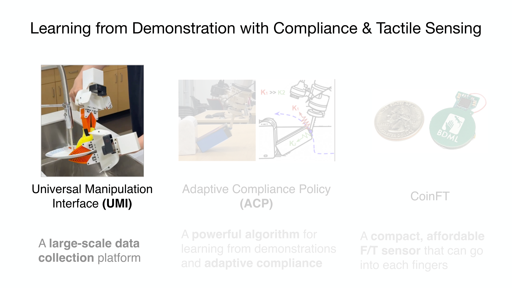

# Chapter 3: Tactile Data: Representation and Collection

## Overview

If tactile sensors (Chapter 2) convert physical contact into electrical signals, the question of **how to structure those signals, how to collect them, and how to build general-purpose representations through pretraining** is the subject of this chapter. Anchored by the taxonomy of Albini et al. [2025], we cover six data structures, collection pipelines, public datasets, and the path toward tactile foundation models through self-supervised pretraining.

> **After reading this chapter, you will be able to...**
> - Distinguish the six tactile data representation structures and their application contexts.
> - Understand canonical and sensor-agnostic representations.
> - Identify major tactile data collection pipelines and public datasets.
> - Explain the significance and limitations of self-supervised pretraining approaches like Sparsh and UniTouch.

---

## 3.1 A Taxonomy of Data Representations

Albini et al. [2025] classified tactile data representations into six structures. This survey (submitted to *IEEE T-RO*) is establishing itself as the de facto standard taxonomy for tactile data representation.

> **Key Paper**: Albini, A., Kaboli, M., Cannata, G., & Maiolino, P. (2025). "Representing Data in Robotic Tactile Perception — A Review." *arXiv preprint* (submitted to IEEE T-RO).
> Identifies 6 data structures (vector, matrix, map, point cloud, mesh, image) with selection guidelines based on hardware, task, and information requirements.

### 3.1.1 Vector

The simplest form: sensor readings arranged as a 1D vector. For multi-axis sensors, this becomes a force vector such as [fx, fy, fz]. The OSMO glove [2025] [#18](https://terry.artlab.ai/en/posts/2512-osmo-tactile-glove) represents tactile state as a 36-dimensional vector from its 12 three-axis sensors.

**Suitable tasks**: Classification, force control, slip detection
**Limitations**: Loss of spatial relationship information

### 3.1.2 Matrix

Sensor array outputs represented as a 2D matrix. The STAG glove's [Sundaram et al., 2019] 548 piezoresistive sensors produce a pressure matrix mapped to the hand surface.

**Suitable tasks**: Contact pattern classification, grasp state recognition
**Limitations**: Distortion when sensors are placed on curved surfaces

### 3.1.3 Map

Sensor data projected onto a reference surface. UniTacHand [Zhang et al., 2025] [#16](https://terry.artlab.ai/en/posts/2512-unitachand) projects tactile data onto a MANO UV map, mapping human and robot hand tactile data into a **shared representation space** (→ Chapter 10.4).

**Suitable tasks**: Cross-embodiment transfer, whole-hand tactile analysis
**Limitations**: UV mapping distortion, dependence on reference model

### 3.1.4 Point Cloud

Contact points represented with 3D coordinates. Robot Synesthesia [Yuan et al., 2024] implemented visuotactile in-hand manipulation using point cloud-based tactile representations. A PointNet encoder processes the tactile point cloud to achieve double-ball rotation and three-axis rotation on novel objects (*ICRA 2024*).

> **Key Paper**: Yuan, Y., Che, H., Qin, Y., Huang, B., Yin, Z.-H., Lee, K.-W., Wu, Y., Lim, S.-C., & Wang, X. (2024). "Robot Synesthesia: In-Hand Manipulation with Visuotactile Sensing." *ICRA 2024*.
> Point cloud-based tactile representation with teacher-student RL for visuotactile in-hand manipulation, achieving generalization to novel objects.

**Suitable tasks**: 3D shape reconstruction, 6-DoF pose estimation, visuo-tactile fusion
**Limitations**: Non-uniform density, unordered data processing required

### 3.1.5 Mesh

Contact surfaces modeled as triangular meshes. Combined with finite element methods (FEM) for deformation simulation. DiffTactile [2024] uses mesh-based contact modeling in a differentiable tactile simulator (→ Chapter 9.1).

**Suitable tasks**: Deformation simulation, force distribution analysis
**Limitations**: Computational cost, real-time processing difficulty

### 3.1.6 Image

The raw output of vision-based tactile sensors (GelSight, DIGIT) is already an image. This allows direct use of the rich vision model ecosystem (CNNs, ViTs), making it the most widely used representation today. Sparsh [Higuera et al., 2024] performed self-supervised pretraining on 460,000+ tactile images (→ Section 3.6).

**Suitable tasks**: Texture recognition, object classification, contact map reconstruction
**Limitations**: Sensor-specific — cannot directly compare images from different sensors

---

## 3.2 How Representation Choices Affect Task Performance

The choice of data representation directly impacts learning performance. Wu et al. [2025] proposed Canonical 3D Tactile [#14](https://terry.artlab.ai/en/posts/2409-3dtactile-dex) representations, transforming raw sensor output into a 3D canonical coordinate system to enable task-agnostic transfer (*ICRA 2025*).

The key insight, also discussed in Seminar 1, is a **two-stage approach**: pretrain a tactile encoder on large-scale play data, then learn the policy from a few expert demonstrations. The visuo-tactile imitation learning pipeline combining three-axis tactile, vision (Realsense D435), and robot state was the core pipeline presented in Seminar 1.

Albini et al. [2025] propose selection guidelines along three axes:
1. **Hardware**: Sensor output characteristics determine the natural representation (vision sensor → image, distributed sensor → matrix)
2. **Task**: Grasp classification → vector/matrix; shape reconstruction → point cloud/mesh
3. **Required information**: Normal force only → scalar/vector; 3D contact geometry → point cloud/image

---

## 3.3 Canonical and Sensor-Agnostic Representations

A fundamental limitation of tactile research is **sensor specificity**: representations learned on GelSight do not work on DIGIT; those from DIGIT do not transfer to ReSkin. Three main approaches address this problem:

### 3.3.1 AnyTouch / AnyTouch 2 (2025)

AnyTouch [2025] learns **unified representations** of static and dynamic touch across multiple vision-based tactile sensors. AnyTouch 2 [2025] extends this to dynamic perception, enabling sensor-agnostic deployment.

### 3.3.2 Sensor-Invariant Tactile Representation (2025)

Achieves **zero-shot transfer** across optical sensor designs by learning representations that strip sensor-specific information while preserving essential contact characteristics.

### 3.3.3 Canonical 3D Tactile (Wu et al., 2025)

Transforms raw sensor output into a 3D canonical coordinate frame, constructing sensor-independent tactile representations. Combined with task-agnostic play data pretraining, it enables transfer from few demonstrations.

> **Key Insight**: Sensor-agnostic representations are the path toward tactile sensing's "CLIP moment" — the ultimate goal is aligning outputs from diverse tactile sensors into a unified embedding space, just as CLIP did for vision-language.

---

## 3.4 Data Collection Pipelines

Collecting tactile data is inherently harder than visual data — **physical contact is required**. Three primary collection methods exist:

### 3.4.1 Teleoperation

A human operator remotely controls the robot while recording tactile data. This yields high-quality demonstrations but with very low throughput — roughly **10 demonstrations per hour** [DexCap benchmark]. DexCap is 3x faster than teleoperation but still limited.

Wu et al. [2025], as presented in Seminar 1, used a two-stage approach: collect large-scale play data via teleoperation, then fine-tune a policy with a few expert demonstrations.

### 3.4.2 Kinesthetic Teaching

DexForce [2025] [#3](https://terry.artlab.ai/en/posts/2501-dexforce-force-informed-actions) proposed a pipeline using a spring model for kinesthetic teaching that **naturally records force-torque information**. This captures more natural force profiles than teleoperation (→ Chapter 7.4).

### 3.4.3 Autonomous Exploration

The robot autonomously explores the environment to collect tactile data. Throughput is high, but demonstration quality may be lower. PP-Tac [2025] [#12](https://terry.artlab.ai/en/posts/2504-pp-tac) uses physics-based trajectory synthesis for automatic tactile data generation.

### 3.4.4 Handheld Demonstration Devices (UMI-FT)

UMI-FT [Choi et al., 2025] extends the Universal Manipulation Interface (UMI) [Chi et al., 2024] with CoinFT force/torque sensors on each finger, enabling **multimodal human demonstration collection at scale** without requiring a full robot setup:

- **Hardware**: Handheld gripper-shaped device with iPhone (RGB + depth), CoinFTs per finger
- **Modalities captured**: Vision, proprioceptive pose, **finger-level 6-axis force/torque**
- **Key advantage**: Natural haptic feedback during demonstration (unlike teleoperation); scalable deployment anywhere
- **Learning pipeline**: High-level multimodal Diffusion Policy (vision + force → pose, gripper width, grasp force, stiffness) + low-level grasp force and compliance controllers

UMI-FT demonstrated that force/torque sensing is critical for contact-rich tasks: on whiteboard wiping, the policy with force achieved controlled, firm wiping and generalized to different table heights, board sizes, and eraser widths, while baselines without force either rammed the surface or barely skimmed it. On light bulb insertion (requiring ~15-20 N force with haptic search), both compliance *and* grasp force control were essential — removing either caused failure [Choi, SNU Seminar 2026].

### 3.4.5 Synthetic Data

NVIDIA's Isaac Sim pipeline generates 780,000 trajectories (equivalent to 6,500 hours) in **just 11 hours**, improving real-world performance by 40%. Tacto [Wang, Lambeta et al., 2022] is an open-source simulator for vision-based tactile sensors enabling sim-to-real training. DiffTactile [2024] supports gradient-based optimization through differentiable simulation (→ Chapter 9).

| Method | Throughput | Data Quality | Force Info | Cost | Representative |
|--------|-----------|-------------|-----------|------|---------------|
| Teleoperation | Low (~10/hr) | High | Limited | High | DexCap, DexUMI |
| Kinesthetic teaching | Medium | High | Natural | Medium | DexForce |
| Handheld device | High | High | **6-axis F/T** | Low | **UMI-FT** |
| Autonomous exploration | High | Medium | Available | Low | PP-Tac |
| Synthetic data | Very high | Medium (gap) | Available | Low | Isaac Sim, Tacto |

---

## 3.5 Public Datasets

The scale of tactile datasets remains orders of magnitude smaller than vision datasets. To put this in perspective: LLaMA 3 was trained on **34,000 human-years** of text data (at ~40 words/min); the largest robot manipulation dataset (Generalist AI) contains **57 human-years** of demonstration data (vision + position only); multimodal tactile data in academia amounts to **less than 1 human-year** — nearly non-existent by comparison [Choi, SNU Seminar 2026]. This massive deficit motivates every data collection and pretraining approach discussed in this chapter.

Major public datasets include:

| Dataset | Scale | Sensor | Modalities | Tasks | Year |
|---------|-------|--------|-----------|-------|------|
| **Touch-and-Go** | 3M+ contacts | GelSight | Vision + tactile | Texture, objects | 2023 |
| **Touch100k** | 100K+ images | Various | Tactile | Texture classification | 2024 |
| **ObjectFolder** | 1K+ objects | Simulation | Vision + tactile + audio | Multimodal | 2022 |
| **VTDexManip** | 10 tasks, 182 objects | Vision + tactile | Human demos | Dexterous manipulation | 2025 |
| **Open X-Embodiment** | 1M+ trajectories | 22 embodiments | Vision + action | General manipulation | 2024 |
| **EgoDex** | 829hr, 90M frames | Apple Vision Pro | RGB + hand pose | 194 tasks | 2025 |

> **Key Paper**: VTDexManip (ICLR 2025). The first large-scale visual-tactile dataset from human demonstrations, spanning 10 tasks and 182 objects with an RL benchmark.

**EgoDex** [Apple, 2025] is a large-scale egocentric hand manipulation dataset collected using Apple Vision Pro + ARKit. With **829 hours**, **90M frames**, and **194 tasks** recorded at 30Hz per-finger tracking, it surpasses existing tactile/manipulation datasets by orders of magnitude. Together with the scaling laws discovered by EgoScale (Chapter 10.6), this demonstrates that large-scale egocentric human data collection is emerging as a key direction for robot learning.

VTDexManip is a significant milestone — the first large-scale collection of visual-tactile data from actual human demonstrations of dexterous manipulation.

Open X-Embodiment [2024] is the largest robot manipulation dataset (1M+ trajectories from 22 embodiments), but tactile data is included in only a small subset. The absence of large-scale tactile-specific datasets is a key limitation discussed in Chapter 13 (→ Chapter 13.1).

---

## 3.6 Self-Supervised Pretraining: Sparsh and UniTouch

The key approach toward the "ImageNet moment" for touch is building general-purpose tactile representations through **self-supervised learning**.

### Sparsh (2024)

A collaboration between Meta FAIR, CMU, and UC Berkeley, Sparsh [Higuera et al., 2024] is a tactile foundation model pretrained via self-supervised learning on **460,000+ tactile images** (*CoRL 2024*).

> **Key Paper**: Higuera, C., Sharma, A., Bodduluri, C. K., Fan, T., Lancaster, P., Malik, J., Pathak, D., Lambeta, M., & Calandra, R. (2024). "Sparsh: Self-Supervised Touch Representations for Vision-Based Tactile Sensing." *CoRL 2024*.
> Self-supervised tactile foundation model pretrained on 460K+ images from multiple vision-based tactile sensors. A milestone for general-purpose tactile representations.

Sparsh's significance lies in being the first large-scale attempt to replicate for touch what ImageNet pretraining accomplished for vision. However, 460K images remain orders of magnitude smaller than ImageNet's 14M, and a 10x+ data expansion is needed (→ Chapter 13.2).

### UniTouch (2024)

Yang et al. [2024] use **contrastive learning** to align touch with vision, language, and audio (*CVPR 2024*). Analogous to how CLIP aligned vision-language, UniTouch builds a unified embedding space across touch-vision-language-audio, enabling **zero-shot tactile classification**.

> **Key Paper**: Yang, F., Feng, C., Chen, Z., Park, H., Wang, D., Dou, Y., ... & Wong, A. (2024). "Binding Touch to Everything: Learning Unified Multimodal Tactile Representations." *CVPR 2024*.
> Contrastive learning aligning touch with vision, language, and audio for cross-modal retrieval and zero-shot classification.

### Tactile Sensing for Dexterous Manipulation Survey (2024)

This survey [2024] comprehensively covers tactile sensing, datasets, and sim-to-real transfer, providing the full context for the data representation, collection, and pretraining topics in this chapter.

---

## Summary and Outlook

Tactile data representations range from vectors to point clouds, with the taxonomy of Albini et al. [2025] providing selection criteria. Sensor-agnostic representations (AnyTouch, Sensor-Invariant, Canonical 3D) are essential for reproducibility and scalability, while Sparsh and UniTouch mark the first milestones toward tactile foundation models.

Yet the scale of tactile data remains orders of magnitude below that of visual data. Expanding from Touch-and-Go's 3M contacts to 100M+, applying NVIDIA's synthetic data pipeline to the tactile domain, and enabling cross-embodiment data reuse (Open X-Embodiment for hands) are key future directions.

The next chapter examines the **design principles of robot hands** that house these sensors and data (→ Chapter 4: Robot Hand Design).

---

## References

1. Albini, A., Kaboli, M., Cannata, G., & Maiolino, P. (2025). Representing data in robotic tactile perception — A review. *arXiv preprint* (submitted to IEEE T-RO). arXiv:2510.10804.

2. Yuan, Y., Che, H., Qin, Y., Huang, B., Yin, Z.-H., Lee, K.-W., Wu, Y., Lim, S.-C., & Wang, X. (2024). Robot Synesthesia: In-hand manipulation with visuotactile sensing. *ICRA 2024*. arXiv:2312.01853.

3. Yang, F., Feng, C., Chen, Z., Park, H., Wang, D., Dou, Y., ... & Wong, A. (2024). Binding touch to everything: Learning unified multimodal tactile representations. *CVPR 2024*.

4. Higuera, C., Sharma, A., Bodduluri, C. K., Fan, T., Lancaster, P., Malik, J., Pathak, D., Lambeta, M., & Calandra, R. (2024). Sparsh: Self-supervised touch representations for vision-based tactile sensing. *CoRL 2024*.

5. Liu, Q., Cui, Y., Sun, Z., Li, G., Chen, J., & Ye, Q. (2025). VTDexManip: A dataset and benchmark for visual-tactile pretraining and dexterous manipulation with reinforcement learning. *ICLR 2025*.

6. Feng, R., Hu, J., Xia, W., Gao, T., Shen, A., Sun, Y., Fang, B., & Hu, D. (2025). AnyTouch: Learning unified static-dynamic representation across multiple visuo-tactile sensors. *ICLR 2025*. arXiv:2502.12191.

7. Various. (2025). AnyTouch 2: General optical tactile representation learning for dynamic tactile perception. *OpenReview*.

8. Various. (2025). Sensor-invariant tactile representation. *OpenReview*.

9. Wu, C., et al. (2025). Canonical 3D tactile representation for visuo-tactile imitation learning. *ICRA 2025*. [#14](https://terry.artlab.ai/en/posts/2409-3dtactile-dex)

10. Wang, S., Lambeta, M., et al. (2022). Tacto: A fast, flexible, and open-source simulator for vision-based tactile sensors. *IEEE Robotics and Automation Letters*.

11. Si, Z., Zhang, G., Ben, Q., Romero, B., Xian, Z., Liu, C., & Gan, C. (2024). DiffTactile: A physics-based differentiable tactile simulator for contact-rich robotic manipulation. *ICLR 2024*.

12. Sundaram, S., Kellnhofer, P., Li, Y., Zhu, J.-Y., Torralba, A., & Matusik, W. (2019). Learning the signatures of the human grasp using a scalable tactile glove. *Nature*, 569, 698-702.

13. Zhang, C., Xue, Z., Yin, S., Zhao, B., et al. (2025). UniTacHand: Unified spatio-tactile representation for human to robotic hand skill transfer. *arXiv preprint*. arXiv:2512.21233. [#16](https://terry.artlab.ai/en/posts/2512-unitachand)

14. Chen, C., Yu, Z., Choi, H., Cutkosky, M., & Bohg, J. (2025). DexForce: Extracting force-informed actions from kinesthetic demonstrations for dexterous manipulation. *IEEE Robotics and Automation Letters*. arXiv:2501.10356. [#3](https://terry.artlab.ai/en/posts/2501-dexforce-force-informed-actions)

15. Lin, P., Huang, Y., Li, W., Ma, J., Xiao, C., & Jiao, Z. (2025). PP-Tac: Paper picking using omnidirectional tactile feedback in dexterous robotic hands. *RSS 2025*. [#12](https://terry.artlab.ai/en/posts/2504-pp-tac)

16. Open X-Embodiment Collaboration. (2024). Open X-Embodiment: Robotic learning datasets and RT-X models. *ICRA 2024*. arXiv:2310.08864.

17. Various. (2024). Tactile sensing for dexterous manipulation: Taxonomies, datasets, and sim-to-real transfer. *Journal of Multidisciplinary Engineering Science*.

18. Yang, F., et al. (2023). Touch and Go: Learning from human-collected vision and touch. *ICCV 2023*.

19. Yang, F., et al. (2024). Touch100k: A large-scale touch-language-vision dataset. *arXiv preprint*. arXiv:2406.03813.

20. Gao, R., et al. (2022). ObjectFolder 2.0: A multisensory object dataset for sim2real transfer. *ICML 2022*.

21. Yin, J., Qi, H., Wi, Y., Kundu, S., Lambeta, M., Yang, W., Wang, C., Wu, T., Malik, J., & Hellebrekers, T. (2025). OSMO: Open-source tactile glove for human-to-robot skill transfer. *arXiv preprint*. arXiv:2512.08920. [#18](https://terry.artlab.ai/en/posts/2512-osmo-tactile-glove)

22. Various. (2025). EgoDex: Large-scale egocentric hand manipulation dataset via Apple Vision Pro. *arXiv preprint*.

23. Choi, H., Kim, A., & Cutkosky, M. R. (2024). CoinFT: A compact and affordable capacitive six-axis force/torque sensor. *IEEE Sensors Journal*. https://coin-ft.github.io/

24. Choi, H., Hou, Y., Song, S., & Cutkosky, M. R. (2025). UMI-FT: Learning compliant manipulation at scale with force/torque sensing. *arXiv preprint*.

25. Choi, H. (2026). Multimodal Data for Robot Manipulation. *SNU Data Science Seminar*.
