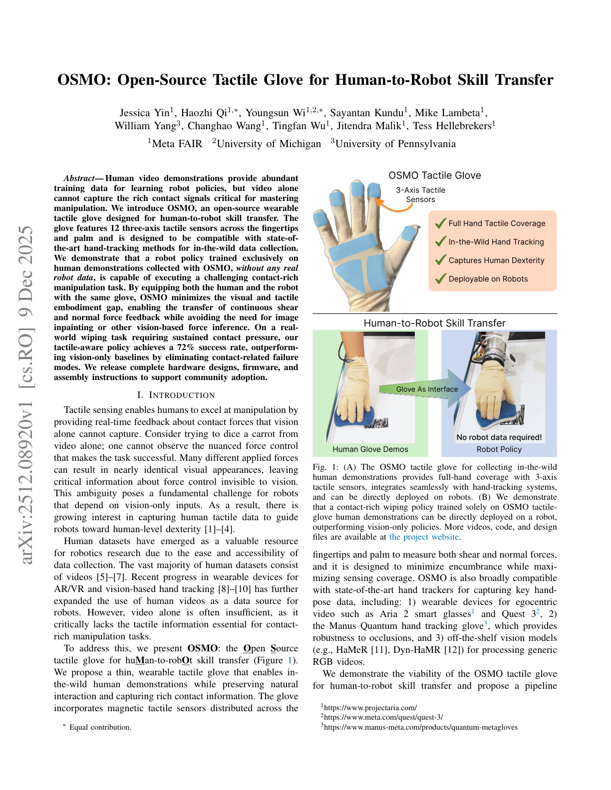
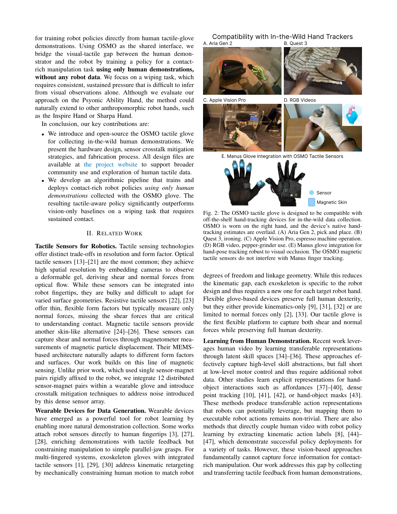
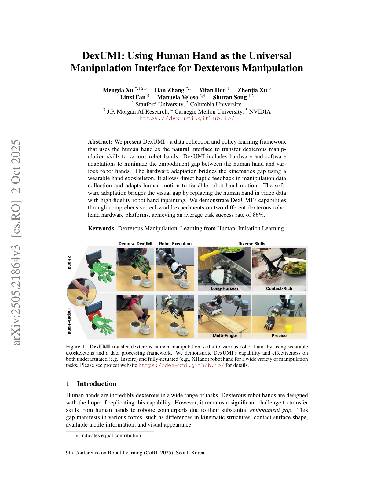
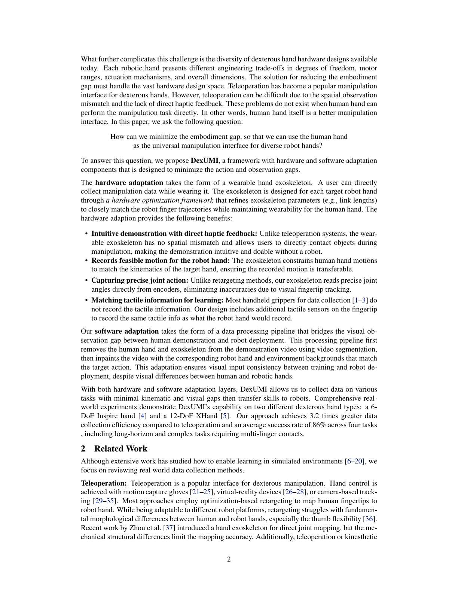

# Chapter 6: Human Hand Data Collection — Teaching by Demonstration

## Overview

The most intuitive way to teach robots to manipulate is to **show them human demonstrations**. Yet transferring the 27-DoF motion and tactile information of the human hand to a robot presents fundamental challenges. This chapter covers human hand modeling (MANO [#17](https://terry.artlab.ai/en/posts/2201-mano-hand-model)), motion tracking gloves, tactile gloves, exoskeletons, and teleoperation systems, surveying the data pipeline from human to robot.

> **After reading this chapter, you will be able to...**
> - Describe the MANO hand model's structure and applications.
> - Compare the characteristics of major motion tracking gloves.
> - Understand tactile glove designs (STAG, OSMO [#18](https://terry.artlab.ai/en/posts/2512-osmo-tactile-glove)) and their cross-embodiment potential.
> - Evaluate the strengths and limitations of exoskeleton and teleoperation approaches.

---

## 6.1 The Human Hand Model: MANO (778 Vertices, 16 Joints)

MANO [Romero et al., 2017] is a statistical human hand model learned from 1,000 3D scans (*SIGGRAPH Asia 2017*):

- **778 vertices**, 16 joints
- **PCA shape space**: Low-dimensional representation of inter-individual hand size/shape variation
- **Pose blend shapes**: Skin deformation modeling as a function of joint angles
- Compatible with the SMPL full-body model (SMPL+H)

MANO serves as the foundation for virtually all human hand research — hand pose estimation, human-robot retargeting, and tactile transfer (UniTacHand's MANO UV map) (→ Chapter 10.4).

---

## 6.2 Motion Tracking Gloves: From Stretchable Sensors to Commercial Products

Seminar 2 (Taejoon) systematically reviewed the current state of motion tracking gloves.

### Stretchable Liquid-Metal Sensor Glove (2024)

Published in *Nature Communications* [2024]:
- 9 eGaIn (eutectic gallium-indium) liquid-metal sensors
- 9 DoF tracking, adapts to all hand sizes (one-size-fits-all)
- **Joint angle error: 4.16 degrees**, fingertip position error: **4.02 mm**
- Bayesian refinement + Kalman filter

> **Key Paper**: Various. (2024). "Stretchable Liquid-Metal Sensor Glove." *Nature Communications*.
> A 9-sensor eGaIn glove adapting to all hand sizes. The 4.02 mm fingertip error is sufficient for most manipulation demonstrations.

### Commercial Glove Comparison

Seminar 2 compared three commercial gloves:

| Glove | Sensor Type | Sensors | DoF | Notes |
|-------|-----------|---------|-----|-------|
| **Rokoko** | IMU | 7 | 6 | Lightest solution |
| **Manus** | Stretch/flex | 16 | — | NVIDIA Isaac Teleop official glove (GTC 2026) |
| **StretchSense** | EMF | — | 25 | Highest DoF |

NVIDIA's designation of Manus as the official data glove for Isaac Teleop at GTC 2026 signals industrial standardization.

### Korean Research: ML-Based Wearable Sensors

Seoul National University research [2024, *PMC*] implemented real-time hand motion recognition with ML-based wearable sensors, bridging the gap between lab research and practical applications.

---

## 6.3 Tactile Gloves: STAG, OSMO, and the Open-Source Approach

Beyond motion tracking, collecting **tactile information** during human grasping is the next step.

### STAG (2019)

Sundaram et al. [2019] (*Nature*, 2019):
- **548 piezoresistive sensors**: High-resolution pressure distribution across the human hand
- Grasp-finger correlation analysis
- Pioneering tactile demonstration dataset for robot learning

Ruppel et al. [2024] proposed a 169-sensor reduced version, exploring the trade-off between sensor count and information loss.

### OSMO Glove (2025)

OSMO [arXiv:2512.08920] takes the innovative approach of using **the same glove on both human and robot hands**:

- **12 three-axis magnetic sensors**: Simultaneous normal and shear force measurement
- MuMetal shielding against external magnetic interference
- **Core concept — Embodiment Bridge**: Using identical sensing gloves on human and robot simplifies the cross-embodiment problem
- **Open-source**: Reproducible design

> **Key Paper**: OSMO. (2025). "OSMO: Open-Source Multi-axis Tactile Glove." *arXiv:2512.08920*.
> A 12-sensor three-axis magnetic tactile glove usable on both human and robot hands. Presents a new paradigm for cross-embodiment tactile transfer.

Key insight from Seminar 2: **Using identical sensing gloves on human and robot simplifies the cross-embodiment problem**. When tactile data is collected from human demonstrations and the same glove is mounted on a robot hand for policy learning, the tactile domain gap is eliminated (→ Chapter 10.4).

### TacCap (2025)

TacCap [arXiv, Mar 2025] implements FBG (Fiber Bragg Grating) optical tactile sensors in a fingertip thimble form factor:
- **FBG fiber-optic tactile sensors**: High sensitivity and fast response
- **Mountable on both human and robot fingers**: Cross-embodiment approach similar to OSMO
- **EMI immune (electromagnetic interference immune)**: Fully immune to electromagnetic interference due to optical sensing — usable in MRI environments or near strong electromagnetic fields
- Thimble form factor for easy attachment to existing gloves or robot fingertips

> TacCap occupies a complementary position to OSMO's magnetic sensors. In environments where magnetic sensors are vulnerable to external fields, FBG optical sensing provides a robust alternative.

### VTDexManip (2025)

VTDexManip [ICLR 2025] is the first large-scale visual-tactile human demonstration dataset:
- **565,000 frames**: Simultaneous visual and tactile data collection
- **10 tasks, 182 objects**: Covering diverse manipulation scenarios
- **First visual-tactile human demonstration dataset**: While prior datasets provided either visual or tactile data, this integrates both modalities
- Serves as a benchmark for cross-embodiment policy learning

> VTDexManip provides a concrete answer to "how to utilize demonstration data collected with tactile gloves." The 565K frames represent sufficient scale for large-scale imitation learning.

### FSR Optimization

Tang et al. [2025] and Chen et al. [2025] addressed the optimal placement of FSR sensors, exploring how to extract maximum information from limited sensors — answering the "high spatial resolution vs. optimized sensor count/position" trade-off.

---

## 6.4 Exoskeleton Approaches: DexUMI [#8](https://terry.artlab.ai/en/posts/2505-dexumi), ExoStart [#9](https://terry.artlab.ai/en/posts/2506-exostart), DEXOP [#10](https://terry.artlab.ai/en/posts/2509-dexop)

Exoskeletons mechanically connect to the human hand, directly capturing motion.

### DexUMI (2025)

Xu et al. [2025] — "Human Hand as Universal Interface":
- Wearable exoskeleton resolves the **kinematic gap**
- SAM2 inpainting resolves the **visual gap** — erasing the human hand from camera images and replacing it with the robot hand
- **86% success** on Inspire and XHand
- **3.2x faster** data collection than teleoperation

### ExoStart (2025)

Si et al. [2025] learn dexterous manipulation policies from **just 10 exoskeleton demonstrations**:
1. ~10 exoskeleton demos
2. MuJoCo dynamics filtering
3. Auto-curriculum RL
4. ACT vision student
5. Zero-shot real → >50% success on 6 of 7 tasks

This pipeline exemplifies Real-Sim-Real transfer (→ Chapter 9.4).

### DEXOP (2025)

DEXOP [2025] uses a four-bar linkage to **directly mechanically couple** human and robot fingers:
- **8x faster** data collection than teleoperation
- Direct contact feedback
- **51.3% vs. 42.5%** success (vs. teleoperation)

### AirExo / AirExo-2 (SJTU, 2024-2025)

AirExo [ICRA 2024] and AirExo-2 [CoRL 2025] are low-cost passive exoskeletons developed at Shanghai Jiao Tong University:
- **Approximately $300 fabrication cost**: Constructed from 3D-printed parts and low-cost sensors
- **Passive actuation**: Records human motion without motors
- **In-the-wild human demonstration collection**: Enables data capture outside laboratory settings in everyday environments
- Key finding from AirExo-2: **3 min teleop + in-the-wild data >= 20 min teleop only** — empirically demonstrating that expensive teleoperation data can be supplemented or replaced by natural environment demonstrations
- Full upper-body exoskeleton covering both arm and hand

> The AirExo series exemplifies the **democratization of data collection**. The finding that in-the-wild data from a $300 exoskeleton can complement or replace costly teleoperation data presents a new solution to the scalability problem of robot learning data.

### ACE (UCSD, CoRL 2024)

ACE [CoRL 2024] is a universal teleoperation interface developed at the University of California San Diego:
- **Hand-facing camera + exoskeleton**: Tracks finger poses via hand-facing camera while capturing arm motion through the exoskeleton
- **Single system supports diverse robot platforms**: Enables teleoperation of humanoids, robot arms, grippers, and quadrupeds
- Cross-embodiment switching occurs at the software level, requiring no hardware changes
- Intuitive operation: Natural human motions map directly to robot actions

> ACE's key contribution is enabling **control of any robot through a single interface**. This maximizes the reusability of collected human demonstration data.

### NuExo (Nubot Lab, ICRA 2025)

NuExo [ICRA 2025] is an active exoskeleton system developed at Nubot Lab:
- **5.2 kg backpack-style active exoskeleton**: Motor-driven with haptic feedback
- **100% upper-limb ROM (Range of Motion)**: Captures the full range of human upper-limb motion without restriction
- **Successful 2.5 mm screw tightening**: Performs extremely precise manipulation tasks remotely
- Backpack form factor ensures mobility across diverse environments

> NuExo takes the opposite approach from passive exoskeletons (AirExo). Active actuation and haptic feedback push the **upper bound of precision**, specializing in fine manipulation demonstration collection.

### HumanoidExo (NUDT, 2025)

HumanoidExo [arXiv, Oct 2025] is a full-body exoskeleton developed at the National University of Defense Technology (NUDT):
- **Lightweight exoskeleton + LiDAR**: Exoskeleton captures upper body/arm motion; LiDAR captures lower body/locomotion trajectories
- **Full-body trajectory collection**: Simultaneously records upper-limb manipulation and lower-limb locomotion
- **Locomotion learning from exoskeleton data alone**: Directly learns locomotion policies from human demonstrations without separate gait simulation
- Optimized for full-body teleoperation of humanoid robots

> HumanoidExo extends the application scope of exoskeletons **from hands/arms to the entire body**. As humanoid robots approach commercialization, the importance of full-body demonstration collection infrastructure is growing.

> **Key Perspective**: DexUMI, ExoStart, and DEXOP each bridge the human-robot gap differently, but all share the goal of overcoming **teleoperation's throughput bottleneck (~10 demos/hr)**. AirExo addresses cost barriers, ACE tackles platform compatibility, NuExo pushes precision limits, and HumanoidExo enables full-body applications.

---

## 6.5 Large-Scale Data: From Internet Videos to Egocentric Capture

Shaw et al. [2024, CMU] proposed extracting human hand motions from internet videos and retargeting them to robot hands. The potential lies in **scalability** — millions of hand manipulation videos exist online, and converting them to robot learning data could fundamentally solve the teleoperation bottleneck.

ImMimic [Liu et al., 2025] augments data by interpolating between large-scale human trajectories and a few teleoperation trajectories. As discussed in Seminar 1, this represents the direction of **synergistically using human data instead of expensive teleop data** (→ Chapter 10.2).

DexH2R [2024] implements task-oriented human-to-robot dexterous transfer, mapping the intent of human demonstrations to robot actions.

### EgoDex (Apple, 2025)

EgoDex [Apple, 2025] is a large-scale egocentric hand manipulation dataset leveraging Apple Vision Pro and ARKit:
- **829 hours, 90M (90 million) frames**: The largest hand manipulation dataset to date
- **194 tasks**: Spanning from everyday object manipulation to tool use
- **30 Hz per-finger tracking**: Real-time 3D trajectory recording for each finger via ARKit hand tracking
- Collected with consumer hardware (Apple Vision Pro), ensuring scalability

> EgoDex opens a **new middle ground** between internet video and teleoperation approaches. It is as large-scale as video data while providing accurate 3D finger trajectories like teleoperation. The 829-hour scale exceeds existing robot demonstration datasets by orders of magnitude, approaching the data volume required for foundation model training.

---

## 6.6 Teleoperation: AnyTeleop, DexPilot, Bunny-VisionPro

Teleoperation remains the most traditional collection method and yields the highest data quality.

### AnyTeleop (2023)

Qin et al. [2023, RSS] built a general-purpose vision-based teleoperation system:
- Dex-Retarget: Maps human keypoints to robot joint positions
- Compatible with diverse robot hands
- As discussed in Seminar 1, **naive retargeting has limitations** — kinematic differences between human and robot can violate physical feasibility

### DexPilot (2020)

Handa & Van Wyk [2020, NVIDIA] achieved 23-DOA teleoperation from bare-hand depth images. Requires only an RGB-D camera, maximizing accessibility.

### Bunny-VisionPro (2024)

Ding et al. [2024, UCSD] implemented bimanual teleoperation via Apple Vision Pro with haptic feedback, achieving research-grade teleoperation using consumer hardware.

### DexCap (2024)

Wang et al. [2024, Stanford] created a portable mocap system enabling **3x faster** data collection than teleoperation, with policy learning from 30 minutes of data.

### DOGlove (2025)

A low-cost open-source haptic feedback glove that provides tactile feedback to operators, improving teleoperation quality.

### Feel Robot Feels (2026)

A tactile feedback array glove that closes the haptic loop, enabling operators to directly feel what the robot touches.

UMI-FT [Choi et al., 2025] occupies a unique position in this landscape: a handheld demonstration device that preserves human dexterity with natural haptic feedback (no teleoperation latency), collects **6-axis force/torque data** via CoinFT sensors, and scales to in-the-wild environments. Hundreds of people can collect demonstrations daily without requiring robots or trained operators. The embodiment gap is small because the device mimics the robot's gripper form factor [Choi, SNU Seminar 2026].

| System | Input Device | Haptic Feedback | Throughput | Cost |
|--------|-------------|----------------|-----------|------|
| AnyTeleop | RGB camera | None | Baseline | Low |
| DexPilot | RGB-D camera | None | Baseline | Low |
| Bunny-VisionPro | Vision Pro | Yes | Baseline | Medium |
| DexCap | Motion capture | None | 3x | Medium |
| DexUMI | Exoskeleton | Direct contact | 3.2x | Medium |
| DEXOP | 4-bar linkage | Direct contact | 8x | Low |
| AirExo | Passive exoskeleton | None | High (in-the-wild) | Very low (~$300) |
| ACE | Camera+exoskeleton | None | Baseline | Medium |
| NuExo | Active exoskeleton | Yes (haptic) | Baseline | High |
| EgoDex | Vision Pro + ARKit | None | Very high (829h) | Medium |
| Internet video | None (observation) | None | Unlimited | Very low |

---

## Summary and Outlook

Human hand data collection sits on a trade-off between **throughput** and **data quality**. Teleoperation provides high quality but scales poorly at ~10 demos/hr; internet video offers unlimited scale but lacks action labels and tactile information. The OSMO glove's Embodiment Bridge and DEXOP's mechanical coupling propose new solutions to this trade-off.

AirExo's $300 passive exoskeleton and EgoDex's 829-hour Vision Pro dataset are simultaneously advancing **democratization and scaling** of data collection. Furthermore, VTDexManip's 565K-frame visual-tactile dataset and TacCap's EMI-immune FBG sensors are accelerating the practical deployment of tactile-inclusive demonstration collection.

NVIDIA Isaac Teleop + MANUS standardization, internet video mining at scale, and extending synthetic data (780K trajectories/11 hours) to the tactile domain are the key directions for resolving the data bottleneck.

The next chapter examines **how robots learn to manipulate** from such collected data (→ Chapter 7: Learning to Manipulate).

---

## References

1. Romero, J., Tzionas, D., & Black, M. J. (2017). Embodied hands: Modeling and capturing hands and bodies together. *SIGGRAPH Asia 2017*.

2. Various. (2024). Stretchable liquid-metal sensor glove. *Nature Communications*. https://doi.org/10.1038/s41467-024-50101-w

3. Sundaram, S., Kellnhofer, P., Li, Y., Zhu, J.-Y., Torralba, A., & Matusik, W. (2019). Learning the signatures of the human grasp using a scalable tactile glove. *Nature*, 569, 698-702.

4. Ruppel, P., et al. (2024). Reduced tactile sensor array for grasp analysis. *Sensors*.

5. Yin, J., Qi, H., Wi, Y., Kundu, S., Lambeta, M., Yang, W., Wang, C., Wu, T., Malik, J., & Hellebrekers, T. (2025). OSMO: Open-source tactile glove for human-to-robot skill transfer. *arXiv preprint*. arXiv:2512.08920. [#18](https://terry.artlab.ai/en/posts/2512-osmo-tactile-glove)

6. Xu, M., Zhang, H., Hou, Y., Xu, Z., Fan, L., Veloso, M., & Song, S. (2025). DexUMI: Using human hand as the universal manipulation interface for dexterous manipulation. *arXiv preprint*. [#8](https://terry.artlab.ai/en/posts/2505-dexumi)

7. Si, Z., et al. (2025). ExoStart: From 10 exoskeleton demos to dexterous robot manipulation. [#9](https://terry.artlab.ai/en/posts/2506-exostart)

8. Fang, H.-S., Romero, B., Xie, Y., et al. (2025). DEXOP: A device for robotic transfer of dexterous human manipulation. *arXiv preprint*. arXiv:2509.04441. [#10](https://terry.artlab.ai/en/posts/2509-dexop)

9. Qin, Y., et al. (2023). AnyTeleop: A general vision-based dexterous robot hand-arm teleoperation system. *RSS 2023*.

10. Handa, A., & Van Wyk, K. (2020). DexPilot: Vision-based teleoperation for dexterous manipulation. *ICRA 2020*.

11. Ding, Z., et al. (2024). Bunny-VisionPro: Real-time bimanual dexterous teleoperation for imitation learning. *arXiv preprint*. arXiv:2407.03162.

12. Wang, C., et al. (2024). DexCap: Scalable and portable mocap data collection system. *RSS 2024*.

13. Shaw, K., Bahl, S., & Pathak, D. (2024). Learning dexterity from human hand motion in internet videos. *arXiv preprint*. arXiv:2404.xxxxx.

14. Liu, Y., et al. (2025). ImMimic: Large-scale human trajectory + few-shot teleoperation interpolation.

15. Li, Y., et al. (2024). DexH2R: Task-oriented dexterous manipulation from human to robots. *arXiv preprint*.

16. Various. (2025). DOGlove: Low-cost open-source haptic feedback glove.

17. Various. (2026). Feel Robot Feels: Tactile feedback array glove.

18. Murphy, L., et al. (2025). Capacitive tactile sensing for teaching by demonstration. *arXiv preprint*.

19. Tang, M., et al. (2025). FSR sensor optimization for grasp classification. *IEEE Journal of Biomedical and Health Informatics*.

20. Chen, H., et al. (2025). Capacitive sensor for lift-risk identification. *Applied Ergonomics*.

21. Various. (2024). ML-based wearable sensors for real-time hand motion recognition. *PMC*. (Seoul National University)

22. TacCap. (2025). TacCap: FBG optical tactile sensor thimble for human and robot fingertips. *arXiv preprint*, Mar 2025.

23. VTDexManip. (2025). VTDexManip: A large-scale visual-tactile dataset for dexterous manipulation from human demonstrations. *ICLR 2025*.

24. Fang, J., et al. (2024). AirExo: Low-cost exoskeletons for learning whole-arm manipulation in the wild. *ICRA 2024*.

25. Fang, J., et al. (2025). AirExo-2: Scaling up generalizable manipulation skills via purely kinesthetic demonstrations in the wild. *CoRL 2025*.

26. Zhao, Q., et al. (2024). ACE: A cross-platform visual-exoskeleton system for low-cost dexterous teleoperation. *CoRL 2024*.

27. NuExo. (2025). NuExo: A 5.2 kg active upper-limb exoskeleton for dexterous teleoperation with 100% ROM. *ICRA 2025*.

28. HumanoidExo. (2025). HumanoidExo: Lightweight exoskeleton with LiDAR for full-body humanoid teleoperation and locomotion learning. *arXiv preprint*, Oct 2025.

29. EgoDex. (2025). EgoDex: Learning dexterous manipulation from large-scale egocentric hand data via Apple Vision Pro. *Apple*, 2025.
