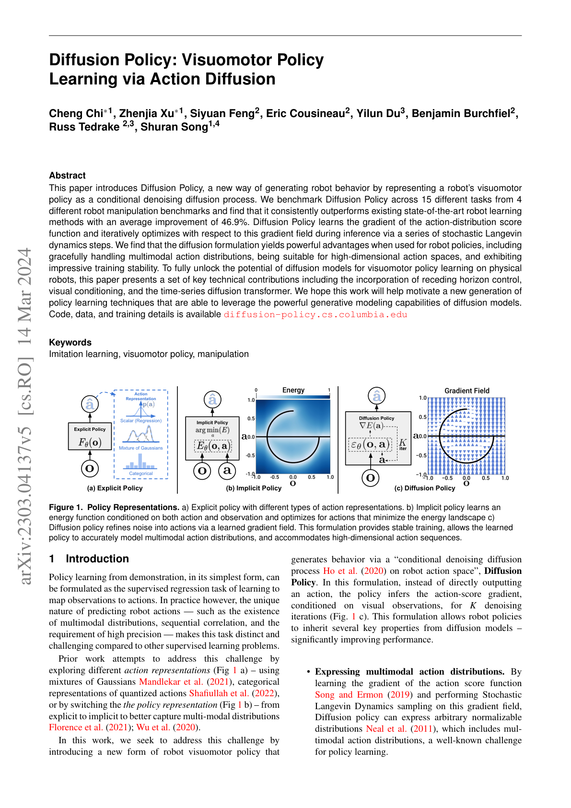
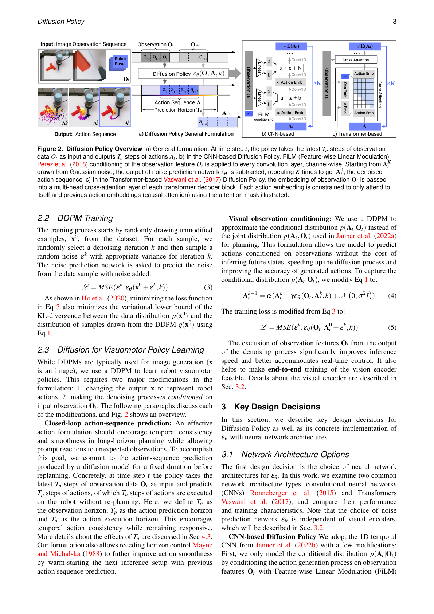
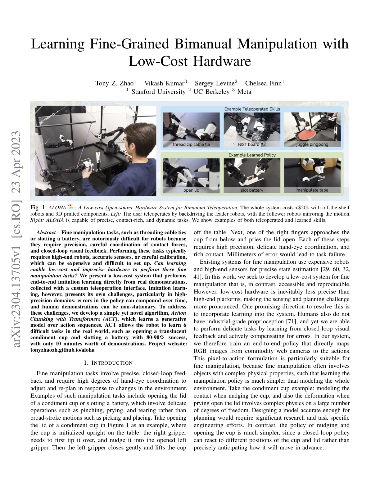
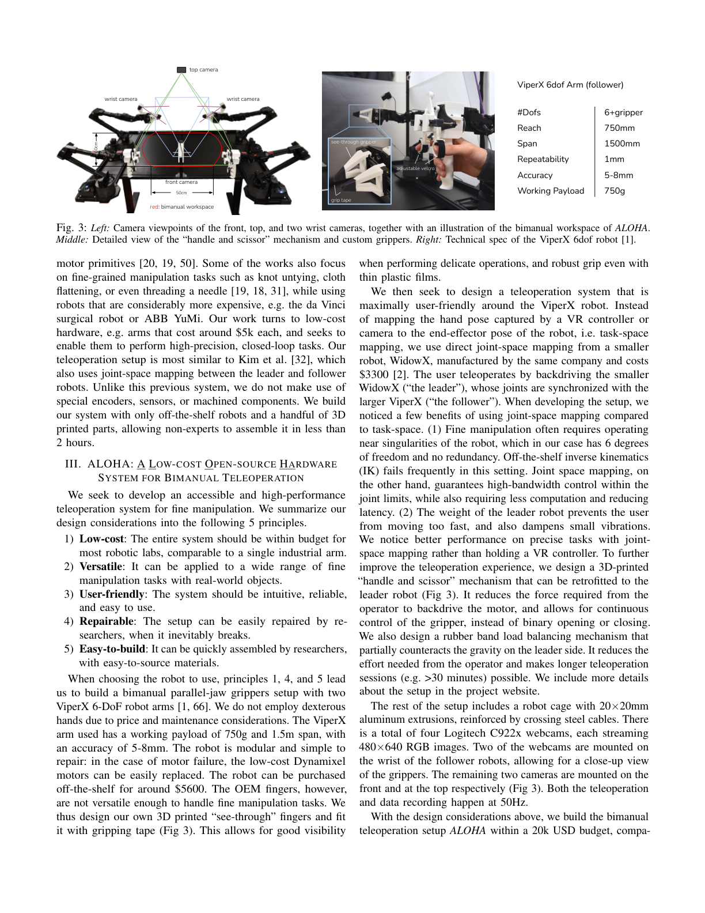
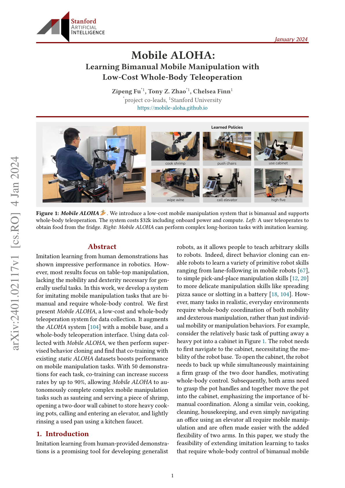
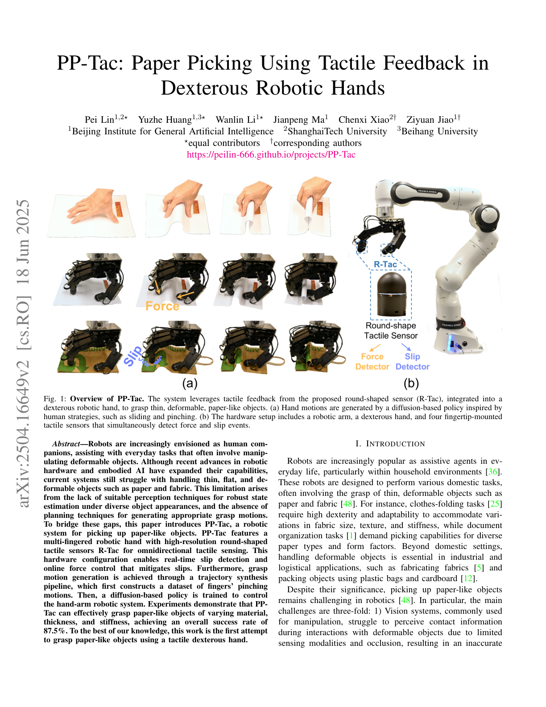
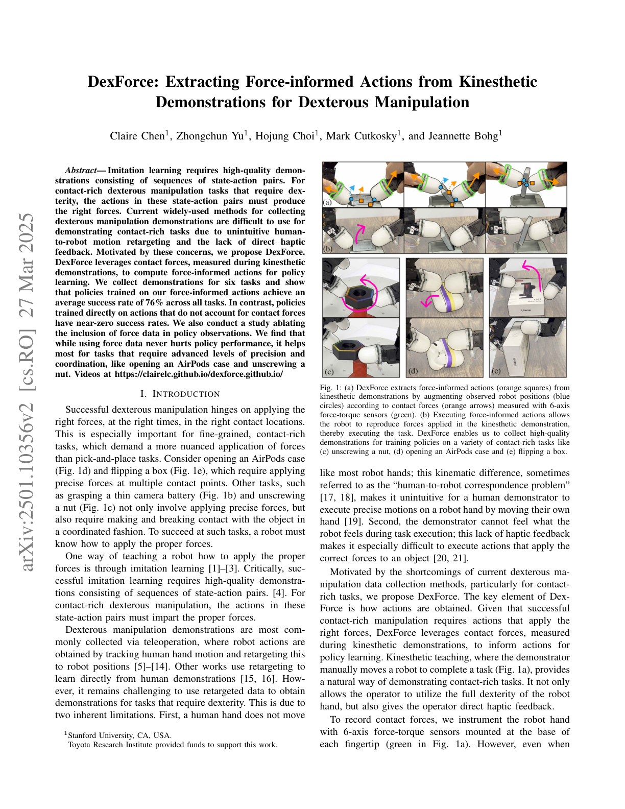

# Chapter 7: Learning to Manipulate — Learning by Touch

## Overview

Parts I and II established the foundations of sensors, data, hands, and human demonstrations. This chapter combines all these elements to examine **how robots actually learn to manipulate**. From imitation learning and reinforcement learning to tactile-based manipulation, force-informed learning, and optimization-based alternatives — we map the full methodological landscape of tactile manipulation learning.

> **After reading this chapter, you will be able to...**
> - Explain the mechanisms and differences between Diffusion Policy and ACT/ALOHA.
> - Compare tactile-only vs. visuo-tactile manipulation approaches.
> - Understand force-informed learning (DexForce [#3](https://terry.artlab.ai/en/posts/2501-dexforce-force-informed-actions), ForceVLA [#1](https://terry.artlab.ai/en/posts/2505-forcevla-force-aware-moe)) and its significance.
> - Evaluate the methodological trade-offs among IL, RL, and optimization.

---

## 7.1 Imitation Learning: Diffusion Policy and ACT/ALOHA

Imitation learning (IL) learns policies by directly mimicking human demonstrations. Two approaches have dominated since 2023.

### Diffusion Policy (2023)

Chi et al. [2023] model robot actions as a **conditional denoising diffusion process** (*RSS 2023 / IJRR 2024*):
- Handles multimodal action distributions naturally
- **46.9% average improvement** over prior methods
- **500+ citations**: The mainstream paradigm for robot policy learning

> **Key Paper**: Chi, C., Feng, S., Du, Y., Xu, Z., Cousineau, E., Burchfiel, B., & Song, S. (2023). "Diffusion Policy: Visuomotor Policy Learning via Action Diffusion." *RSS 2023 / IJRR 2024*.
> Action diffusion for visuomotor policy learning. Natural handling of multimodal distributions makes it readily combinable with tactile conditioning.

### ACT/ALOHA (2023)

Zhao et al. [2023, Stanford] achieve **80-90% bimanual success from 10-minute demonstrations** via Action Chunking with Transformers:
- ALOHA: Sub-$20K bimanual hardware
- Mobile ALOHA: Mobile + bimanual integration (→ Chapter 11.2)
- **400+ citations**

> **Key Paper**: Zhao, T. Z., Kumar, V., Levine, S., & Finn, C. (2023). "Learning Fine-Grained Bimanual Manipulation with Low-Cost Hardware." *RSS 2023*.
> Transformer-based action chunking achieving fine-grained bimanual manipulation on low-cost hardware, open-sourced with ALOHA.

### ALOHA Unleashed (2024)

Zhao et al. [2024, Google DeepMind] scaled up the ALOHA framework with ALOHA 2 hardware and large-scale data collection for **contact-rich bimanual manipulation** (*CoRL 2024*):
- **Diffusion Policy** backbone for complex bimanual coordination
- Tasks include tying shoelaces, hanging clothes, and other highly dexterous bimanual operations
- Demonstrates that scaling both data quantity and task complexity with Diffusion Policy yields robust contact-rich manipulation
- Bridges the gap between simple pick-and-place and truly dexterous manipulation

### LAPA (2025)

LAPA [ICLR 2025] introduces **latent action pretraining from human videos**:
- **VQ-VAE** encodes human video actions into a latent space
- Learns action representations from human videos alone, without robot data
- Fine-tuned with small amounts of robot data afterward
- **30x data efficiency** improvement over prior methods
- Aligns with the teleop-free approaches discussed in Chapter 10.7

---

## 7.2 Reinforcement Learning: PPO with Tactile, Sim-to-Real RL

Reinforcement learning (RL) learns policies that maximize reward through trial and error. Key achievements combining tactile sensing with RL:

### OpenAI Dactyl (2020)

A landmark in sim-to-real RL (*IJRR*):
- Rubik's Cube manipulation with Shadow Hand
- Trained entirely in simulation, zero-shot transferred to reality
- Proved the power of domain randomization
- **1,500+ citations**

### DeXtreme (2023)

Handa et al. [2023, NVIDIA] with Allegro Hand + Isaac Gym:
- Automatic Domain Randomization (ADR): Simultaneous physics + non-physics parameter randomization
- Synthetic visual data via Omniverse Replicator
- Vision-based policies outperform prior literature
- **200+ citations** (→ Chapter 9.2 for details)

### Tactile-Based Sim-to-Real RL

Yin et al. [2024] developed a binary 3-axis tactile skin [#13](https://terry.artlab.ai/en/posts/2407-tactile-skin-inhand-translation) sensor model:
- **5,000 FPS** simulation speed
- S3-Axis: **93% success** on out-of-distribution objects
- **Zero-shot** sim-to-real transfer

This work demonstrates that simplified sensors (binary contact) with wide coverage (whole hand) can outperform high-resolution sensors with limited coverage — aligning with Seminar 1's insight that "coverage matters more than resolution."

---

## 7.3 Tactile-Based Manipulation: Tactile-Only Rotation, Visuo-Tactile Fusion, PP-Tac [#12](https://terry.artlab.ai/en/posts/2504-pp-tac)

### 7.3.1 Tactile-Only In-Hand Rotation

Yin et al. [2023, *RSS*] and Pitz et al. [2024] proved continuous object rotation possible with touch alone. However, as discussed in Seminar 1:
- **Limitation**: Tactile-only manipulation is currently limited to **rotation**
- **Reason**: Touch provides only local, post-contact information — no global information before contact
- **Known environment assumption**: Tactile-only LfD requires known environments

### 7.3.2 Visuo-Tactile Manipulation

Wu et al. [2025, *ICRA*] combined 3-axis tactile + vision (Realsense D435) + robot state:
- **Canonical 3D Tactile [#14](https://terry.artlab.ai/en/posts/2409-3dtactile-dex)** representation for sensor-independent transfer
- Play data pretraining + few-shot expert fine-tuning
- **78% average success** (vs. T-DEX 63%)

Robot Synesthesia [Yuan et al., 2024] achieved double-ball and 3-axis rotation using point cloud-based tactile representations (→ Chapter 3.1.4).

### 7.3.3 Visual-Tactile Self-Supervised Pretraining + RL (Ye et al., 2025)

Ye et al. [Science Robotics, 2025/26] perform **visual-tactile self-supervised pretraining** from human demonstrations, then learn robot policies with **binary tactile sensing + RL**:
- Self-supervised visual-tactile representation learning from human demo data
- Achieves **85% success** with binary (contact/no-contact) tactile sensors alone
- **Counterintuitive finding**: Simple sensors with wide coverage outperform high-resolution sensors with narrow coverage
- Consistent with Yin et al. [2024]'s finding (binary tactile 93%) in §7.2

This result carries significant implications for tactile sensor design — **spatial coverage** may matter more than **resolution** for manipulation learning.

### 7.3.4 PP-Tac: Tactile Grasping of Thin Objects

PP-Tac [2025, *RSS*] solves grasping of extremely thin objects (paper, cards):
- **R-Tac**: Round camera-based gel tactile sensor
- **Slip detection CNN**: Real-time slip detection
- **Online force control**: Force adjustment based on detected slip
- **Diffusion Policy** integration
- **87.5% success** on thin/deformable objects

---

## 7.4 Force-Informed Learning: DexForce and ForceVLA

Approaches that explicitly integrate force information into learning.

### DexForce (2025)

Hou et al. [2025] naturally record force information from kinesthetic teaching:
- **Spring model**: $x_f = x_o + k_f \cdot f$ (single parameter $k_f = 0.0045$)
- Generates force-informed action targets
- **76% average success** across 6 tasks
- Uses **CoinFT sensors** on Allegro Hand fingers for 6-axis force/torque recording during kinesthetic demonstrations

> **Key Paper**: Hou, Y., et al. (2025). "DexForce: Learning Contact Forces from Human Demonstrations."
> Spring model-based force-informed demonstration learning. A single parameter $k_f$ naturally integrates force information into action targets.

DexForce's results on dexterous manipulation are striking: without F/T and compliance, tasks achieve ~0% success; with both, success rises to **>90%** — demonstrating that force sensing is not merely helpful but *essential* for contact-rich dexterous tasks [Chen et al., 2025].

### Adaptive Compliance Policy — ACP (2025)

The Adaptive Compliance Policy (ACP) [Hou et al., 2025], developed as part of the UMI-FT framework, addresses a fundamental trade-off in contact-rich manipulation: compliance reduces impact forces (improving safety) but degrades tracking accuracy.

ACP's key insight is **selective compliance** — learned from human demonstrations, the policy modulates compliance *directionally*:
- **Compliant** in the direction normal to the contact surface (absorbing impact)
- **Stiff** in tangential directions (preserving motion tracking accuracy)

This is implemented as a low-level controller running at ~500 Hz, separate from the high-level Diffusion Policy (~10 Hz). The architecture resembles the human sensorimotor hierarchy: a "brain" (VLA/Diffusion Policy) handles high-level planning while "reflexes" (ACP) handle fast contact modulation. Task results demonstrate ACP's necessity: on whiteboard wiping, force control without compliance leads to excessive force; on light bulb insertion, the robot cannot perform haptic search without compliance [Choi, SNU Seminar 2026].

### ForceVLA (2025)

Yu et al. [2025] implement dynamic force-vision-language fusion:
- **FVLMoE**: 4-expert Mixture of Experts architecture
- Force integration into pi0-based VLA
- **+23.2 percentage points** over force-free baseline
- **90% success** under visual occlusion

ForceVLA represents the direction of integrating tactile/force as a "first-class modality" in VLA models (→ Chapters 8.4, 11.1).

### Feel the Force: Contact-Driven Learning from Humans (Adeniji et al., 2025)

Adeniji et al. [2025] present a direct pipeline from **human tactile glove demonstrations to robot policies** with zero-shot transfer:
- Human demonstrators wear a tactile glove while performing manipulation tasks
- Force/contact signals are recorded alongside visual observations
- A contact-driven policy is learned that transfers to a robot without any robot-specific data
- **77% average success** across 5 contact-rich tasks
- Demonstrates that human force demonstrations contain sufficient information for cross-embodiment transfer

This work validates the same core insight as UMI-FT and DexForce: **force information from human demonstrations is transferable to robots**, and collecting it at scale can bypass the teleoperation bottleneck. The difference is that Adeniji et al. achieve this without any robot data at all — pure zero-shot human-to-robot transfer via force signals.

---

## 7.5 Optimization-Based Alternatives: The RGMC Champion

Not all manipulation requires learning. Yu et al. [2025]'s RGMC Champion solution:
- **Kinematic trajectory optimization**: No pretraining required
- 40 waypoints in 5x5x5 cm space
- **5 mm average error**
- ICRA RGMC Champion + Most Elegant Solution

This result shows that for structured problems, optimization can match or exceed learning-based approaches.

### FARM: Tactile-Conditioned Diffusion Policy (2025)

FARM [2025] infers force signals from high-dimensional tactile data and conditions Diffusion Policy on tactile feedback.

### TLA: Tactile-Language-Action Model (2025)

TLA [2025] implements language-conditioned tactile control with 24,000 tactile-action instruction pairs, enabling natural language commands for contact-rich manipulation.

### Non-Prehensile Tactile Manipulation

Tactile-Driven Non-Prehensile Manipulation [RSS 2024] controls extrinsic contact modes via tactile feedback for precise object manipulation without grasping.

---

## 7.6 Methodology Comparison: IL vs. RL vs. Optimization

| Property | Imitation Learning | Reinforcement Learning | Optimization |
|----------|-------------------|----------------------|-------------|
| **Data needs** | Demonstrations (10-50) | Millions of sim steps | Model/structural knowledge |
| **Generalization** | Within demo distribution | Depends on reward design | Structured problems |
| **Sim-to-Real** | Direct real-world | Gap exists (DR needed) | Model accuracy dependent |
| **Tactile integration** | Natural | Via reward | Contact model needed |
| **Representative** | Diffusion Policy, ACT | DeXtreme, Dactyl | RGMC Champion |
| **Strengths** | Data efficient | Superhuman possible | Interpretable, guarantees |
| **Limitations** | Out-of-distribution failure | Real-world exploration risk | Unstructured problems |

Surveys provide broader context:
- Learning-Based In-Hand Manipulation Survey [Frontiers, 2024]
- Robot Intelligent Grasping Based on Tactile Perception [Elsevier, 2024]
- Dexterous Manipulation Through Imitation Learning Survey [2025]

---

## Summary and Outlook

Tactile manipulation learning is a pluralistic landscape where Diffusion Policy and ACT lead imitation learning, DeXtreme and Dactyl push RL boundaries, and the RGMC Champion demonstrates optimization's viability. Tactile information is progressively being elevated to a **first-class modality** as seen in FARM, TLA, and ForceVLA, while PP-Tac proves tactile's direct practical value on real problems (thin object grasping).

The next chapter examines the frontier of these learning methods — **VLA models** (→ Chapter 8: Vision-Language-Action Models).

---

## References

1. Chi, C., Feng, S., Du, Y., Xu, Z., Cousineau, E., Burchfiel, B., & Song, S. (2023). Diffusion Policy: Visuomotor policy learning via action diffusion. *RSS 2023 / IJRR 2024*. arXiv:2303.04137.

2. Zhao, T. Z., Kumar, V., Levine, S., & Finn, C. (2023). Learning fine-grained bimanual manipulation with low-cost hardware (ACT/ALOHA). *RSS 2023*. arXiv:2304.13705.

3. Various. (2020). OpenAI Dactyl: Solving Rubik's Cube with a robot hand. *IJRR*.

4. Handa, A., et al. (2023). DeXtreme: Transfer of agile in-hand manipulation from simulation to reality. *ICRA 2023*. arXiv:2210.13702.

5. Yin, Z.-H., et al. (2023). Rotating without seeing: Towards in-hand dexterity through touch. *RSS 2023*.

6. Yin, Z.-H., et al. (2024). Learning in-hand translation using a binary 3-axis tactile skin. *arXiv preprint*. [#13](https://terry.artlab.ai/en/posts/2407-tactile-skin-inhand-translation)

7. Pitz, J., et al. (2024). Dextrous tactile in-hand manipulation using modular RL. *Humanoid Robots*.

8. Wu, C., et al. (2025). Canonical 3D tactile for visuo-tactile imitation learning. *ICRA 2025*. [#14](https://terry.artlab.ai/en/posts/2409-3dtactile-dex)

9. Yuan, Y., et al. (2024). Robot Synesthesia: In-hand manipulation with visuotactile sensing. *ICRA 2024*.

10. Lin, P., Huang, Y., Li, W., Ma, J., Xiao, C., & Jiao, Z. (2025). PP-Tac: Paper picking using omnidirectional tactile feedback in dexterous robotic hands. *RSS 2025*. [#12](https://terry.artlab.ai/en/posts/2504-pp-tac)

11. Chen, C., Yu, Z., Choi, H., Cutkosky, M., & Bohg, J. (2025). DexForce: Extracting force-informed actions from kinesthetic demonstrations for dexterous manipulation. *IEEE Robotics and Automation Letters*. [#3](https://terry.artlab.ai/en/posts/2501-dexforce-force-informed-actions)

12. Yu, J., Liu, H., Yu, Q., et al. (2025). ForceVLA: Enhancing VLA models with a force-aware MoE for contact-rich manipulation. *NeurIPS 2025*. [#1](https://terry.artlab.ai/en/posts/2505-forcevla-force-aware-moe)

13. Yu, M., et al. (2025). RGMC Champion: Kinematic trajectory optimization. *IEEE RA-L*.

14. Helmut, E., Funk, N., Schneider, T., de Farias, C., & Peters, J. (2025). Tactile-conditioned diffusion policy for force-aware robotic manipulation. *ICRA 2026*. arXiv:2510.13324.

15. Hao, P., Zhang, C., Li, D., Cao, X., Hao, X., Cui, S., & Wang, S. (2025). TLA: Tactile-language-action model for contact-rich manipulation. *arXiv preprint*. arXiv:2503.08548.

16. Oller, M., Berenson, D., & Fazeli, N. (2024). Tactile-driven non-prehensile object manipulation via extrinsic contact mode control. *RSS 2024*.

17. Various. (2025). Robust in-hand manipulation with motion-contact planning. *arXiv:2505.04978*.

18. Huang, J., Wang, S., Lin, F., Hu, Y., Wen, C., & Gao, Y. (2025). Tactile-VLA: Unlocking vision-language-action model's physical knowledge for tactile generalization. *OpenReview*.

19. Various. (2024). Survey of learning-based in-hand manipulation. *Frontiers in Robotics and AI*.

20. Various. (2024). Robot intelligent grasping based on tactile perception. *Elsevier*.

21. Zhao, C., Yu, Y., Ye, Z., Tian, Z., Zhang, Y., & Zeng, L.-L. (2025). Universal slip detection of robotic hand with tactile sensing. *Frontiers in Neurorobotics*, 19. https://doi.org/10.3389/fnbot.2025.1478758

22. Li, Y., et al. (2025). Dexterous manipulation through imitation learning: A survey. *arXiv preprint*. arXiv:2504.03515.

23. Hogan, N. (1985). Impedance control: An approach to manipulation. *JDSMC*, 107(1), 1-24.

24. Various. (2025). LAPA: Latent action pretraining from human videos. *ICLR 2025*.

25. Ye, L., et al. (2025). Visual-tactile self-supervised pretraining for robotic manipulation. *Science Robotics*.

26. Choi, H., Kim, A., & Cutkosky, M. R. (2024). CoinFT: A compact and affordable capacitive six-axis force/torque sensor. *IEEE Sensors Journal*.

27. Choi, H., Hou, Y., Song, S., & Cutkosky, M. R. (2025). UMI-FT: Learning compliant manipulation at scale with force/torque sensing. *arXiv preprint*.

28. Choi, H. (2026). Multimodal Data for Robot Manipulation. *SNU Data Science Seminar*.

29. Zhao, T. Z., et al. (2024). ALOHA Unleashed: A simple recipe for robot dexterity. *CoRL 2024*.

30. Adeniji, A., et al. (2025). Feel the Force: Contact-driven learning from humans. *arXiv:2506.01944*.
