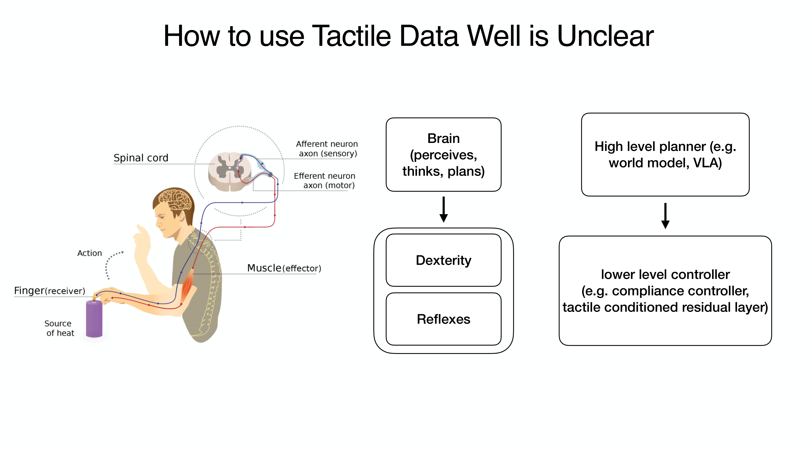

# Chapter 13: Limitations and Future Directions — Toward Physical AI for Manufacturing

## Overview

This book has painted the full picture from tactile sensors to VLA models, from robot hands to industrial deployment. This final chapter systematically organizes the **Top 10 common limitations** across 131 papers, presents **future research directions** in five groups, identifies **ten manufacturing-specific challenges**, and proposes **our research agenda**.

> **After reading this chapter, you will be able to...**
> - List the 10 most common limitations in tactile manipulation research.
> - Describe future directions across 5 research groups (sensing, learning, hardware, data, deployment).
> - Understand the 3-5 year gap between research demonstrations and manufacturing deployment.
> - Explain the mechanism-tactile-learning triangle as a research direction.

---

## 13.1 Top 10 Common Limitations

| Rank | Limitation | Frequency | Core Issue | Related Chapter |
|------|-----------|-----------|-----------|----------------|
| 1 | **Sim-to-Real Gap** | 20+ | Tactile harder than visual | Ch9 |
| 2 | **Novel Object Generalization** | 15+ | Material properties not captured | Ch7, Ch8 |
| 3 | **Sensor Durability** | 12+ | Gel wear, calibration loss | Ch2 |
| 4 | **Data Scarcity** | 12+ | ~10 demos/hr; tactile especially hard. However, EgoScale (NVIDIA, 2026) [21] discovered a log-linear scaling law for human data — with R²=0.998 across 20,854 hours of human data, performance improves predictably as data volume increases. This suggests that systematic data collection directly translates to performance gains | Ch3, Ch6 |
| 5 | **Hardware Cost/Fragility** | 10+ | No MTBF data | Ch4 |
| 6 | **Cross-Embodiment Transfer** | 10+ | Tactile: UniTacHand only. However, rapid progress in kinematic/visual domains during 2024-2026 — EgoMimic (Georgia Tech, 2024) [22]: 1hr human data > 2hr robot data (+34-228%); X-Sim (Cornell, CoRL 2025 Oral) [23]: real task success with zero robot data; VidBot (TU Munich, CVPR 2025) [24]: +20% zero-shot from internet video alone; EgoZero (2025) [25]: 70% success on 7 tasks from smart glasses only. A general solution for the tactile domain remains elusive, but cross-embodiment transfer possibilities are expanding rapidly | Ch10 |
| 7 | **Multi-Modal Fusion Timing** | 8+ | Vision 30Hz vs tactile 1000Hz | Ch8, Ch11 |
| 8 | **Safety in Human Proximity** | 7+ | ISO/TS 15066 not met | Ch5 |
| 9 | **Long-Horizon Task** | 7+ | Error compounding beyond 5-30s | Ch8 |
| 10 | **Evaluation Standardization** | 6+ | No established benchmark | Ch11 |

---

## 13.2 Future Research Directions (5 Groups)

### A. Sensing & Perception
- Tactile foundation models at scale (Sparsh 460K → 10x+ needed)
- Neuromorphic sensors: spike-based, event-driven (NRE-skin)
- Self-healing/self-calibrating sensors for industrial longevity
- Sensor-agnostic representations (AnyTouch, Sensor-Invariant)
- Whole-hand dense tactile coverage as standard (F-TAC direction)
- **Affordable compact F/T sensors**: CoinFT [Choi et al., 2024] demonstrated that 6-axis F/T sensing at <$10 is achievable, but key challenges remain — vulnerability to tensile/peeling forces and the need for standardized packaging across different hand morphologies [Choi, SNU Seminar 2026]

### B. Learning & Control
- VLA + tactile as first-class modality (ForceVLA [#1](https://terry.artlab.ai/en/posts/2505-forcevla-force-aware-moe), Tactile-VLA)
- Post-deployment RL for continuous improvement (pi0.6 [#4](https://terry.artlab.ai/en/posts/2511-pi0-6-recap)/RECAP)
- One-demo/zero-demo learning from human video
- World models with tactile feedback for model-based planning
- Hierarchical VLA for long-horizon dexterous tasks with error recovery

### C. Hardware & Design
- Sub-$1K dexterous hands with integrated tactile (LEAP cost + F-TAC sensing)
- Modular, replaceable sensor skin (AnySkin 12-second replacement)
- Variable stiffness for safety + dexterity co-optimization (Seminar 3)
- Standardized hand-sensor integration (Digit Plexus direction)

### D. Data & Simulation
- Tactile simulation fidelity (DiffTactile, TacEx)
- Massive synthetic data (NVIDIA 780K approach for tactile)
- Shared tactile datasets (Touch-and-Go 3M → 100M+)
- Cross-embodiment data reuse (OXE for hands)
- **Explosive growth in egocentric data collection**: EgoDex (Apple, 2025) [26] provides 829 hours and 90 million frames of hand manipulation data, while Ego4D (Meta) [27] offers 3,670 hours from 931 participants. Human egocentric video is emerging as a key data source for robot learning (→ Ch6.5)
- **Scaling-law-driven data strategy**: The log-linear scaling law discovered by EgoScale (NVIDIA, 2026) [21] (R²=0.998) demonstrates that systematically increasing human data volume yields predictable robot performance gains. This provides a quantitative basis for estimating ROI on data collection investments

### E. Deployment & Application
- Safety certification for human-proximity dexterous manipulation
- Quality inspection via touch (defects invisible to cameras)
- Deformable object manipulation at production speed
- Multi-robot collaborative manipulation (Helix dual-robot)

---

## 13.3 Ten Manufacturing-Specific Challenges

The gap from research demonstration to manufacturing floor is typically **3-5 years**:

| Challenge | Severity | Expected | Related Chapters |
|-----------|----------|----------|-----------------|
| Cycle time matching | Critical | 3-5 yrs | Ch7, Ch8 |
| Multi-shift reliability (24/7) | Critical | 2-4 yrs | Ch2, Ch4 |
| Safety certification | Critical | 2-3 yrs | Ch5 |
| Sub-mm assembly + force control | High | 3-5 yrs | Ch7, Ch10 |
| Deformable material handling | High | 2-4 yrs | Ch7, Ch5 |
| Tool use (screwdriver, wrench) | High | 3-5 yrs | Ch7 |
| Maintenance by technicians | High | 2-4 yrs | Ch4, Ch12 |
| Mixed small-part bin picking | Medium | 1-3 yrs | Ch7 |
| Tactile quality inspection | Medium | 2-4 yrs | Ch2, Ch11 |
| ROI vs traditional automation | Medium | Ongoing | Ch12 |

> **Key Observation**: Current factory deployments (BMW, Amazon, Mercedes) are at the logistics level. **Dexterous assembly has not reached production.** This book has clearly distinguished these capability levels.

---

## 13.4 Our Research Agenda: The Mechanism-Tactile-Learning Triangle

Synthesizing insights from all 12 preceding chapters into a unified research direction:

**Axis 1 — Mechanism (Physical Intelligence)**:
When intelligent mechanisms induce continuous contact (→ Chapter 5), state stability improves and control simplifies.

**Axis 2 — Tactile (Sensing)**:
When tactile sensors recognize the contact state during continuous contact (→ Chapter 2), finer force control and slip detection become possible. CoinFT's multi-axis sensing at ~360 Hz and ACP's ~500 Hz compliance control demonstrate that the required temporal resolution is achievable with current hardware [Choi, SNU Seminar 2026].

**Axis 3 — Learning (VLA/Diffusion)**:
When VLA/Diffusion Policy leverages tactile feedback from stable contact (→ Chapters 7, 8), sample efficiency and generalization improve. The UMI-FT results validate this: policies trained with in-the-wild data achieved **100% success** in unseen environments, versus 20% for lab-only training — demonstrating that data diversity enabled by scalable collection (Axis 2) directly improves learning (Axis 3) [Choi, SNU Seminar 2026].

> **Core Proposition**: When mechanism physically guarantees continuous contact, tactile recognizes the contact state, and learning exploits this information — the burden on each axis is reduced and overall system robustness improves.

### Additional Directions

- **Shared Sensing Platform**: Generalizing OSMO [#18](https://terry.artlab.ai/en/posts/2512-osmo-tactile-glove)/UniTacHand [#16](https://terry.artlab.ai/en/posts/2512-unitachand) cross-embodiment tactile transfer (→ Chapter 10.4)
- **Factory-Specific Foundation Model**: Tactile-visual foundation model specialized for factory environments
- **Open Hardware + Open Data**: Sub-$2K hands + Touch100k-scale dataset expansion
- **Continuous-Contact Manipulation**: Seminar 3's original insight — mechanism-induced continuous contact reduces sensing/learning burden

### Key Counterintuitive Findings from 2024-2026

Recent studies report results that challenge conventional assumptions about robot learning:

1. **1 hour of human data > 2 hours of robot data**: EgoMimic [22] demonstrated that 1 hour of human demonstrations outperforms 2 hours of robot teleoperation by +34-228%. The quality and diversity of human data overwhelms the quantity of robot data.

2. **Human data alone can control robots**: X-Sim [23] achieved real robot task success with zero robot data using only human video, EgoZero [25] achieved 70% success on 7 tasks from smart glasses demonstrations alone, and VidBot [24] achieved +20% zero-shot performance from internet videos only.

3. **Log-linear scaling: more human data yields predictably better performance**: EgoScale [21] discovered a log-linear scaling law (R²=0.998) across 20,854 hours of human data. Analogous to scaling laws in large language models, this implies that systematic investment in human data collection leads to predictable improvements in robot performance.

> **Implications**: These three findings challenge the prevailing paradigm that "robot learning requires robot data." Large-scale collection of human egocentric data combined with cross-embodiment transfer may be the key pathway to resolving the data bottleneck in tactile robotics.

---

## Closing Message

Tactile sensing is the **last puzzle piece** of robotic manipulation. Three converging trends — cost reduction of vision-based sensors (GelSight → DIGIT $350 → Digit 360), democratization of open-source hands (Shadow $100K → LEAP $2K), and emergence of foundation models (RT-2 → pi0 → Gemini Robotics) — are driving tactile robotics at unprecedented speed.

As of 2026, touch is no longer optional. It is becoming **standard**.

And converting this standard into dexterous manipulation on manufacturing floors is the core challenge of **"Physical AI for Manufacturing"** — the vision this book proposes.

---

## References

1. Various. (2023). DeXtreme. *ICRA 2023*.
2. Various. (2025). Tactile Robotics: Past and Future. *arXiv:2512.01106*.
3. Bhirangi, R., et al. (2024). AnySkin. *ICRA 2025*.
4. Zhao, Z., Li, W., Li, Y., Liu, T., Li, B., Wang, M., Du, K., Liu, H., Zhu, Y., Wang, Q., Althoefer, K., & Zhu, S.-C. (2025). Embedding high-resolution touch across robotic hands enables adaptive human-like grasping. *Nature Machine Intelligence*. https://doi.org/10.1038/s42256-025-01053-3
5. Various. (2025). NRE-skin. *PNAS*.
6. Various. (2026). Bioinspired spiking architecture. *Nature Communications*.
7. Yu, J., et al. (2025). ForceVLA: Enhancing VLA models with a force-aware MoE for contact-rich manipulation. *NeurIPS 2025*. [#1](https://terry.artlab.ai/en/posts/2505-forcevla-force-aware-moe)
8. Various. (2025). Tactile-VLA. *OpenReview*.
9. Physical Intelligence. (2025). pi0.5/RECAP: Post-deployment RL for continuous improvement. *arXiv preprint*. arXiv:2504.16932. [#4](https://terry.artlab.ai/en/posts/2511-pi0-6-recap)
10. Shaw, K., et al. (2024). Learning from internet videos. *CMU*.
11. Si, Z., Zhang, G., Ben, Q., Romero, B., Xian, Z., Liu, C., & Gan, C. (2024). DiffTactile: A physics-based differentiable tactile simulator. *ICLR 2024*.
12. Various. (2024). TacEx: GelSight tactile simulation in Isaac Sim. *arXiv preprint*. arXiv:2411.04776.
13. NVIDIA. (2026). 780K trajectories in 11 hours. *GTC 2026*.
14. Various. (2025). OSMO. *arXiv:2512.08920*. [#18](https://terry.artlab.ai/en/posts/2512-osmo-tactile-glove)
15. Zhang, Y., et al. (2025). UniTacHand. *Various*. [#16](https://terry.artlab.ai/en/posts/2512-unitachand)
16. Bicchi, A. (2000). Hands for dexterous manipulation. *IEEE T-RA*.
17. Billard, A., & Kragic, D. (2019). Trends and challenges. *Science*.
18. Various. (2026). VLA systematic review. *Information Fusion*.
19. Various. (2025). What matters in building VLA models. *Nature MI*.
20. Hogan, N. (1985). Impedance control. *JDSMC*.
21. Bansal, A., et al. (2026). EgoScale: Scaling laws for egocentric human data in robot learning. *arXiv preprint*. NVIDIA Research.
22. Kareer, S., et al. (2024). EgoMimic: Scaling imitation learning via egocentric video. *arXiv preprint*. Georgia Tech.
23. Rishabh, A., et al. (2025). X-Sim: Cross-embodiment simulation for robot learning. *CoRL 2025 (Oral)*. Cornell University.
24. Bahl, S., et al. (2025). VidBot: Learning robot policies from internet videos. *CVPR 2025*. TU Munich.
25. Wang, Y., et al. (2025). EgoZero: Robot learning from smart glasses demonstrations. *arXiv preprint*.
26. Apple ML Research. (2025). EgoDex: Learning dexterous manipulation from large-scale egocentric video. 829 hours, 90M frames. *arXiv preprint*.
27. Grauman, K., et al. (2022). Ego4D: Around the world in 3,000 hours of egocentric video. *CVPR 2022*. Meta AI. 3,670 hours, 931 participants.
