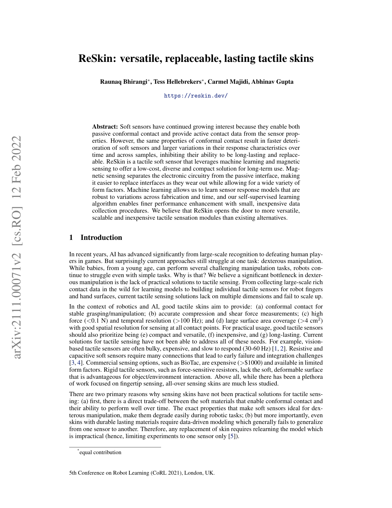
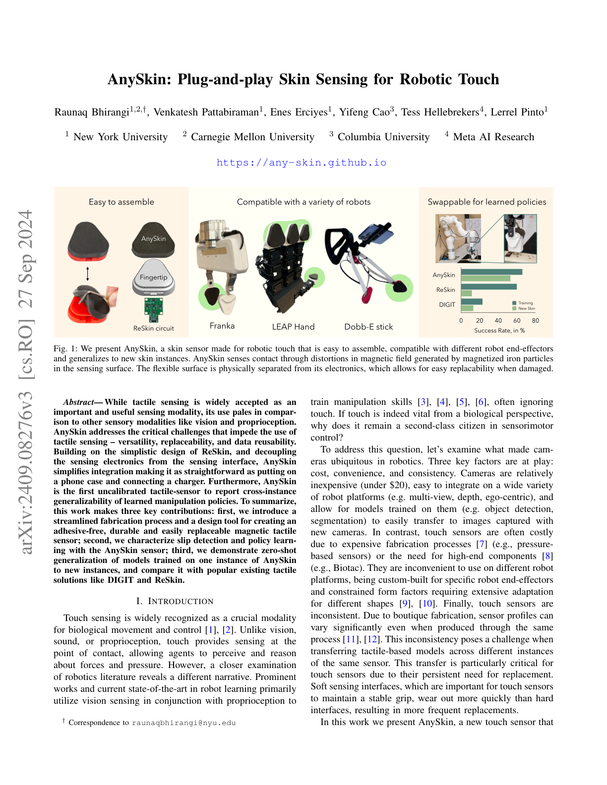
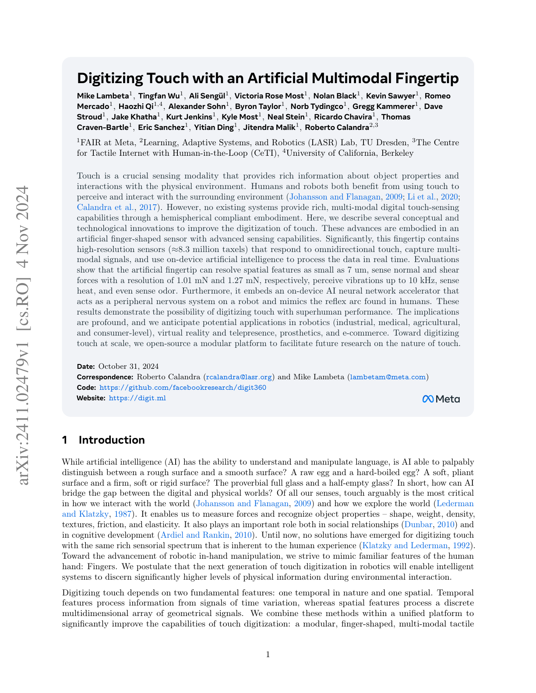
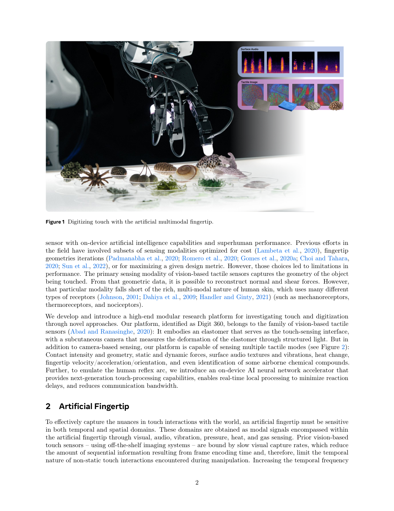
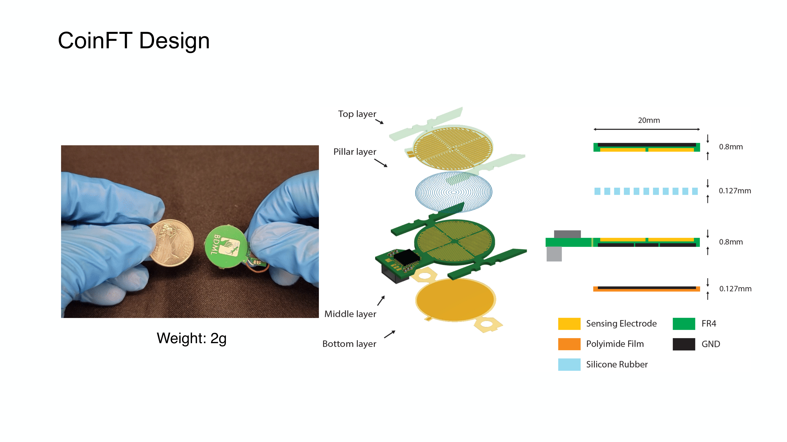
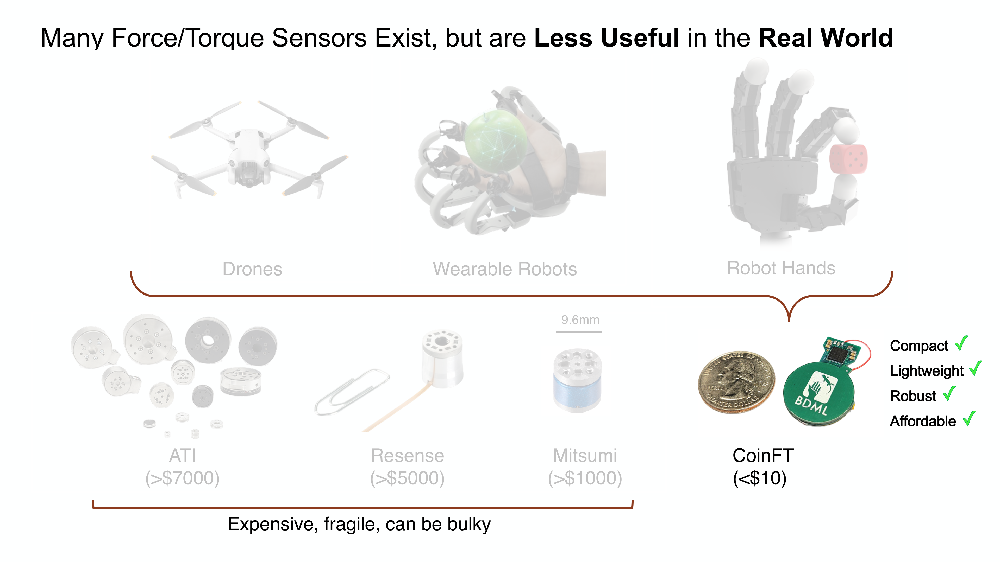
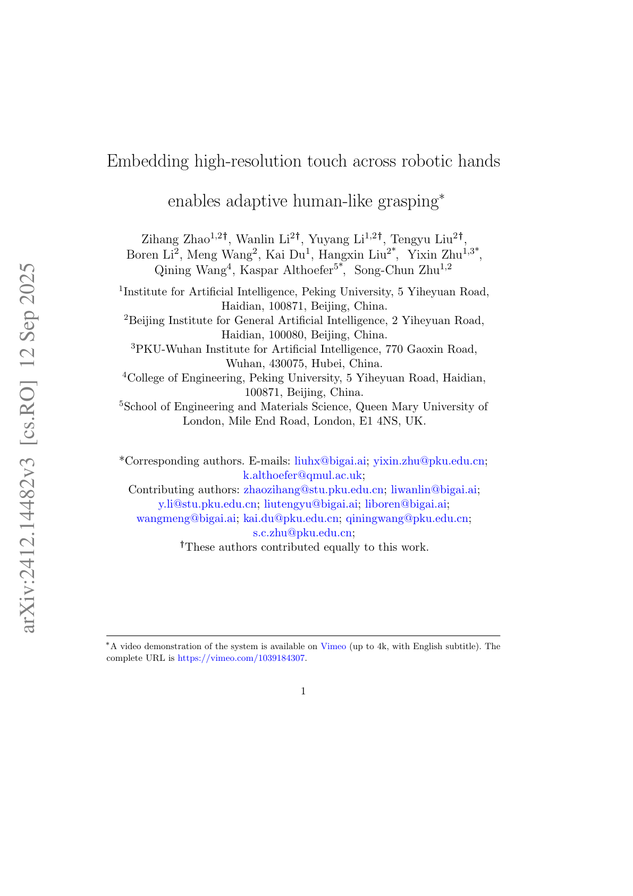
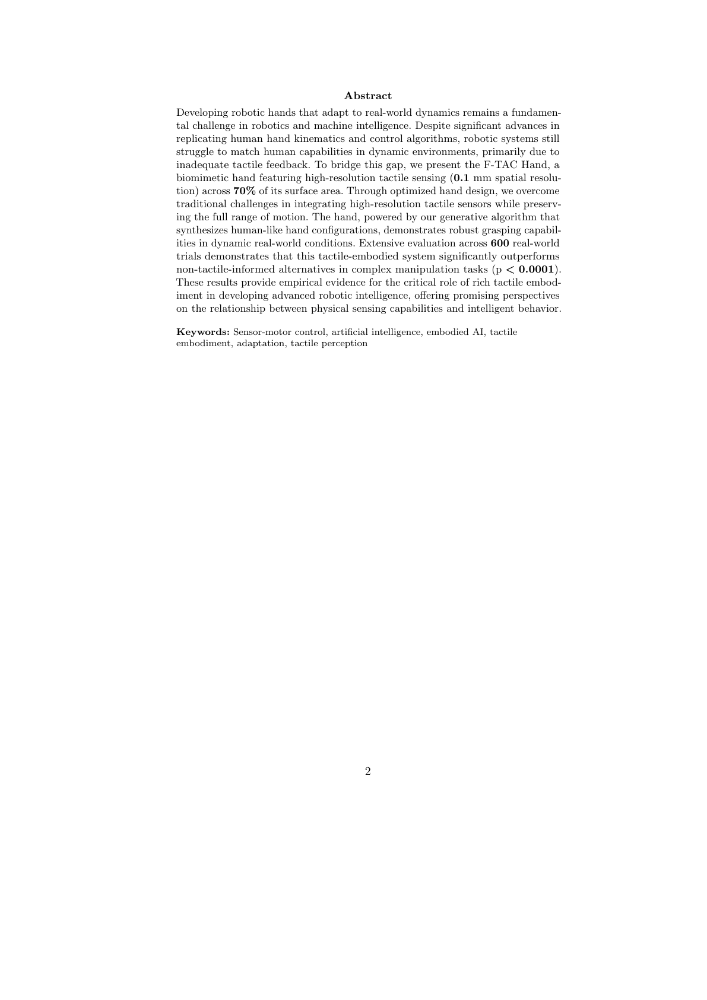

# Chapter 2: 촉각 센서 기술 — 로봇의 피부

## 개요

Chapter 1에서 촉각이 로봇 조작에 왜 필수적인지를 논의했다면, 이 챕터에서는 그 촉각을 **물리적으로 구현하는 센서 기술**을 다룹니다. 압저항식에서 비전 기반 광학 센서까지, 다양한 변환(transduction) 원리를 살펴보고, 최신 Digit 360과 F-TAC Hand에 이르는 통합 설계의 최전선을 조망합니다.

> **이 챕터를 읽고 나면...**
> - 주요 촉각 센서의 물리적 변환 원리를 설명할 수 있습니다.
> - 비전 기반 광학 촉각 센서의 작동 메커니즘과 장단점을 이해합니다.
> - 다축 센싱의 필요성과 구현 방법을 파악합니다.
> - 응용에 따른 센서 선택 기준을 제시할 수 있습니다.

---

## 2.1 센서 물리: 변환 원리별 분류

촉각 센서는 물리적 접촉을 전기 신호로 변환하는 방식에 따라 분류됩니다. Dahiya et al. [2010]의 체계를 기반으로, 주요 변환 방식을 정리합니다.

### 2.1.1 압저항식 (Piezoresistive)

접촉에 의한 물질의 저항 변화를 측정합니다. 구조가 단순하고 비용이 낮아 가장 널리 사용되는 방식 중 하나입니다. Sundaram et al. [2019]의 STAG 글로브는 548개의 압저항 센서를 인간 손에 배치하여, 물체를 잡을 때의 힘 분포를 높은 공간 해상도로 기록했습니다 (*Nature*, 2019).

**상용 제품 사례**:

| | |
|:---:|:---:|
|  |  |
| Interlink FSR 400 | Tekscan FlexiForce A201 |

- **Interlink FSR 400**: 단일 감지 영역의 FSR(Force Sensing Resistor). PTF(Polymer Thick Film) 기반으로, 힘이 커질수록 저항이 감소하는 원리를 이용합니다.
- **Tekscan FlexiForce A201**: 초박형 piezoresistive force sensor. 4.4 N / 111 N / 445 N 범위 옵션을 제공합니다.

- **Sensible Robotics**: 약 2 mm pitch의 80-taxel piezoresistive 촉각 어레이. 0.1 N 미만부터 100 N까지의 힘을 최대 1 kHz로 측정하며, 80 dB 이상의 dynamic range, 12-bit 출력, 100만 회 내구성, I2C/SPI/USB/UART/CAN 인터페이스를 지원합니다.

**장점**: 낮은 비용, 단순 구조, 높은 감도, 얇은 폼 팩터로 로봇 손가락/그리퍼에 부착이 용이
**단점**: 히스테리시스(hysteresis), 온도 의존성, 반복 사용 시 드리프트, 절대 힘(absolute force) 측정이 어려움

### 2.1.2 정전용량식 (Capacitive)

두 전극 사이의 정전용량(capacitance) 변화를 측정합니다. Murphy et al. [2025]은 102개의 정전용량 센서를 이용한 시연 학습(teaching by demonstration)을 구현했습니다. 정전용량식 센서는 힘의 크기뿐 아니라 근접(proximity) 감지도 가능하여, 접촉 전 사전 정보를 제공할 수 있습니다.

**상용 제품 사례**:

| | |
|:---:|:---:|
|  |  |
| Robotiq TSF-85 | PPS RoboTact |

- **Robotiq TSF-85**: Capacitive array 기반 센서. 28 taxels, 1000 Hz 샘플링, 0–225 N 범위를 제공합니다.
- **PPS (Pressure Profile Systems) RoboTact**: Capacitive tactile sensing 기반의 유연한 촉각 센서 시스템입니다.

**주목할 연구 설계 — CoinFT [Choi et al., 2024]**: 동전 크기의 소형 정전용량식 **6축 힘/토크 센서** — 두께 2 mm, 무게 2 g, 재료비 $10 미만. 빗살(comb) 패턴 전극이 있는 두 장의 PCB를 실리콘 고무 기둥(pillar) 배열로 연결한 구조입니다. 칩의 내부 전극 재구성 기능을 활용하여 단일 PCB 쌍에서 6축 모두를 센싱합니다. 기둥 직경(100-200 μm)과 재료를 조절하면 감도와 동적 범위를 응용별로 최적화할 수 있습니다. ~360 Hz 샘플링, 해머 충격 시험에서도 작동 — 비구조 환경의 우발적 접촉에 강합니다. 학술용 오픈소스 공개 (→ 2.3절 상세 비교 참조).

**장점**: 높은 감도, 반복성(repeatability), 안정성(stability)이 강점. 정적 힘/압력 분포를 안정적으로 읽기 좋으며, 설계 유연성과 근접 감지가 가능
**단점**: 기생 정전용량(parasitic capacitance), 긴 배선 노이즈, 프론트엔드 전자 회로의 복잡도가 높으며, 전자기 간섭(EMI)에 취약

### 2.1.3 광학식 — 비전 기반 촉각 센서 (Optical / Vision-Based)

투명한 젤(gel) 또는 탄성체의 변형을 내장 카메라로 촬영하여 접촉 정보를 추출합니다. 이 방식이 현재 촉각 로봇 연구의 **주류 패러다임**이 되었습니다 — 다음 섹션(2.2)에서 상세히 다룹니다.

### 2.1.4 자기식 (Magnetic)

자석과 홀 효과(Hall effect) 센서 또는 자기 저항(magnetoresistive) 센서의 조합으로 변형을 측정합니다. ReSkin [Bhirangi et al., 2021]은 자기 탄성체(magnetic elastomer) 기반으로 단가 $6 미만, 두께 2-3mm, 50,000회 이상 반복 사용 가능한 촉각 피부를 구현했습니다. 전자부와 감지부의 분리 설계가 핵심으로, AnySkin [Bhirangi et al., 2024]은 이를 발전시켜 **12초 만에 교체 가능**한 플러그 앤 플레이 방식을 달성했습니다 — 재교정(recalibration) 없이 92%의 미끄러짐 감지 정확도를 유지합니다.

> **핵심 논문**: Bhirangi, R., Hellebrekers, T., Majidi, C., & Gupta, A. (2021). "ReSkin: Versatile, Replaceable, Lasting Tactile Skin [#13](https://terry.artlab.ai/ko/posts/2407-tactile-skin-inhand-translation)s." *arXiv preprint*.
> 자기 탄성체 기반의 저비용($6/개), 교체 가능한 촉각 피부. 산업 환경에서의 센서 내구성 문제에 대한 실용적 해답을 제시했습니다.

**상용 제품 사례**:

| | |
|:---:|:---:|
|  |  |
| XELA uSkin | ReSkin |

- **XELA uSkin**: 얇고 유연한 패키지에서 3축 촉각 센싱을 제공. 센싱 포인트당 전단력과 법선력을 동시에 측정하며, 모듈당 최대 64 sensing points, 0.1 gf 해상도, 500 Hz 샘플링을 지원합니다.

OSMO 글로브 [2025] [#18](https://terry.artlab.ai/ko/posts/2512-osmo-tactile-glove)는 12개의 3축 자기 센서를 사용하여 법선력과 전단력을 동시에 측정하며, MuMetal 차폐로 외부 자기장 간섭을 억제합니다 (→ Chapter 6.3 참조).

### 2.1.5 압전식 (Piezoelectric)

압전 물질(PZT, PVDF 등)이 변형 시 전하를 생성하는 원리를 이용합니다. 정적 힘보다 동적 변화(진동, 질감)의 감지에 적합하여, Pacinian 소체의 기능적 등가물로 활용됩니다. 에너지 하베스팅(energy harvesting)과 결합하면 자가 전원 센서도 가능합니다 [Yu et al., 2025].

**상용 제품 사례**:

- **TE Connectivity DT1-028K**: Piezo film sensor element. 기계 자극에 대한 감도가 높고, 진동/충격/과도 현상(transient) 감지에 강합니다. 다만 정적 힘 측정에는 한계가 있으며, 표면 전하가 중화되어 지속적인 하중을 안정적으로 읽기 어렵습니다.

### 2.1.6 스트레인 게이지 / MEMS (Strain-Gauge / MEMS)

스트레인 게이지 기반 센서는 외력에 의한 탄성체의 미세 변형을 전기 저항 변화로 측정합니다. 특히 6축 힘/토크(F/T) 센서로 널리 사용되며, 높은 정확도와 해상도가 강점입니다.

**상용 제품 사례**:

| | |
|:---:|:---:|
|  |  |
| ATI Nano17 | Adin Miniature FT |

- **ATI Nano17**: 직경 17 mm, 높이 14.5 mm의 소형 상용 6축 F/T 센서. Silicon strain gauge와 높은 SNR이 강점입니다.
- **Adin Miniature FT**: 직경 15 mm, 높이 10.5 mm로 Nano17보다 더 소형화된 6축 F/T 센서입니다.

6축 F/T 센서의 설계 공간은 다양한 변환 방식으로 탐색되어 왔습니다. Kim et al. [2017]은 광학 측정 원리를 이용한 광전자식 6축 F/T 센서를 개발했고 (*IEEE/ASME Trans. Mechatronics*), Palli et al. [2014]은 cross-beam 설계에 photodetector/LED 반사광 측정 방식을 제안했습니다 (*Sensors and Actuators A*). 비전 기반 측에서는 Fernandez et al. [2021]이 소형 카메라를 이용한 저비용 유연 촉각 손가락 끝 Visiflex를 소개하여 (*IEEE RA-L*) 비전 기반 촉각 센싱과 F/T 측정을 결합했습니다.

이런 연구 다양성에도 불구하고, 상용 6축 F/T 센서는 **매우 고가**입니다: ATI >$7,000, Mitsumi >$1,000, Resense >$5,000 [Choi, SNU 세미나 2026]. 또한 매우 취약하여 — 낙하 시 교정이 틀어지고, 수리비가 수천 달러에 달합니다. Flexiv, OnRobot 같은 산업용 로봇 기업이 협동로봇에 F/T 센싱을 통합하고 있으나 센서 자체는 여전히 고가 OEM 부품입니다. 이러한 제약은 소형 로봇 핸드, 웨어러블 로봇, 드론에 기존 F/T 센서를 장착하는 것을 사실상 불가능하게 만들어, CoinFT 같은 저가 대안 연구를 촉진합니다 (→ 2.1.2절 참조).

**장점**: 정확도, 해상도, 교정(calibration) 품질이 우수. 손목/손가락 끝 F/T 측정에 적합
**단점**: 넓은 면적의 soft tactile skin 용도보다는 포인트 F/T 센싱에 특화. 가격이 높고($7K+) 대면적 확장성이 불리; 충격에 취약

### 2.1.7 유체/공압식 (Fluidic / Pneumatic)

유체(액체 또는 공기)의 압력 변화를 통해 접촉력을 측정합니다. 내부 유체가 외력에 의해 변형되면 압력 센서가 이를 감지하는 구조로, 인간 손가락 끝의 접촉 거동에 가까운 유연성(compliance)을 구현할 수 있습니다.

**상용 제품 사례**:

| | |
|:---:|:---:|
|  |  |
| SynTouch BioTac | Allegro Hand V5 Plus fingertip pressure sensor |

- **SynTouch BioTac**: 힘, 진동, 온도를 동시에 감지하며, 유체 압력(fluid pressure)과 피부 변형(skin deformation)을 결합한 다감각 센서입니다. Rigid core + skin + fluid 구조로 인간 손가락 끝에 가까운 감지 특성을 제공합니다.
- **Allegro Hand V5 Plus fingertip pressure sensor**: 정전용량 압력 센서를 이용한 공압 기반(pneumatic) 촉각 센서. 전방위(omnidirectional) 접촉 감지가 가능합니다.

**장점**: 유연성(compliance)이 좋고, 인간 손가락 끝에 가까운 접촉 거동 구현 가능. 취약한 물체 파지, 미끄러짐, 질감 인식에 강점
**단점**: Chamber/유체/실링/패키징 구조가 복잡하여 thin-film array 대비 부피가 크고 통합 난이도가 높음. 실사용 시 **내부 액체 누출로 인한 부식**이 빈번한 문제로 보고됨

### 2.1.8 열감지식 (Thermal)

열 구배(thermal gradient)를 측정하여 접촉 물체의 재질(thermal property)을 판별합니다. 히터(heater)와 서미스터(thermistor)를 조합하여 물체와의 열전달 차이를 감지합니다.

**상용 제품 사례**:

- **SynTouch BioTac SP**: BioTac의 열감지 모달리티를 소형 단일 지절(single-phalanx) 형태로 제공합니다.

**장점**: 금속/플라스틱/목재 등 재질 구분에 유리. 열적 단서(thermal cue) 기반 재질 인식(material recognition)에 강점
**단점**: 열 채널은 힘 채널보다 응답이 느리고, 주변 온도와 접촉 지속 시간의 영향을 많이 받음

### 변환 방식 비교

| 특성 | 압저항식 | 정전용량식 | 광학/비전 기반 | 자기식 | 압전식 | 스트레인 게이지 | 유체/공압식 | 열감지식 |
|------|---------|----------|-------------|--------|--------|------------|----------|---------|
| **공간 해상도** | 중간 | 중간 | 매우 높음 | 낮음-중간 | 낮음 | 낮음 (포인트) | 중간 | 낮음 |
| **힘 범위** | 넓음 | 넓음 | 중간 | 중간 | 넓음 (동적) | 매우 넓음 | 중간 | — |
| **다축 감지** | 어려움 | 가능 | 우수 | 우수 | 어려움 | 우수 (6축) | 가능 | — |
| **내구성** | 보통 | 보통 | 낮음 (젤 마모) | 높음 | 높음 | 매우 높음 | 보통 (누출) | 보통 |
| **비용** | 매우 낮음 | 낮음 | 중간 | 낮음 | 중간 | 높음 | 높음 | 높음 |
| **크기** | 소형 | 소형 | 대형 (카메라) | 소형 | 소형 | 소형 | 대형 (유체) | 소형 |
| **대표 센서** | FSR 400, STAG | Robotiq TSF-85 | GelSight, DIGIT | ReSkin, XELA uSkin | DT1-028K | ATI Nano17 | BioTac | BioTac SP |

> **용도별 간단 선택 가이드**: 가장 무난한 범용형은 **정전용량식**, 가장 정보량이 큰 연구형은 **광학/비전 기반**, 전단력/미끄러짐까지 보려면 **자기식**, 진동/미세 미끄러짐만 잡으려면 **압전식**, 생체모방(biomimetic) 손가락 끝을 원하면 **유체/공압식** 계열을 추천합니다.

---

## 2.2 비전 기반 촉각 센서: GelSight에서 Digit 360까지

비전 기반 광학 촉각 센서(vision-based optical tactile sensor)는 2017년 GelSight의 등장 이후 촉각 연구의 주류가 되었습니다. 이 센서군의 핵심 원리는 **광도 입체법(photometric stereo)**입니다: 탄성 젤 표면에 내장된 LED가 빛을 비추고, 접촉에 의한 젤 변형을 카메라가 촬영하여 3D 접촉 지도(contact map)를 재구성합니다.

### GelSight (2017)

Yuan, Dong, & Adelson [2017]이 MIT CSAIL에서 개발한 GelSight는 광도 입체법을 이용하여 접촉면의 3D 형상을 마이크로미터 수준으로 복원합니다. 이 센서는 촉각 연구에 "비전의 도구"를 가져왔다는 점에서 패러다임 전환적 기여를 했습니다 — 기존의 전기적 변환 방식과 달리, 이미지 처리와 딥러닝의 풍부한 도구 생태계를 직접 활용할 수 있게 되었습니다.

> **핵심 논문**: Yuan, W., Dong, S., & Adelson, E. H. (2017). "GelSight: High-Resolution Robot Tactile Sensors for Estimating Geometry and Force." *Sensors*, 17(12), 2762.
> 광도 입체법 기반 고해상도 3D 촉각 센서의 기초 논문. 600회 이상 인용으로, 비전 기반 촉각 센서 패러다임의 시작점입니다.

### GelSight Wedge (2021)

Wang et al. [2021]은 GelSight의 쐐기(wedge) 형태 변형을 개발하여, 표준 로봇 그리퍼에 장착할 수 있는 소형 폼 팩터를 달성했습니다. 원형 GelSight가 연구용으로만 적합한 크기였다면, Wedge는 실제 로봇 시스템에의 통합을 가능하게 했습니다.

### DIGIT (2020)

Meta FAIR의 Lambeta et al. [2020]이 개발한 DIGIT은 소형화와 저비용화의 이정표입니다. **$350**이라는 가격은 기존 BioTac ($5K-10K) 대비 10배 이상 저렴하며, 소형 폼 팩터로 다지 핸드의 각 손가락에 장착이 가능합니다. DIGIT은 촉각 연구의 민주화에 결정적 기여를 했으며, 이후 수많은 후속 연구의 표준 센서로 자리잡았습니다.

### Digit 360 (2024)

Lambeta et al. [2024]의 Digit 360은 현재까지 가장 포괄적인 인공 손가락(artificial fingertip)입니다:

- **8.3M taxels**: 약 830만 개의 촉각 감지점
- **18+ 센싱 모달리티**: 3D 형상, 힘 (법선 + 전단), 진동, 온도, 근접 등
- **전방위(omnidirectional)** 촉각: 손가락 전체 표면을 커버
- **1mN 힘 분해능**: 인간 수준에 근접하는 민감도

이 센서는 단일 손가락에 인간의 여러 수용기 유형에 상응하는 다중 모달 감지를 통합했다는 점에서, 인공 촉각의 "완전체"에 가까운 시도입니다.

### 모듈러 GelSight 설계 (2025)

Agarwal et al. [2025]은 GelSight 계열 센서의 체계적 모듈러 설계 프레임워크를 제안했습니다 (*IJRR*). 젤 물질, 조명 배치, 카메라 위치, 하우징을 모듈 단위로 조합하여 응용에 맞는 센서를 커스터마이징할 수 있습니다.

### 비전 기반 F/T 센싱: Visiflex (2021)

Fernandez et al. [2021]은 단일 카메라로 힘, 토크, 접촉 기하를 추정하는 저비용 유연 촉각 손가락 끝 Visiflex를 소개했습니다 (*IEEE RA-L*). Photometric stereo 방식(GelSight, DIGIT)과 달리, 탄성체 내 마커 변위를 추적하여 6축 F/T를 추론합니다 — 비전 기반 센싱의 접근성과 다축 힘 측정을 결합한 중간 지점입니다.

### 비전 기반 센서의 한계

비전 기반 센서의 가장 큰 한계는 **내구성**입니다. 젤 표면은 반복 접촉으로 마모되며, 조명원의 열화, 먼지 침입, 세척 어려움이 산업 환경에서의 장기 운용을 제약합니다. F-TAC Hand [2025]가 17개의 센서를 손 전체에 배치했을 때, 이는 곧 17개의 잠재적 고장점을 의미합니다. AnySkin [2024]의 12초 교체 접근은 이 문제의 실용적 해결책 중 하나입니다 (→ Chapter 13.1 참조).

---

## 2.3 다축 센싱: 법선력과 전단력의 중요성

세미나 2 (Taejoon)에서 강조된 바와 같이, **법선력(normal force)만으로는 불충분**합니다. 전단력(shear force)은 미끄러짐 감지, 물체 방향 추정, 힘/잡음 분리에 필수적입니다.

### 다축 센싱의 동기

- **효율적 로봇 학습**: 다차원 촉각 정보는 정책 학습의 샘플 효율성을 높입니다 [Yin et al., 2025]
- **미끄러짐 감지**: 전단 방향의 힘 변화가 미끄러짐의 선행 지표 [Hossain et al., 2025]
- **물체 방향 감지**: 접선 힘 벡터로 물체의 기울기를 추정 [Lach et al., 2023]
- **힘/잡음 분리**: 다축 정보로 실제 접촉 힘과 센서 노이즈를 구분 [Cho et al., 2025]

### 세미나 2의 다축 센서

세미나 2에서 소개된 자체 개발 다축 촉각 센서는 10x10x6.5mm 크기로:
- 법선력: ~50N 범위
- 전단력: ~5N 범위
- 샘플링 속도: 100Hz
- 로봇 핸드 적용 검증 완료

이 소형 다축 센서는 비전 기반 센서의 부피 문제를 해결하면서도 전단력 정보를 제공한다는 점에서 의미가 있습니다.

### CoinFT: 소형 다축 센싱의 사례 연구

CoinFT [Choi et al., 2024]는 비전 기반 센서와 기존 스트레인 게이지 F/T 센서 모두에 대한 대안으로, 정전용량식 6축 센서를 동전 크기(2 g, <$10)로 구현했습니다.

| 항목 | ATI Nano17 | Mitsumi | CoinFT | 세미나 2 센서 |
|------|-----------|---------|--------|-------------|
| **축** | 6 | 6 | 6 | 3+ (법선+전단) |
| **크기** | Ø17 × 14.5 mm | — | **2 mm 두께, 동전 크기** | 10 × 10 × 6.5 mm |
| **무게** | 9.1 g | — | **2 g** | — |
| **비용** | >$7,000 | >$1,000 | **<$10** | 연구 프로토타입 |
| **샘플링** | 7,000 Hz | — | ~360 Hz | 100 Hz |
| **견고성** | 취약 (낙하=재교정) | 보통 | **해머 충격 견딤** | — |
| **오픈소스** | 아니오 | 아니오 | **예 (학술용)** | 아니오 |

CoinFT의 조절 가능한 설계(기둥 직경, 재료, 패턴 변경)는 특정 응용에 맞는 최적화를 가능하게 합니다. 전 세계 다수 대학에서 채택되었으며, DexForce [Chen et al., 2025]에서 다지 핸드에 통합되어 사용됩니다 (→ Chapter 7.4 참조).

**CoinFT의 원 연구실을 넘은 채택 사례**: CoinFT의 오픈소스 설계는 다양한 연구 분야에서 채택을 가능하게 했습니다:
- **햅틱 장치**: Winston et al. [2025]은 Fourigami라는 4-DoF 힘 제어 종이접기 손가락 패드 햅틱 장치에 CoinFT를 통합, 햅틱 렌더링 중 폐쇄 루프 힘 제어에 활용 (*IEEE Trans. Robotics*).
- **방향성 햅틱 큐**: Yoshida et al. [2024]은 전완부 방향성 전단 햅틱 큐 연구에서 CoinFT로 접촉력 초기화 및 제어 (*IEEE Trans. Haptics*).
- **웨어러블 햅틱**: Sarac et al. [2022]은 웨어러블 햅틱 브레이슬릿에서 법선/전단 피부 자극의 지각 강도 측정에 CoinFT를 활용 (*IEEE RA-L*).

이러한 응용은 CoinFT의 소형/저가 설계가 로봇 조작을 넘어 — 햅틱, 웨어러블, 인간 지각 연구 등 — 다양한 분야에서 힘 제어 연구를 가능하게 했음을 입증합니다.

> **핵심 논문**: Choi, H., Kim, A., & Cutkosky, M. R. (2024). "CoinFT: A Compact and Affordable Capacitive Six-Axis Force/Torque Sensor." *IEEE Sensors Journal*.
> 오픈소스 동전 크기 6축 F/T 센서. 상용 센서 대비 1/700 가격으로 유사한 정확도를 달성합니다.

> **핵심 논문**: Fang, J., et al. (2025). "Force Measurement Technology of Vision-Based Tactile Sensor." *Advanced Intelligent Systems* (Wiley).
> 비전 기반 촉각 센서에서의 힘 측정 접근법을 체계적으로 리뷰한 서베이. 교정(calibration) 방법과 다축 힘 추정 기법을 포괄합니다.

---

## 2.4 센서 통합 설계: F-TAC Hand 사례

센서의 성능이 아무리 뛰어나도, 로봇 핸드에 통합되지 않으면 실용적 가치가 제한됩니다. F-TAC Hand [2025, *Nature Machine Intelligence*]는 센서 통합 설계의 현 최선 사례입니다:

- **17개 촉각 센서**: 손 표면의 **70%**를 커버
- **0.1mm 해상도**: 미세 특징 감지
- **100% 촉각 기반 적응 성공률**: 다중 물체 파지에서 촉각 피드백을 활용한 적응 성공률 (M=1.000, SD=0.000 vs. 촉각 미사용 시 53.5%, p=2.1×10⁻¹⁷)
- **센서 배치 최적화**: 접촉 확률이 높은 영역에 센서 집중

F-TAC Hand의 성공은 센서 기술 자체보다 **통합 설계 방법론**의 중요성을 보여줍니다. 센서의 종류, 수량, 배치를 핸드 설계와 동시에 최적화(co-optimization)하는 접근이 향후 표준이 될 것입니다.

3D-ViTac [Huang et al., 2024]은 3mm² 밀도의 고밀도 촉각 센서를 시각과 융합하여 통합 3D 표현을 구축하고, Diffusion Policy로 양손 정밀 조작에서 85-90% 성공률을 달성했습니다 — 시각만 사용할 때의 45-50% 대비 크게 향상된 수치입니다 (*CoRL 2024*) (→ Chapter 11.1 참조).

Soft Robotic Hand with Tactile Palm-Finger Coordination [2025, *Nature Communications*]은 유연 로봇 핸드에서 손바닥과 손가락의 촉각 협조를 통해 조작 성능을 향상시켰습니다.

---

## 2.5 센서 유형별 비교와 선택 가이드

센서 선택은 응용의 요구사항에 따라 달라집니다. 아래는 주요 응용 시나리오별 권장 센서 유형입니다:

| 응용 시나리오 | 핵심 요구사항 | 권장 센서 유형 | 대표 사례 |
|-------------|-------------|-------------|----------|
| 연구용 다지 조작 | 고해상도, 저비용 | 비전 기반 (DIGIT) | DeXtreme, Robot Synesthesia |
| 산업용 그리퍼 | 내구성, 다축 | 자기식 (ReSkin/AnySkin) | 공장 자동화 |
| 인간 손 데이터 수집 | 소형, 유연, 다축 | 자기식 (OSMO) | OSMO 글로브 |
| 전체 손 커버리지 | 넓은 면적, 이진 접촉 | 압저항식 어레이 | Yin et al. (2023) |
| 질감/표면 분류 | 고해상도 3D | 비전 기반 (GelSight) | UniTouch |
| 미끄러짐 감지 | 빠른 응답, 전단 감지 | 다축 (자기식/정전용량식) | Universal Slip Detection |

> **핵심 관점**: 센서 선택은 단일 최적해가 아닌, **태스크-센서 적합도(task-sensor fitness)** 관점에서 접근해야 합니다. Albini et al. [2025]의 촉각 데이터 분류 체계(taxonomy)는 센서 하드웨어에서 데이터 표현으로 이어지는 결정 흐름을 체계화했습니다 (→ Chapter 3 참조).

---

## 2.6 최신 동향: 신경형태학적 센서와 자가 치유 센서

### 2.6.1 신경형태학적 촉각 센서 (Neuromorphic Tactile Sensors)

생물학적 신경계를 모방한 신경형태학적(neuromorphic) 센서는 이벤트 기반(event-driven) 처리로 에너지 효율과 시간 해상도를 극대화합니다. NRE-skin [2025, *PNAS*]은 계층적 아키텍처로 고해상도 촉각, 능동 통증/손상 감지, 국소 반사를 통합했으며, 모듈형 퀵릴리스 수리가 가능합니다.

스파이크 기반 신경 코딩 서베이 [2025, *Microsystems & Nanoengineering*]는 CMOS/멤리스터 하드웨어와 SNN(Spiking Neural Network) 디코딩을 결합하여 10배 초해상도(super-resolution)를 달성할 수 있음을 보여줍니다. Bioinspired Spiking Architecture [2026, *Nature Communications*]은 에너지 제약 환경에서의 효율적 촉각 인코딩을 시연했습니다.

### 2.6.2 자가 치유 및 다감각 전자 피부 (Self-Healing and Multisensory E-Skin)

Multisensory Electronic Skin [2025, *PNAS*]은 압력과 온도 감지를 분리(decoupled)하는 전자 피부를 구현했으며, 자가 치유(self-healing) 물질을 통합하여 센서 수명을 연장합니다. 이러한 접근은 산업 환경에서의 촉각 센서 내구성 문제(→ Chapter 13.1 참조)를 근본적으로 해결할 잠재력을 가집니다.

### 2.6.3 물리 기반 렌더링을 통한 센서 설계

Vision-Based Tactile Sensor Design Using Physically Based Rendering [2025, *Nature Communications Engineering*]은 물리 기반 렌더링(PBR)으로 광학 촉각 센서의 설계를 시뮬레이션에서 검증하는 방법을 제안했습니다. 이는 센서 설계의 시행착오를 줄이고, 디지털 트윈(digital twin) 기반 설계를 가능하게 합니다.

---

## 2.7 촉각 센서의 우주 응용

우주 로봇 공학에서의 촉각 센싱은 극한 환경(진공, 극저온, 방사선)에서의 센서 설계 요구사항을 제시합니다. Comprehensive Review of Tactile Sensing Technologies in Space Robotics [2025, *Chinese Journal of Aeronautics*]은 우주 환경 특유의 도전과 센서 설계 전략을 리뷰했습니다. 이러한 극한 환경용 센서 설계의 교훈은 지상의 산업용 센서 설계에도 적용될 수 있습니다.

---

## 요약 및 전망

촉각 센서 기술은 비전 기반 광학 센서의 등장으로 패러다임 전환을 겪었습니다. GelSight($350 수준의 DIGIT)에서 시작하여 Digit 360(8.3M taxels, 18+ 모달리티)에 이르기까지, 해상도와 다중 모달리티는 비약적으로 향상되었습니다. 동시에 ReSkin/AnySkin의 자기식 센서는 $6 수준의 교체 가능한 촉각 피부를 실현하여, 내구성 문제에 대한 실용적 해법을 제시했습니다.

그러나 핵심 과제는 여전합니다: 젤 마모, 재교정(recalibration), 산업 환경 검증, 소형화와 다축 센싱의 동시 달성. Sanctuary AI의 5mN 민감도 촉각 통합이 상용 휴머노이드에서 구현되고, Meta의 Digit Plexus가 표준화된 센서-핸드 인터페이스를 추진하는 등, 촉각이 "옵션에서 표준으로" 전환되는 과도기에 있습니다.

다음 챕터에서는 이러한 센서들이 생성하는 **촉각 데이터의 표현과 수집**을 다룹니다 (→ Chapter 3: 촉각 데이터 참조).

---

## 참고문헌

1. Dahiya, R. S., Metta, G., Valle, M., & Sandini, G. (2010). Tactile sensing: From humans to humanoids. *IEEE Transactions on Robotics*, 26(1), 1-20. https://doi.org/10.1109/TRO.2009.2033627

2. Yuan, W., Dong, S., & Adelson, E. H. (2017). GelSight: High-resolution robot tactile sensors for estimating geometry and force. *Sensors*, 17(12), 2762. https://doi.org/10.3390/s17122762

3. Wang, S., She, Y., Romero, B., & Adelson, E. H. (2021). GelSight Wedge: Measuring high-resolution 3D contact geometry with a compact robot finger. *IEEE ICRA 2021*. https://doi.org/10.1109/ICRA48506.2021.9560783

4. Lambeta, M., Chou, P.-W., Tian, S., Yang, B., Maloon, B., Most, V. R., ... & Calandra, R. (2020). DIGIT: A novel design for a low-cost compact high-resolution tactile sensor with application to in-hand manipulation. *IEEE Robotics and Automation Letters*, 5(3), 3838-3845.

5. Lambeta, M., Wu, T., Sengul, A., & Calandra, R. (2024). Digitizing touch with an artificial multimodal fingertip (Digit 360). *arXiv preprint*, arXiv:2411.02834.

6. Agarwal, A., Mirzaee, M. A., Sun, X., & Yuan, W. (2025). A modularized design approach for GelSight family of vision-based tactile sensors. *International Journal of Robotics Research*. https://doi.org/10.1177/02783649251339680

7. Bhirangi, R., Hellebrekers, T., Majidi, C., & Gupta, A. (2021). ReSkin: Versatile, replaceable, lasting tactile skins. *arXiv preprint*, arXiv:2111.00071. [#13](https://terry.artlab.ai/ko/posts/2407-tactile-skin-inhand-translation)

8. Bhirangi, R., Pattabiraman, V., Norcross, E., Shocher, A., & Pinto, L. (2024). AnySkin: Plug-and-play skin sensing for robotic touch. *ICRA 2025*. arXiv:2409.08276.

9. Sundaram, S., Kellnhofer, P., Li, Y., Zhu, J.-Y., Torralba, A., & Matusik, W. (2019). Learning the signatures of the human grasp using a scalable tactile glove. *Nature*, 569, 698-702.

10. Murphy, L., et al. (2025). Capacitive tactile sensing for teaching by demonstration. *arXiv preprint*.

11. Fang, J., et al. (2025). Force measurement technology of vision-based tactile sensor. *Advanced Intelligent Systems* (Wiley). https://doi.org/10.1002/aisy.202400290

12. Yu, et al. (2025). Recent progress in tactile sensing and machine learning for texture perception in humanoid robots. *Interdisciplinary Materials* (Wiley). https://doi.org/10.1002/idm2.12233

13. Various. (2025). Comprehensive review of tactile sensing technologies in space robotics. *Chinese Journal of Aeronautics*. https://doi.org/10.1016/j.cja.2025.01.031

14. Various. (2025). Vision-based tactile sensor design using physically based rendering. *Communications Engineering* (Nature). https://doi.org/10.1038/s44172-025-00350-4

15. Zhao, Z., Li, W., Li, Y., Liu, T., Li, B., Wang, M., Du, K., Liu, H., Zhu, Y., Wang, Q., Althoefer, K., & Zhu, S.-C. (2025). Embedding high-resolution touch across robotic hands enables adaptive human-like grasping. *Nature Machine Intelligence*. https://doi.org/10.1038/s42256-025-01053-3

16. Huang, B., Wang, Y., et al. (2024). 3D-ViTac: Learning fine-grained manipulation with visuo-tactile sensing. *CoRL 2024*. arXiv:2410.24091.

17. Zhang, N., Ren, J., Dong, Y., Gu, G., & Zhu, X. (2025). Soft robotic hand with tactile palm-finger coordination. *Nature Communications*, 16, 2395. https://doi.org/10.1038/s41467-025-57741-6

18. Gao, Y., Zhang, J., Zhang, H., et al. (2025). A neuromorphic robotic electronic skin with active pain and injury perception. *PNAS*. https://doi.org/10.1073/pnas.2520922122

19. Various. (2025). Multisensory electronic skin with decoupled pressure-temperature sensing. *PNAS*.

20. Various. (2025). Recent advances in spike-based neural coding for tactile perception. *Microsystems & Nanoengineering* (Nature). https://doi.org/10.1038/s41378-025-01074-3

21. Various. (2026). Bioinspired spiking architecture for energy-constrained touch encoding. *Nature Communications*. https://doi.org/10.1038/s41467-026-68858-7

22. Yin, Z.-H., et al. (2025). Multi-dimensional tactile sensing for efficient robot learning. *arXiv preprint*.

23. Hossain, M., et al. (2025). Multi-axis tactile for object orientation detection. *Sensors and Actuators A: Physical*.

24. Lach, L., et al. (2023). Tactile-based object orientation detection for blind manipulation. *arXiv preprint*.

25. Cho, W., et al. (2025). Multi-dimensional tactile sensing for force/noise decoupling. *ACS Applied Materials & Interfaces*.

26. Various. (2025). Recent advances in tactile sensing technologies for human-robot interaction. *Sensors International*. https://doi.org/10.1016/j.sintl.2025.100345

27. Yin, J., Qi, H., Wi, Y., Kundu, S., Lambeta, M., Yang, W., Wang, C., Wu, T., Malik, J., & Hellebrekers, T. (2025). OSMO: Open-source tactile glove for human-to-robot skill transfer. *arXiv preprint*. arXiv:2512.08920. [#18](https://terry.artlab.ai/ko/posts/2512-osmo-tactile-glove)

28. Albini, A., Kaboli, M., Cannata, G., & Maiolino, P. (2025). Representing data in robotic tactile perception — A review. *arXiv preprint* (submitted to IEEE Trans. Robot.). arXiv:2510.10804.

29. Choi, S. (Korea University). (2026). Commercial tactile sensor survey. https://www.notion.so/2026-03-26-Tactile-sensors-32f13b6f5ea48054a5e3f4cee07f00c6
