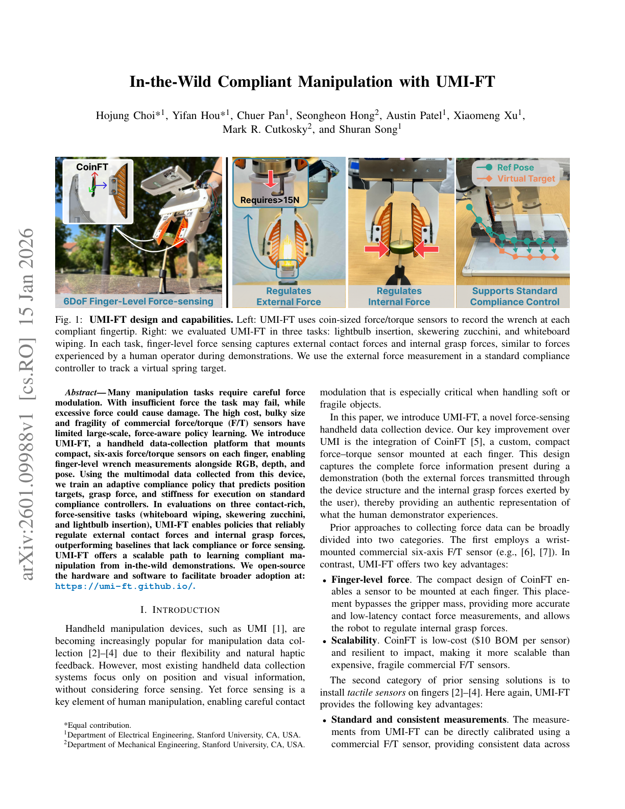
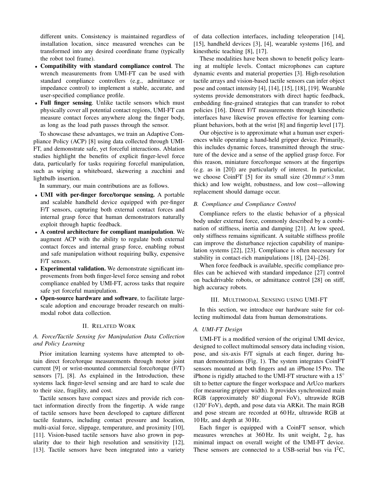
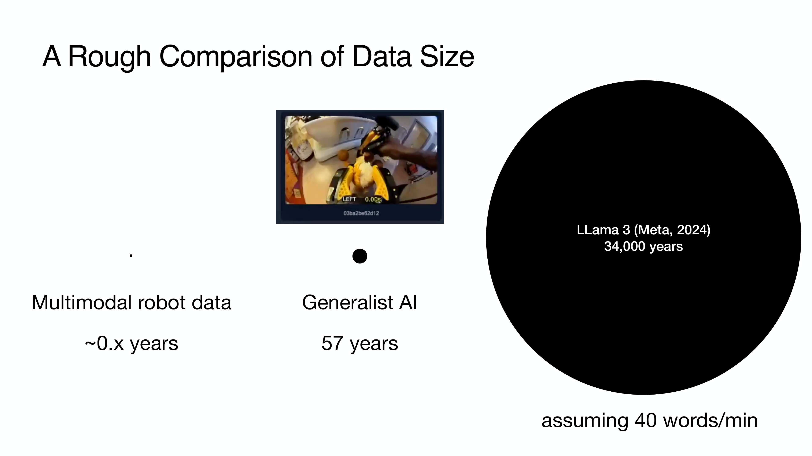

# Chapter 3: 촉각 데이터: 표현과 수집

## 개요

촉각 센서(Chapter 2)가 물리적 접촉을 전기 신호로 변환한다면, 그 신호를 **어떤 구조로 표현하고, 어떻게 수집하며, 어떤 사전학습으로 범용 표현을 구축하는가**가 이 챕터의 주제입니다. Albini et al. [2025]의 분류 체계를 축으로, 데이터 표현의 6가지 구조, 수집 파이프라인, 공개 데이터셋, 그리고 촉각 Foundation Model을 향한 자기지도 사전학습까지 다룹니다.

> **이 챕터를 읽고 나면...**
> - 촉각 데이터의 6가지 표현 구조를 구분하고 각각의 적용 맥락을 설명할 수 있습니다.
> - 정규 표현(canonical representation)과 센서 무관 표현(sensor-agnostic representation)의 의미를 이해합니다.
> - 주요 촉각 데이터 수집 파이프라인과 공개 데이터셋을 파악합니다.
> - Sparsh, UniTouch 등 자기지도 사전학습 접근의 의미와 한계를 설명할 수 있습니다.

---

## 3.1 데이터 표현의 분류 체계

Albini et al. [2025]은 촉각 데이터 표현을 6가지 구조로 분류했습니다. 이 서베이(*IEEE T-RO* 투고)는 촉각 데이터 표현의 사실상 표준 분류 체계로 자리잡고 있습니다.

> **핵심 논문**: Albini, A., Kaboli, M., Cannata, G., & Maiolino, P. (2025). "Representing Data in Robotic Tactile Perception — A Review." *arXiv preprint* (submitted to IEEE T-RO).
> 6가지 데이터 구조(벡터, 행렬, 맵, 포인트 클라우드, 메시, 이미지)를 식별하고, 하드웨어-태스크-정보 요구사항에 따른 선택 가이드라인을 제시합니다.

### 3.1.1 벡터 (Vector)

가장 단순한 형태로, 각 센서의 측정값을 1차원 벡터로 나열합니다. 다축 센서의 경우 [fx, fy, fz]와 같은 힘 벡터가 됩니다. OSMO 글로브 [2025] [#18](https://terry.artlab.ai/ko/posts/2512-osmo-tactile-glove)의 12개 3축 센서는 36차원 벡터로 촉각 상태를 표현합니다.

**적합한 태스크**: 분류(classification), 힘 제어, 미끄러짐 감지
**한계**: 공간 관계 정보 손실

### 3.1.2 행렬 (Matrix)

센서 어레이의 출력을 2D 행렬로 표현합니다. STAG 글로브 [Sundaram et al., 2019]의 548개 압저항 센서 출력은 손 표면의 압력 행렬로 표현됩니다.

**적합한 태스크**: 접촉 패턴 분류, 파지 상태 인식
**한계**: 곡면 센서 배치 시 왜곡

### 3.1.3 맵 (Map)

센서 데이터를 기준 표면(reference surface)에 매핑합니다. UniTacHand [Zhang et al., 2025] [#16](https://terry.artlab.ai/ko/posts/2512-unitachand)는 MANO UV 맵에 촉각 데이터를 투영하여, 인간 손과 로봇 손의 촉각을 **공유 표현 공간(shared representation space)**에 매핑합니다 (→ Chapter 10.4 참조).

**적합한 태스크**: 교차 체현 전이(cross-embodiment transfer), 전체 손 촉각 분석
**한계**: UV 매핑의 왜곡, 기준 모델 의존성

### 3.1.4 포인트 클라우드 (Point Cloud)

접촉점을 3D 좌표와 함께 표현합니다. Robot Synesthesia [Yuan et al., 2024]는 포인트 클라우드 기반 촉각 표현으로 시각-촉각 손안 조작(visuotactile in-hand manipulation)을 구현했습니다. PointNet 인코더로 촉각 포인트 클라우드를 처리하여, 이중 공 회전(double-ball rotation)과 3축 회전을 새로운 물체에서도 달성했습니다 (*ICRA 2024*).

> **핵심 논문**: Yuan, Y., Che, H., Qin, Y., Huang, B., Yin, Z.-H., Lee, K.-W., Wu, Y., Lim, S.-C., & Wang, X. (2024). "Robot Synesthesia: In-Hand Manipulation with Visuotactile Sensing." *ICRA 2024*.
> 포인트 클라우드 기반 촉각 표현과 teacher-student RL로 시각-촉각 손안 조작을 구현. 새로운 물체에 대한 일반화를 달성했습니다.

**적합한 태스크**: 3D 형상 재구성, 6DoF 자세 추정, 시각-촉각 융합
**한계**: 밀도 불균일, 순서 없는(unordered) 데이터 처리 필요

### 3.1.5 메시 (Mesh)

접촉 표면을 삼각형 메시로 모델링합니다. 유한 요소법(FEM)과 결합하여 변형 시뮬레이션에 활용됩니다. DiffTactile [2024]은 미분 가능한 촉각 시뮬레이터에서 메시 기반 접촉 모델링을 사용합니다 (→ Chapter 9.1 참조).

**적합한 태스크**: 변형 시뮬레이션, 힘 분포 분석
**한계**: 계산 비용, 실시간 처리 어려움

### 3.1.6 이미지 (Image)

비전 기반 촉각 센서(GelSight, DIGIT)의 원시 출력이 이미 이미지입니다. CNN, ViT 등 비전 모델의 풍부한 도구를 직접 활용할 수 있어, 현재 가장 널리 사용되는 표현입니다. Sparsh [Higuera et al., 2024]는 460,000장 이상의 촉각 이미지로 자기지도 사전학습을 수행했습니다 (→ 3.6 참조).

**적합한 태스크**: 질감 인식, 물체 분류, 접촉 지도 재구성
**한계**: 센서 특이적(sensor-specific) — 다른 센서의 이미지와 직접 비교 불가

---

## 3.2 표현 선택이 태스크 성능에 미치는 영향

데이터 표현의 선택은 학습 성능에 직접적 영향을 미칩니다. Wu et al. [2025]은 Canonical 3D Tactile [#14](https://terry.artlab.ai/ko/posts/2409-3dtactile-dex) 표현을 제안하여, 센서의 원시 출력을 3D 정규 좌표계로 변환함으로써 태스크 무관(task-agnostic)한 전이를 가능하게 했습니다 (*ICRA 2025*).

이 연구의 핵심 인사이트는 세미나 1에서도 논의되었습니다: **play data로 촉각 인코더를 사전학습하고, 소수의 전문가 시연(few-shot expert demonstration)으로 정책을 학습**하는 2단계 접근이 데이터 효율성을 크게 높입니다. 3축 촉각 + 시각(Realsense D435) + 로봇 상태를 결합한 시각-촉각 모방 학습(visuo-tactile imitation learning)이 세미나 1의 핵심 파이프라인이었습니다.

Albini et al. [2025]은 표현 선택의 가이드라인을 세 축으로 제시합니다:
1. **하드웨어**: 센서의 출력 특성이 자연스러운 표현을 결정 (비전 센서 → 이미지, 분산 센서 → 행렬)
2. **태스크**: 파지 분류 → 벡터/행렬, 형상 재구성 → 포인트 클라우드/메시
3. **필요 정보**: 법선력만 → 스칼라/벡터, 3D 접촉 형상 → 포인트 클라우드/이미지

---

## 3.3 정규 표현과 센서 무관 표현

촉각 연구의 근본적 한계 중 하나는 **센서 특이성(sensor specificity)**입니다. GelSight에서 학습한 표현은 DIGIT에서 작동하지 않으며, DIGIT에서 학습한 표현은 ReSkin에서 작동하지 않습니다. 이 문제를 해결하려는 세 가지 주요 접근이 있습니다:

### 3.3.1 AnyTouch / AnyTouch 2 (2025)

AnyTouch [2025]는 여러 비전 기반 촉각 센서에 걸쳐 정적/동적 촉각의 **통합 표현(unified representation)**을 학습합니다. AnyTouch 2 [2025]는 이를 동적 인지(dynamic perception)로 확장하여, 센서 유형에 무관한 배치(deployment)를 가능하게 합니다.

### 3.3.2 Sensor-Invariant Tactile Representation (2025)

광학 센서 설계 간 **제로샷 전이(zero-shot transfer)**를 달성합니다. 센서 특이적 정보를 제거하고 접촉의 본질적 특성만 보존하는 표현을 학습합니다.

### 3.3.3 Canonical 3D Tactile (Wu et al., 2025)

센서의 원시 출력을 3D 정규 좌표계로 변환하여, 센서에 독립적인 촉각 표현을 구축합니다. 태스크 무관 play data 사전학습과 결합하여, 소수 시연으로의 전이를 가능하게 합니다.

> **핵심 관점**: 센서 무관 표현은 촉각의 "CLIP 순간"을 향한 핵심 방향입니다 — 시각-언어에서 CLIP이 달성한 것처럼, 다양한 촉각 센서의 출력을 통합된 임베딩 공간에 정렬하는 것이 궁극적 목표입니다.

---

## 3.4 데이터 수집 파이프라인

촉각 데이터의 수집은 시각 데이터에 비해 본질적으로 어렵습니다 — **물리적 접촉이 필수**이기 때문입니다. 주요 수집 방법은 세 가지입니다:

### 3.4.1 원격 조작 (Teleoperation)

사람이 원격으로 로봇을 조종하며 촉각 데이터를 수집합니다. 높은 품질의 시연(demonstration)을 얻을 수 있지만, 처리량이 약 **10회 시연/시간**으로 매우 낮습니다 [DexCap 기준]. DexCap은 원격 조작 대비 3배 빠르지만 여전히 한계적입니다.

Wu et al. [2025]은 세미나 1에서 발표된 바와 같이, 원격 조작으로 대규모 play data를 수집한 후 소수의 전문가 시연으로 정책을 미세 조정(fine-tuning)하는 2단계 접근을 사용했습니다.

### 3.4.2 시연 학습 / 운동학적 시연 (Kinesthetic Teaching)

DexForce [2025] [#3](https://terry.artlab.ai/ko/posts/2501-dexforce-force-informed-actions)는 스프링 모델을 이용하여 운동학적 시연(kinesthetic teaching)으로 **힘-토크 정보를 자연스럽게 기록**하는 파이프라인을 제안했습니다. 원격 조작 대비 더 자연스러운 힘 정보를 수집할 수 있습니다 (→ Chapter 7.4 참조).

### 3.4.3 자율 탐색 (Autonomous Exploration)

로봇이 자율적으로 환경을 탐색하며 촉각 데이터를 수집합니다. 처리량은 높지만, 시연 품질이 낮을 수 있습니다. PP-Tac [2025] [#12](https://terry.artlab.ai/ko/posts/2504-pp-tac)는 물리 기반 궤적 합성(trajectory synthesis)으로 촉각 데이터를 자동 생성합니다.

### 3.4.4 휴대형 시연 장치 (UMI-FT)

UMI-FT [Choi et al., 2025]는 Universal Manipulation Interface (UMI) [Chi et al., 2024]에 CoinFT 힘/토크 센서를 각 손가락에 장착하여, 로봇 없이도 **대규모 멀티모달 인간 시연 수집**을 가능하게 합니다:

- **하드웨어**: 그리퍼 형태의 휴대 장치 + iPhone (RGB + depth) + 손가락별 CoinFT
- **수집 모달리티**: 비전, 자세(proprioception), **손가락 수준 6축 힘/토크**
- **핵심 이점**: 시연 중 자연스러운 햅틱 피드백 (원격 조작과 달리); 어디서든 배치 가능
- **학습 파이프라인**: 상위 멀티모달 Diffusion Policy + 하위 파지력/컴플라이언스 컨트롤러

UMI-FT의 태스크 실험에서 힘/토크 센싱의 중요성이 입증되었습니다: 화이트보드 닦기에서 힘 정보 있는 정책은 다양한 테이블 높이, 보드 크기에 일반화된 반면, 힘 없는 기준선은 표면을 세게 충돌하거나 거의 닿지 않았습니다. 전구 삽입(~15-20 N 필요, 햅틱 탐색 포함)에서는 컴플라이언스와 파지력 제어가 모두 필수적이었습니다 [Choi, SNU 세미나 2026].

### 3.4.5 합성 데이터 (Synthetic Data)

NVIDIA의 Isaac Sim 파이프라인은 780,000 궤적(6,500시간 상당)을 **11시간에 생성**하여, 실제 성능을 40% 향상시켰습니다. Tacto [Wang, Lambeta et al., 2022]는 비전 기반 촉각 센서의 오픈소스 시뮬레이터로 sim-to-real 학습을 가능하게 합니다. DiffTactile [2024]은 미분 가능한 촉각 시뮬레이터로 기울기 기반 최적화를 지원합니다 (→ Chapter 9 참조).

| 수집 방법 | 처리량 | 데이터 품질 | 힘 정보 | 비용 | 대표 사례 |
|----------|--------|----------|---------|------|----------|
| 원격 조작 | 낮음 (~10/hr) | 높음 | 제한적 | 높음 | DexCap, DexUMI |
| 운동학적 시연 | 중간 | 높음 | 자연스러움 | 중간 | DexForce |
| 휴대형 장치 | 높음 | 높음 | **6축 F/T** | 낮음 | **UMI-FT** |
| 자율 탐색 | 높음 | 중간 | 가능 | 낮음 | PP-Tac |
| 합성 데이터 | 매우 높음 | 중간 (gap) | 가능 | 낮음 | Isaac Sim, Tacto |

---

## 3.5 공개 데이터셋

촉각 데이터셋의 규모는 시각 데이터셋에 비해 여전히 수 자릿수 작습니다. 그 격차를 직관적으로 보면: LLaMA 3는 **34,000 인간-년** 분량의 텍스트 데이터(~40 단어/분 기준)로 훈련되었고, 최대 로봇 조작 데이터셋(Generalist AI)은 **57 인간-년** 분량(시각+위치만), 학계의 멀티모달 촉각 데이터는 **1 인간-년 미만** — 비교 자체가 무의미한 수준입니다 [Choi, SNU 세미나 2026]. 이 대규모 결핍이 이 챕터에서 다루는 모든 데이터 수집/사전 학습 접근법의 동기입니다.

아래는 주요 공개 데이터셋입니다:

| 데이터셋 | 규모 | 센서 | 모달리티 | 태스크 | 연도 |
|---------|------|------|---------|--------|------|
| **Touch-and-Go** | 3M+ 접촉 | GelSight | 시각 + 촉각 | 질감, 물체 | 2023 |
| **Touch100k** | 100K+ 이미지 | 다양 | 촉각 | 질감 분류 | 2024 |
| **ObjectFolder** | 1K+ 물체 | 시뮬레이션 | 시각 + 촉각 + 오디오 | 다중 모달 | 2022 |
| **VTDexManip** | 10 태스크, 182 물체 | 시각 + 촉각 | 인간 시연 | 다지 조작 | 2025 |
| **Open X-Embodiment** | 1M+ 궤적 | 22 체현 | 시각 + 동작 | 조작 전반 | 2024 |
| **EgoDex** | 829hr, 90M 프레임 | Apple Vision Pro | RGB + 손 포즈 | 194 태스크 | 2025 |

> **핵심 논문**: VTDexManip (ICLR 2025). 인간 시연에서 수집한 최초의 대규모 시각-촉각 데이터셋. 10개 태스크, 182개 물체를 포괄하며, 강화학습 벤치마크를 함께 제공합니다.

**EgoDex** [Apple, 2025]는 Apple Vision Pro + ARKit를 사용하여 수집한 대규모 egocentric 손 조작 데이터셋입니다. **829시간**, **90M 프레임**, **194개 태스크**를 30Hz per-finger tracking으로 기록했으며, 이는 기존 촉각/조작 데이터셋의 규모를 수 자릿수 넘어서는 것입니다. Chapter 10.6에서 다루는 EgoScale의 스케일링 법칙과 함께, 인간 egocentric 데이터의 대규모 수집이 로봇 학습의 핵심 방향으로 부상하고 있음을 보여줍니다.

VTDexManip은 촉각 데이터셋 분야에서 중요한 이정표입니다 — 인간의 실제 시연에서 다지 조작의 시각-촉각 데이터를 대규모로 수집한 최초의 사례이기 때문입니다.

Open X-Embodiment [2024]는 1M+ 궤적을 22개 체현(embodiment)에서 수집한 가장 큰 로봇 조작 데이터셋이지만, 촉각 데이터는 소수 subset에만 포함됩니다. 촉각 특화 대규모 데이터셋의 부재는 Chapter 13에서 다루는 핵심 한계입니다 (→ Chapter 13.1 참조).

---

## 3.6 자기지도 사전학습: Sparsh와 UniTouch

촉각의 "ImageNet 모멘트"를 향한 핵심 접근은 **자기지도 학습(self-supervised learning)**을 통한 범용 촉각 표현의 구축입니다.

### Sparsh (2024)

Meta FAIR, CMU, UC Berkeley의 협업으로 탄생한 Sparsh [Higuera et al., 2024]는 **460,000장 이상의 촉각 이미지**에서 자기지도 학습으로 사전훈련된 촉각 Foundation Model입니다 (*CoRL 2024*).

> **핵심 논문**: Higuera, C., Sharma, A., Bodduluri, C. K., Fan, T., Lancaster, P., Malik, J., Pathak, D., Lambeta, M., & Calandra, R. (2024). "Sparsh: Self-Supervised Touch Representations for Vision-Based Tactile Sensing." *CoRL 2024*.
> 다양한 비전 기반 촉각 센서에서 수집한 460K+ 이미지로 사전학습한 자기지도 촉각 Foundation Model. 범용 촉각 표현의 이정표입니다.

Sparsh의 의미는 비전에서 ImageNet 사전학습이 수행한 역할을 촉각에서 재현하려는 첫 대규모 시도라는 점입니다. 그러나 460K 이미지는 ImageNet의 14M 이미지에 비하면 여전히 수십 배 작으며, 향후 10배 이상의 데이터 확장이 필요합니다 (→ Chapter 13.2 참조).

### UniTouch (2024)

Yang et al. [2024]의 UniTouch는 **대조 학습(contrastive learning)**으로 촉각을 시각, 언어, 오디오에 정렬(align)합니다 (*CVPR 2024*). CLIP이 시각-언어를 정렬한 것과 유사하게, UniTouch는 촉각-시각-언어-오디오의 통합 임베딩 공간을 구축하여 **제로샷 촉각 분류**를 가능하게 합니다.

> **핵심 논문**: Yang, F., Feng, C., Chen, Z., Park, H., Wang, D., Dou, Y., ... & Wong, A. (2024). "Binding Touch to Everything: Learning Unified Multimodal Tactile Representations." *CVPR 2024*.
> 대조 학습으로 촉각을 시각, 언어, 오디오와 정렬하여 교차 모달 검색과 제로샷 분류를 달성합니다.

### Tactile Sensing for Dexterous Manipulation (2024)

이 서베이 [2024]는 촉각 센싱, 데이터셋, 시뮬레이션-현실 전이를 포괄적으로 다루며, 본 챕터에서 다룬 데이터 표현, 수집, 사전학습의 전체 맥락을 제공합니다.

---

## 요약 및 전망

촉각 데이터의 표현은 벡터에서 포인트 클라우드까지 다양하며, Albini et al. [2025]의 분류 체계가 선택의 기준을 제공합니다. 센서 무관 표현(AnyTouch, Sensor-Invariant, Canonical 3D)은 촉각 연구의 재현성과 확장성을 위한 핵심 방향이며, Sparsh와 UniTouch는 촉각 Foundation Model의 첫 이정표입니다.

그러나 촉각 데이터의 규모는 여전히 시각 데이터에 비해 수 자릿수 부족합니다. Touch-and-Go의 3M 접촉에서 100M+ 규모로의 확장, NVIDIA 합성 데이터 파이프라인의 촉각 영역 적용, 그리고 교차 체현 데이터 재활용(Open X-Embodiment for hands)이 향후 핵심 연구 방향입니다.

다음 챕터에서는 이 센서와 데이터를 탑재하는 **로봇 핸드의 설계 원리**를 다룹니다 (→ Chapter 4: 로봇 핸드 설계 참조).

---

## 참고문헌

1. Albini, A., Kaboli, M., Cannata, G., & Maiolino, P. (2025). Representing data in robotic tactile perception — A review. *arXiv preprint* (submitted to IEEE T-RO). arXiv:2510.10804.

2. Yuan, Y., Che, H., Qin, Y., Huang, B., Yin, Z.-H., Lee, K.-W., Wu, Y., Lim, S.-C., & Wang, X. (2024). Robot Synesthesia: In-hand manipulation with visuotactile sensing. *ICRA 2024*. arXiv:2312.01853.

3. Yang, F., Feng, C., Chen, Z., Park, H., Wang, D., Dou, Y., ... & Wong, A. (2024). Binding touch to everything: Learning unified multimodal tactile representations. *CVPR 2024*.

4. Higuera, C., Sharma, A., Bodduluri, C. K., Fan, T., Lancaster, P., Malik, J., Pathak, D., Lambeta, M., & Calandra, R. (2024). Sparsh: Self-supervised touch representations for vision-based tactile sensing. *CoRL 2024*.

5. Liu, Q., Cui, Y., Sun, Z., Li, G., Chen, J., & Ye, Q. (2025). VTDexManip: A dataset and benchmark for visual-tactile pretraining and dexterous manipulation with reinforcement learning. *ICLR 2025*.

6. Feng, R., Hu, J., Xia, W., Gao, T., Shen, A., Sun, Y., Fang, B., & Hu, D. (2025). AnyTouch: Learning unified static-dynamic representation across multiple visuo-tactile sensors. *ICLR 2025*. arXiv:2502.12191.

7. Various. (2025). AnyTouch 2: General optical tactile representation learning for dynamic tactile perception. *OpenReview*.

8. Various. (2025). Sensor-invariant tactile representation. *OpenReview*.

9. Wu, C., et al. (2025). Canonical 3D tactile representation for visuo-tactile imitation learning. *ICRA 2025*. [#14](https://terry.artlab.ai/ko/posts/2409-3dtactile-dex)

10. Wang, S., Lambeta, M., et al. (2022). Tacto: A fast, flexible, and open-source simulator for vision-based tactile sensors. *IEEE Robotics and Automation Letters*.

11. Si, Z., Zhang, G., Ben, Q., Romero, B., Xian, Z., Liu, C., & Gan, C. (2024). DiffTactile: A physics-based differentiable tactile simulator for contact-rich robotic manipulation. *ICLR 2024*. arXiv:2403.08716.

12. Sundaram, S., Kellnhofer, P., Li, Y., Zhu, J.-Y., Torralba, A., & Matusik, W. (2019). Learning the signatures of the human grasp using a scalable tactile glove. *Nature*, 569, 698-702.

13. Zhang, C., Xue, Z., Yin, S., Zhao, B., et al. (2025). UniTacHand: Unified spatio-tactile representation for human to robotic hand skill transfer. *arXiv preprint*. arXiv:2512.21233. [#16](https://terry.artlab.ai/ko/posts/2512-unitachand)

14. Chen, C., Yu, Z., Choi, H., Cutkosky, M., & Bohg, J. (2025). DexForce: Extracting force-informed actions from kinesthetic demonstrations for dexterous manipulation. *IEEE Robotics and Automation Letters*. arXiv:2501.10356. [#3](https://terry.artlab.ai/ko/posts/2501-dexforce-force-informed-actions)

15. Various. (2025). PP-Tac: Physics-based trajectory synthesis for thin object grasping. *RSS 2025*. [#12](https://terry.artlab.ai/ko/posts/2504-pp-tac)

16. Open X-Embodiment Collaboration. (2024). Open X-Embodiment: Robotic learning datasets and RT-X models. *ICRA 2024*. arXiv:2310.08864.

17. Various. (2024). Tactile sensing for dexterous manipulation: Taxonomies, datasets, and sim-to-real transfer. *Journal of Multidisciplinary Engineering Science*.

18. Yang, F., et al. (2023). Touch and Go: Learning from human-collected vision and touch. *ICCV 2023*.

19. Yang, F., et al. (2024). Touch100k: A large-scale touch-language-vision dataset. *arXiv preprint*. arXiv:2406.03813.

20. Gao, R., et al. (2022). ObjectFolder 2.0: A multisensory object dataset for sim2real transfer. *ICML 2022*.

21. Yin, J., Qi, H., Wi, Y., Kundu, S., Lambeta, M., Yang, W., Wang, C., Wu, T., Malik, J., & Hellebrekers, T. (2025). OSMO: Open-source tactile glove for human-to-robot skill transfer. *arXiv preprint*. arXiv:2512.08920. [#18](https://terry.artlab.ai/ko/posts/2512-osmo-tactile-glove)

22. Various. (2025). EgoDex: Large-scale egocentric hand manipulation dataset via Apple Vision Pro. *arXiv preprint*.
