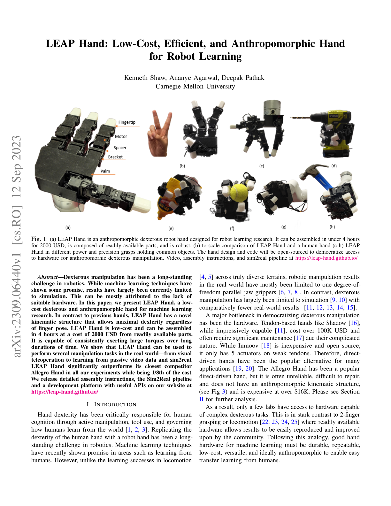
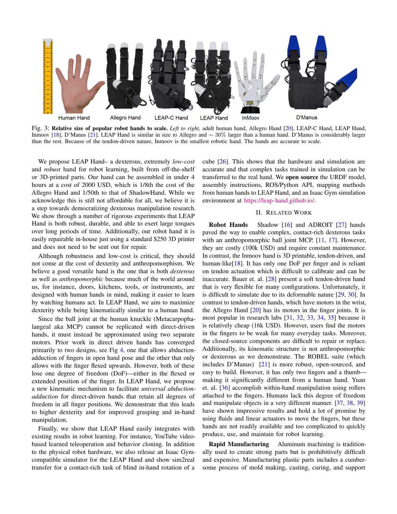
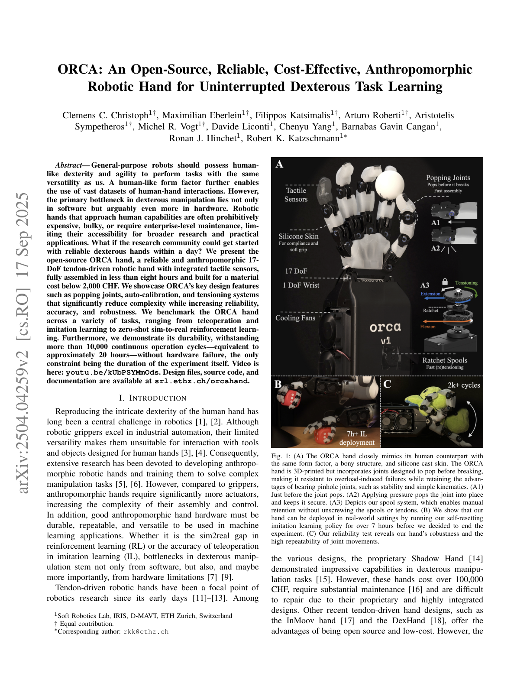
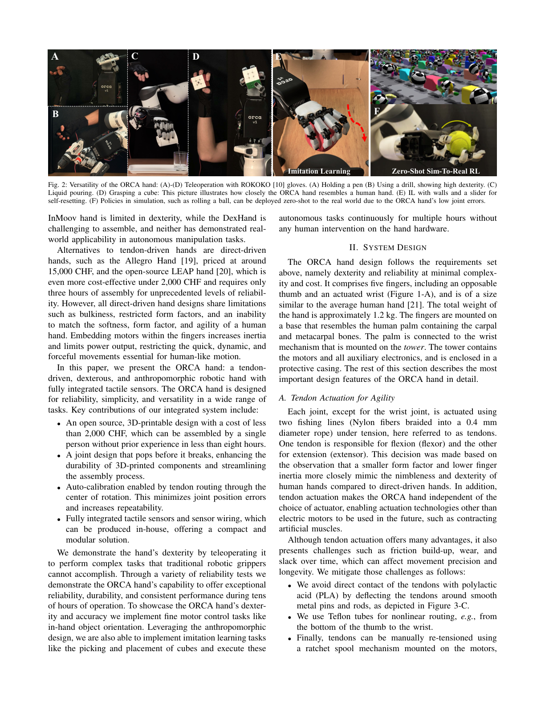

# Chapter 4: 로봇 핸드 설계 — 잡기 위한 기계

## 개요

촉각 센서(Chapter 2)와 데이터(Chapter 3)는 그것을 탑재할 **로봇 핸드** 없이는 의미가 없습니다. 이 챕터에서는 병렬 그리퍼에서 다지 핸드까지 로봇 핸드 설계의 스펙트럼을 탐구하고, $100,000 이상의 Shadow Hand에서 $2,000 LEAP Hand로 이어진 오픈소스 혁명, 그리고 센서 통합 설계의 최신 성과를 다룹니다.

> **이 챕터를 읽고 나면...**
> - 병렬 그리퍼와 다지 핸드의 설계 트레이드오프를 설명할 수 있습니다.
> - 오픈소스 저비용 핸드의 설계 철학과 영향력을 이해합니다.
> - 건 구동, 직접 구동 등 주요 구동 방식의 차이를 파악합니다.
> - Allegro Hand 생태계의 연구적 위치를 설명할 수 있습니다.

---

## 4.1 병렬 그리퍼 vs 다지 핸드: 설계 트레이드오프

세미나 3 (Inchul)은 이 두 극단의 설계를 체계적으로 비교했습니다.

**병렬 그리퍼 (Parallel Gripper)**:
- 2개의 대향 손가락, 1 DoF
- 제어 단순, 신뢰성 높음, 산업 현장에서 압도적 점유율
- **한계**: 형상 적응 부족, 연속 접촉 유지 어려움, 얇은 물체/복수 물체 취약

**다지 핸드 (Dexterous Hand)**:
- 4-5 손가락, 12-22 DoF
- 다양한 파지(grasp) 유형과 손안 조작(in-hand manipulation) 가능
- **한계**: 제어 복잡, 접촉 상태 조합 폭발, 비용 높음, 고장 빈번

> **핵심 논문**: Bicchi, A. (2000). "Hands for Dexterous Manipulation and Robust Grasping: A Difficult Road Toward Simplicity." *IEEE Transactions on Robotics and Automation*, 16(6), 652-662.
> 핸드 설계에서 단순함을 향한 논거를 제시한 기념비적 논문. 부족 구동(underactuation)과 시너지(synergy) 개념의 기초가 되었으며, SoftHand와 LEAP Hand 설계에 영향을 미쳤습니다.

세미나 3의 핵심 인사이트는 이 이분법을 넘어서는 것이었습니다: **지능형 메커니즘**(Chapter 5에서 상세)으로 병렬 그리퍼의 단순함과 다지 핸드의 적응성을 결합할 수 있다는 관점입니다.

---

## 4.2 오픈소스 혁명: LEAP Hand, ISyHand, ORCA

2023년 이후, 저비용 오픈소스 다지 핸드의 등장이 연구 생태계를 근본적으로 변화시켰습니다.

### LEAP Hand (2023)

Shaw, Agarwal, & Pathak [2023]이 CMU에서 개발한 LEAP Hand는 오픈소스 핸드 혁명의 시작점입니다:

- **$2,000** 비용 (Allegro Hand $16,000의 1/8)
- **3D 프린팅** 가능: 누구나 제작 가능
- 4손가락, 16 DoF
- Allegro Hand를 성능에서 능가
- **200회+ 인용** (*RSS 2023*)

> **핵심 논문**: Shaw, K., Agarwal, A., & Pathak, D. (2023). "LEAP Hand: Low-Cost, Efficient, and Anthropomorphic Hand for Robot Learning." *RSS 2023*.
> $2,000, 3D 프린팅 가능한 오픈소스 다지 핸드. 연구용 핸드의 민주화를 이끌었습니다.

LEAP Hand의 설계 철학은 "최소한의 비용으로 최대한의 손재주(dexterity)"입니다. 새로운 운동학적 구조(kinematic structure)로 인간 손의 핵심 자유도를 재현하면서, 저가 서보 모터와 3D 프린팅 부품만으로 구현했습니다. 핵심 혁신은 MCP(손가락 관절) 부위의 **범용 외전-내전(universal abduction-adduction) 메커니즘**입니다: Allegro(펴진 상태에서 자유도 상실)나 기존 설계(굽힌 상태에서 자유도 상실)와 달리, LEAP Hand는 모든 손가락 위치에서 전체 자유도를 유지합니다. 이로 인해 엄지-손가락 대향 볼륨(opposability volume)과 조작성 타원체(manipulability ellipsoid)가 크게 증가하여, 파지력 19.5 N(인간 파지력 초과)과 Allegro 대비 더 빠른 손안 큐브 회전을 달성합니다.

### ISyHand (2025)

ISyHand [2025]는 $1,300으로 비용을 더 낮추면서 **관절 연결 손바닥(articulated palm)**을 도입했습니다:
- 4시간 조립 시간
- 기성품 + 3D 프린팅 부품
- 손바닥 움직임으로 파지 다양성 확대

### ORCA (2025)

ETH의 Katzschmann 그룹에서 탄생한 ORCA는 **17 DoF 건 구동(tendon-driven)** 핸드입니다:
- 2,000 CHF 이하, 1인이 8시간 내 제작 가능
- **통합 촉각 센서** (5개 손끝에 FSR 기반 이진 촉각)
- **팝 가능 핀 조인트(poppable pin joints)**: 과부하 시 파손 대신 탈구, 회전 중심을 통과하는 건 라우팅으로 자동 캘리브레이션
- 10,000회+ 연속 동작 사이클(20시간+) 무고장 달성
- 4손가락 파지 시 최대 10.5 kg (103 N) 하중 지지
- 손안 공 재방향 조정(in-hand ball reorientation)을 위한 제로샷 sim-to-real RL 시연
- Mimic Robotics로 상용화 추진 중

이 세 핸드는 공통적으로 **오픈소스 + 저비용 + 3D 프린팅**이라는 설계 철학을 공유하며, 다지 조작 연구의 진입 장벽을 $100K 이상에서 $2K 이하로 낮추었습니다.

| 핸드 | 비용 | DoF | 구동 방식 | 촉각 | 오픈소스 | 연도 |
|------|------|-----|----------|------|---------|------|
| Shadow Hand | $100K+ | 24 | 건/공압 | 옵션 (BioTac) | 아니오 | 1990s |
| Allegro Hand | $16K | 16 | 직접 구동 | 아니오 | 아니오 | 2012 |
| **LEAP Hand** | **$2K** | 16 | 직접 구동 | 아니오 | **예** | 2023 |
| **ISyHand** | **$1.3K** | — | 직접 구동 | 아니오 | **예** | 2025 |
| **ORCA** | **$2K** | 17 | 건 구동 | **예** | **예** | 2025 |
| **F-TAC Hand** | — | — | — | **17센서** | 일부 | 2025 |

---

## 4.3 건 구동 방식: Pisa/IIT SoftHand, CRAFT, Mimic Robotics

건 구동(tendon-driven) 방식은 구동기를 손가락 밖(예: 전완부)에 배치하고 건(tendon)으로 힘을 전달합니다. 이 접근의 장점은 손가락의 소형화와 경량화, 그리고 자연스러운 유연성(compliance)입니다.

### Pisa/IIT SoftHand

Bicchi [2000]의 "단순함을 향한 길" 철학의 직접적 산물입니다:
- **SoftHand 1**: 1 구동기, 19 관절 — 적응 시너지(adaptive synergy)로 다양한 물체에 형상 적응
- **SoftHand 2**: 2 구동기, 마찰을 이용한 구동 확장 — 더 다양한 파지 유형
- 3D 프린팅, 모듈형 설계

> **핵심 논문**: Bicchi, A., & Kumar, V. (2000). "Robotic Grasping and Contact: A Review." *IEEE ICRA 2000*.
> 로봇 파지 이론의 기초 리뷰. 힘/형태 폐합(force/form closure), 파지 품질 척도, 접촉 모델을 망라합니다.

### CRAFT Hand (2026)

Lin et al. [2026]의 CRAFT는 건 구동 방식에 하이브리드 경성-연성 유연성(hard-soft compliance)을 통합했습니다. 강성 링크로 정밀 위치 제어를, 연성 요소로 형상 적응을 동시에 달성합니다.

### Mimic Robotics (ORCA Hand)

ETH Katzschmann 그룹의 창업으로 이어진 Mimic Robotics는 ORCA Hand를 기반으로 **공장 환경의 Physical AI**를 추구합니다. 가벼운 건 구동 설계로 인간에 가까운 유연성을 구현하며, 통합 촉각 센서를 포함합니다.

### CATCH-919 Hand

Zhang et al. [2025]의 CATCH-919은 9 구동기, 19 DoF로 손끝 과신전(hyperextension)이 가능하며, 33가지 안정 파지를 달성합니다.

---

## 4.4 핵심 설계 원리: 자유도, 구동, 유연성, 비용

로봇 핸드 설계의 네 가지 핵심 축:

### 4.4.1 자유도 (Degrees of Freedom)

인간 손은 약 27 DoF를 가지지만, 연구에 따르면 일상 파지의 대부분은 **2-3개의 시너지(synergy)**로 설명됩니다 [Bicchi, 2000]. 이 관찰이 SoftHand의 1-2 구동기 설계의 이론적 기초입니다.

| DoF 범위 | 대표 핸드 | 파지 유형 | 손안 조작 |
|---------|----------|----------|---------|
| 1 (그리퍼) | 산업용 병렬 그리퍼 | Power grasp | 불가 |
| 1-2 (부족 구동) | SoftHand, Dollar's Hand | 적응형 power grasp | 제한적 |
| 12-16 | LEAP, Allegro | Power + precision | 기초적 |
| 17-22 | ORCA, Shadow | 다양한 유형 | 가능 |

### 4.4.2 구동 방식

- **직접 구동 (Direct drive)**: 모터가 관절에 직접 연결. Allegro, LEAP. 제어 응답 빠름, 구조 단순
- **건 구동 (Tendon-driven)**: 건으로 힘 전달. SoftHand, ORCA, Shadow. 소형화, 유연성, 비용 절감
- **공압 (Pneumatic)**: 공기압으로 구동. 변형 가능, 안전. 제어 정밀도 낮음
- **유압 (Hydraulic)**: Sanctuary AI의 Phoenix Gen 8. 고출력, 고정밀. 복잡, 비쌈

### 4.4.3 유연성 (Compliance)

접촉이 풍부한(contact-rich) 조작에서 유연성은 필수입니다. 세미나 1에서 강조된 바와 같이, 위치 제어(position control)만으로는 접촉이 풍부한 환경에서 부족하며, **토크 제어(torque control)**가 가능한 다지 핸드가 필수입니다.

Soft Robotic Hand with Tactile Palm-Finger Coordination [2025, *Nature Communications*]은 연성 재료 기반의 손바닥-손가락 촉각 협조를 통해, 경성 핸드로는 어려운 다양한 형상의 물체 파지를 달성했습니다.

### 4.4.4 비용

5년간의 가격 하락 추세:
- Shadow Hand: $100K+ (1990s-현재)
- Allegro Hand: $16K (2012-현재)
- LEAP Hand: $2K (2023)
- ISyHand: $1.3K (2025)

이 가격 압축은 연구 민주화뿐 아니라, 산업 배치의 경제적 타당성에도 직접적 영향을 미칩니다.

---

## 4.5 센서 통합 설계: 핸드와 촉각의 결합

Chapter 2에서 다룬 센서 기술은 핸드 설계와 **동시 최적화(co-optimization)**될 때 최대 효과를 발휘합니다.

F-TAC Hand [2025, *Nature Machine Intelligence*]는 17개의 비전 기반 촉각 센서로 손 표면의 70%를 커버하여, 다중 물체 파지에서 100% 성공률을 달성했습니다. 센서 배치는 접촉 확률 분포를 기반으로 최적화되었습니다 (→ Chapter 2.4 참조).

ORCA [2025]는 설계 단계에서부터 촉각 센서를 통합하여, 후천적(after-the-fact) 센서 부착의 어려움을 해소했습니다.

Integrated Linkage-Driven Dexterous Anthropomorphic Robotic Hand [2021, *Nature Communications*]은 링크 구동 메커니즘으로 자유 공간에서의 결합 운동(coupled motion)과 접촉 시 적응형 파지를 통합하는 새로운 설계를 제안했습니다.

---

## 4.6 Allegro Hand 생태계와 연구 플랫폼

Wonik Robotics의 Allegro Hand ($16K)는 오픈소스 핸드 등장 이전부터 다지 조작 연구의 **사실상 표준(de facto standard)**이었습니다. 4손가락, 16 DoF, 직접 구동의 Allegro는 다음 연구들에서 핵심 플랫폼으로 사용되었습니다:

- **DeXtreme** [Handa et al., 2023]: Allegro Hand + Isaac Gym으로 sim-to-real 다지 조작 (→ Chapter 9.2)
- **RGMC** (Robotic Grasping and Manipulation Competition): ICRA 매년 개최, Allegro가 주요 플랫폼
- **D(R,O) Grasp** [Wei et al., 2025]: LEAP Hand로 89% 실세계 성공률 (*ICRA 2025 Best Paper*)

Wonik은 현재 Meta FAIR의 **Digit Plexus** 통합을 추진하고 있으며, 이는 표준화된 센서-핸드 인터페이스를 향한 중요한 발걸음입니다.

리뷰 논문들은 이 분야의 전체 조망을 제공합니다:
- Kadalagere Sampath et al. [2023]: 다지 핸드를 이용한 인간형 로봇 조작의 포괄적 리뷰
- Anthropomorphic Five-Fingered Hand Manipulation [2025]: 5손가락 핸드의 하이브리드 전달 방식 비교
- Soft Robotic Dexterous Hands Advances [2025]: 연성 로봇 다지 핸드의 최신 동향

---

## 요약 및 전망

로봇 핸드 설계는 세 가지 수렴 추세를 보입니다: (1) $2K 이하의 오픈소스 설계 (LEAP, ISyHand, ORCA), (2) 통합 촉각 센싱의 표준화 (F-TAC Hand, ORCA), (3) 강성 정밀도와 연성 유연성의 하이브리드 구동. 이 추세들이 합류하면, $1K 이하의 촉각 통합 다지 핸드가 현실이 될 것입니다 (→ Chapter 13.2 참조).

다음 챕터에서는 병렬 그리퍼의 단순함과 다지 핸드의 적응성을 메커니즘으로 결합하는 **지능형 메커니즘**을 다룹니다 (→ Chapter 5: 지능형 메커니즘 참조).

---

## 참고문헌

1. Shaw, K., Agarwal, A., & Pathak, D. (2023). LEAP Hand: Low-cost, efficient, and anthropomorphic hand for robot learning. *RSS 2023*. arXiv:2309.06440.

2. Bicchi, A. (2000). Hands for dexterous manipulation and robust grasping: A difficult road toward simplicity. *IEEE Transactions on Robotics and Automation*, 16(6), 652-662.

3. Bicchi, A., & Kumar, V. (2000). Robotic grasping and contact: A review. *IEEE ICRA 2000*.

4. Zhao, Z., Li, W., Li, Y., et al. (2025). Embedding high-resolution touch across robotic hands enables adaptive human-like grasping. *Nature Machine Intelligence*. https://doi.org/10.1038/s42256-025-01053-3

5. Richardson, B. A., Grüninger, F., Mack, L., Stueckler, J., & Kuchenbecker, K. J. (2025). ISyHand: A dexterous multi-finger robot hand with an articulated palm. *IEEE-RAS Humanoids 2025*. arXiv:2509.26236.

6. Christoph, C. C., Eberlein, M., Katsimalis, F., Roberti, A., Sympetheros, A., Vogt, M. R., Liconti, D., Yang, C., Cangan, B. G., Hinchet, R. J., & Katzschmann, R. K. (2025). ORCA: An open-source, reliable, cost-effective, anthropomorphic robotic hand. *arXiv preprint*. arXiv:2504.04259.

7. Kim, U., Jung, D., Jeong, H., Park, J., Jung, H.-M., Cheong, J., Choi, H. R., Do, H., & Park, C. (2021). Integrated linkage-driven dexterous anthropomorphic robotic hand. *Nature Communications*, 12, 7177. https://doi.org/10.1038/s41467-021-27261-0

8. Zhang, N., Ren, J., Dong, Y., Gu, G., & Zhu, X. (2025). Soft robotic hand with tactile palm-finger coordination. *Nature Communications*, 16, 2395. https://doi.org/10.1038/s41467-025-57741-6

9. Kadalagere Sampath, et al. (2023). Review on human-like robot manipulation using dexterous hands. *Cognitive Computation and Systems* (IET/Wiley).

10. Various. (2025). Human-like dexterous manipulation for anthropomorphic five-fingered hands: A review. *Journal of Engineering Science and Technology Review*. https://doi.org/10.1016/j.jestch.2025.101938

11. Various. (2025). Soft robotic dexterous hands: Advances and challenges. *International Journal of Advanced Manufacturing and Mechatronic*.

12. Handa, A., et al. (2023). DeXtreme: Transfer of agile in-hand manipulation from simulation to reality. *ICRA 2023*.

13. Wei, Z., Xu, Z., Guo, J., Hou, Y., Gao, C., Cai, Z., Luo, J., & Shao, L. (2025). D(R,O) Grasp: A unified representation of robot and object interaction for cross-embodiment dexterous grasping. *ICRA 2025* (Best Paper).

14. Lin, L., Patel, S., Moon, J., Lazebnik, S., & Jain, U. (2026). CRAFT: A tendon-driven hand with hybrid hard-soft compliance. *arXiv preprint*. arXiv:2602.xxxxx.

15. Zhang, Z., Han, T., Pan, J., & Wang, Z. (2025). CATCH-919 Hand: A 9-actuator 19-DOF anthropomorphic robotic hand. *arXiv preprint*.

16. Yu, M., Jiang, Y., Chen, C., Jia, Y., & Li, X. (2025). RGMC Champion: Kinematic trajectory optimization for in-hand manipulation. *IEEE Robotics and Automation Letters*.
