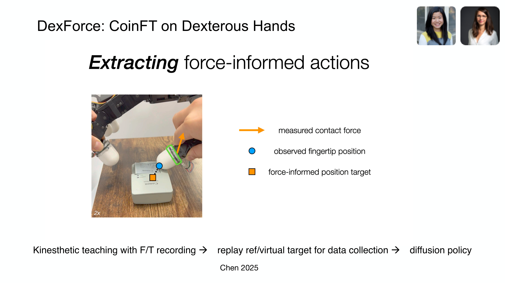

# Chapter 7: 조작 학습 — 만지며 배우기

## 개요

Part I-II에서 센서, 데이터, 핸드, 인간 시연의 기반을 마련했다면, 이 챕터에서는 이 모든 요소를 결합하여 **로봇이 실제로 조작을 학습하는 방법**을 다룹니다. 모방 학습(imitation learning), 강화학습(reinforcement learning), 촉각 기반 조작, 힘 기반 학습, 최적화 기반 대안까지 — 현재 촉각 기반 조작 학습의 전체 방법론 지형도를 그립니다.

> **이 챕터를 읽고 나면...**
> - Diffusion Policy와 ACT/ALOHA의 작동 원리와 차이를 설명할 수 있습니다.
> - 촉각 전용 vs 시각-촉각 융합 조작의 장단점을 비교할 수 있습니다.
> - 힘 기반 학습(DexForce [#3](https://terry.artlab.ai/ko/posts/2501-dexforce-force-informed-actions), ForceVLA [#1](https://terry.artlab.ai/ko/posts/2505-forcevla-force-aware-moe))의 접근과 의의를 이해합니다.
> - IL, RL, 최적화의 방법론적 트레이드오프를 판단할 수 있습니다.

---

## 7.1 모방 학습: Diffusion Policy, ACT/ALOHA

모방 학습(Imitation Learning, IL)은 인간 시연을 직접 모방하여 정책(policy)을 학습합니다. 2023년 이후 두 접근이 지배적입니다.

### Diffusion Policy (2023)

Chi et al. [2023]의 Diffusion Policy는 로봇 행동을 **조건부 잡음 제거 확산 과정(conditional denoising diffusion process)**으로 모델링합니다 (*RSS 2023 / IJRR 2024*):

- 다중 모달 행동 분포(multimodal action distribution) 처리 가능
- 기존 방법 대비 **46.9% 평균 향상**
- **500회+ 인용**: 로봇 정책 학습의 주류 패러다임

> **핵심 논문**: Chi, C., Feng, S., Du, Y., Xu, Z., Cousineau, E., Burchfiel, B., & Song, S. (2023). "Diffusion Policy: Visuomotor Policy Learning via Action Diffusion." *RSS 2023 / IJRR 2024*.
> 행동 확산을 통한 시각-운동 정책 학습. 다중 모달 행동 분포를 자연스럽게 처리하여, 촉각 조건화(tactile conditioning)와의 결합이 용이합니다.

### ACT/ALOHA (2023)

Zhao et al. [2023, Stanford]의 ACT(Action Chunking with Transformers)는 Transformer 기반 행동 청킹으로 **10분 시연에서 80-90% 양손 조작 성공률**을 달성합니다:

- ALOHA: $20K 이하 저비용 양손 하드웨어
- Mobile ALOHA: 이동 + 양손 조작 통합 (→ Chapter 11.2 참조)
- **400회+ 인용**

> **핵심 논문**: Zhao, T. Z., Kumar, V., Levine, S., & Finn, C. (2023). "Learning Fine-Grained Bimanual Manipulation with Low-Cost Hardware." *RSS 2023*.
> Transformer 기반 행동 청킹으로 저비용 하드웨어에서 양손 정밀 조작을 달성. ALOHA 하드웨어와 함께 오픈소스 공개.

### ALOHA Unleashed (2024)

Zhao et al. [2024, Google DeepMind]은 ALOHA 2 하드웨어와 대규모 데이터 수집으로 ALOHA 프레임워크를 **접촉 풍부 양손 조작**으로 확장했습니다 (*CoRL 2024*):
- **Diffusion Policy** 백본으로 복잡한 양손 협응
- 신발끈 묶기, 옷 걸기 등 고도의 양손 조작 태스크
- 데이터 양과 태스크 복잡도를 함께 확장하면 견고한 접촉 풍부 조작이 달성됨을 입증
- 단순 pick-and-place와 진정한 다지 조작 사이의 격차를 메움

### LAPA (2025)

LAPA [ICLR 2025]는 **인간 비디오에서 잠재 행동(latent action)을 사전학습**하는 새로운 접근입니다:
- **VQ-VAE**로 인간 비디오의 행동을 잠재 공간으로 인코딩
- 로봇 데이터 없이 인간 비디오만으로 행동 표현 학습
- 이후 소량의 로봇 데이터로 미세 조정
- 기존 방법 대비 **30배 데이터 효율** 향상
- Chapter 10.7의 teleop-free 접근과 맥을 같이함

---

## 7.2 강화학습: PPO + 촉각, Sim-to-Real RL

강화학습(Reinforcement Learning, RL)은 시행착오를 통해 보상을 최대화하는 정책을 학습합니다. 촉각과 결합된 RL의 핵심 성과들:

### OpenAI Dactyl (2020)

OpenAI Dactyl [2020, *IJRR*]은 sim-to-real RL의 이정표입니다:
- Shadow Hand로 Rubik's Cube 조작
- 시뮬레이션에서만 학습, 현실에 제로샷 전이
- 도메인 랜덤화(domain randomization)의 위력을 입증
- **1,500회+ 인용**

### DeXtreme (2023)

Handa et al. [2023, NVIDIA]의 DeXtreme은 Allegro Hand + Isaac Gym으로:
- 자동 도메인 랜덤화(ADR): 물리 + 비물리 파라미터 동시 랜덤화
- Omniverse Replicator로 합성 시각 데이터 생성
- 시각 기반 정책이 기존 문헌을 능가
- **200회+ 인용** (→ Chapter 9.2에서 상세)

### 촉각 기반 Sim-to-Real RL

Yin et al. [2024]은 이진 3축 촉각 피부(binary 3-axis tactile skin [#13](https://terry.artlab.ai/ko/posts/2407-tactile-skin-inhand-translation)) 센서 모델을 개발하여:
- **5,000 FPS** 시뮬레이션 속도
- S3-Axis: OOD(분포 외) 물체에서 **93% 성공률**
- **제로샷** sim-to-real 전이

이 연구는 촉각 센서 모델의 단순화(이진 접촉)와 넓은 커버리지(전체 손)가 고해상도 센서보다 효과적일 수 있음을 보여줍니다 — 세미나 1에서 강조된 "센서 해상도보다 넓은 영역 커버가 중요"라는 인사이트와 일치합니다.

---

## 7.3 촉각 기반 조작: 촉각 전용 회전, 시각-촉각 융합, PP-Tac [#12](https://terry.artlab.ai/ko/posts/2504-pp-tac)

### 7.3.1 촉각 전용 손안 회전 (Tactile-Only In-Hand Rotation)

Yin et al. [2023, *RSS*]과 Pitz et al. [2024]은 시각 없이 촉각만으로 물체를 연속 회전시키는 것이 가능함을 입증했습니다. 그러나 세미나 1에서 논의된 바와 같이:

- **한계**: 촉각만으로 가능한 조작은 현재 **회전(rotation)**에 한정
- **이유**: 촉각은 접촉 *후*의 국소(local) 정보만 제공 — 접촉 전 글로벌 정보 부재
- **Known environment 가정**: 촉각 전용 LfD(Learning from Demonstration)는 알려진 환경을 가정해야 함

### 7.3.2 시각-촉각 융합 조작 (Visuo-Tactile Manipulation)

Wu et al. [2025, *ICRA*]은 3축 촉각 + 시각(Realsense D435) + 로봇 상태를 결합한 시각-촉각 모방 학습을 구현했습니다:
- **Canonical 3D Tactile [#14](https://terry.artlab.ai/ko/posts/2409-3dtactile-dex)** 표현으로 센서 독립적 전이
- Play data 사전학습 + 소수 전문가 시연 미세 조정
- **78% 평균 성공률** (T-DEX 63% 대비)

Robot Synesthesia [Yuan et al., 2024]는 포인트 클라우드 기반 촉각 표현으로 이중 공 회전과 3축 회전을 달성했습니다 (→ Chapter 3.1.4 참조).

### 7.3.3 시각-촉각 자기지도 사전학습 + RL (Ye et al., 2025)

Ye et al. [Science Robotics, 2025/26]은 인간 시연에서 **시각-촉각 자기지도 사전학습(visual-tactile self-supervised pretraining)**을 수행한 후, **이진(binary) 촉각 + RL**로 로봇 정책을 학습합니다:
- 인간 시연 데이터에서 시각-촉각 표현을 자기지도 학습
- 이진 촉각 센서(접촉/비접촉)만으로 **85% 성공률** 달성
- **반직관적 발견**: 넓은 커버리지의 단순 센서가 좁은 영역의 고해상도 센서보다 우월
- §7.2의 Yin et al. [2024]의 발견(binary tactile 93%)과 일관된 결론

이 결과는 촉각 센서 설계에 중요한 시사점을 줍니다 — 센서의 **공간적 커버리지(spatial coverage)**가 **해상도(resolution)**보다 조작 학습에서 더 중요할 수 있다는 것입니다.

### 7.3.4 PP-Tac: 얇은 물체의 촉각 기반 파지

PP-Tac [2025, *RSS*]은 극도로 얇은 물체(종이, 카드)의 파지 문제를 해결합니다:
- **R-Tac**: 원형 카메라 기반 젤 촉각 센서
- **미끄러짐 감지 CNN**: 실시간 미끄러짐 감지
- **온라인 힘 제어**: 감지된 미끄러짐에 따른 힘 조절
- **Diffusion Policy** 통합
- **87.5% 성공률**: 얇은/변형 가능 물체

---

## 7.4 힘 기반 학습: DexForce, ForceVLA

힘(force) 정보를 학습에 명시적으로 통합하는 접근입니다.

### DexForce (2025)

Hou et al. [2025]의 DexForce는 운동학적 시연에서 힘 정보를 자연스럽게 기록합니다:
- **스프링 모델**: $x_f = x_o + k_f \cdot f$ (단일 파라미터 $k_f = 0.0045$)
- 힘 인식 행동 타겟(force-informed action targets) 생성
- 6개 태스크에서 **76% 평균 성공률**
- 원격 조작의 힘 정보 부재 문제를 해결

> **핵심 논문**: Hou, Y., et al. (2025). "DexForce: Learning Contact Forces from Human Demonstrations." *Various*.
> 스프링 모델 기반 힘 인식 시연 학습. 단일 파라미터 $k_f$로 힘 정보를 자연스럽게 행동 타겟에 통합합니다.

DexForce의 다지 조작 결과는 인상적입니다: F/T 및 컴플라이언스 없이는 ~0% 성공, 둘 다 갖추면 **>90% 성공** — 힘 센싱이 접촉 풍부 다지 태스크에서 단순히 유용한 것이 아니라 *필수*임을 입증합니다 [Chen et al., 2025]. DexForce는 Allegro Hand 손가락에 **CoinFT 센서**를 장착하여 시연 중 6축 힘/토크를 기록합니다.

### Adaptive Compliance Policy — ACP (2025)

Adaptive Compliance Policy (ACP) [Hou et al., 2025]는 UMI-FT 프레임워크의 일부로, 접촉 풍부 조작의 근본적 트레이드오프를 해결합니다: 컴플라이언스는 충격력을 줄이지만(안전성 향상) 추적 정확도를 저하시킵니다.

ACP의 핵심은 **방향별 선택적 컴플라이언스** — 인간 시연에서 학습하여:
- 접촉 표면 **법선 방향으로 유연** (충격 흡수)
- **접선 방향으로 강성** (운동 추적 정확도 유지)

~500 Hz의 하위 컨트롤러로 동작하며, 상위 Diffusion Policy (~10 Hz)와 분리됩니다. 인간의 감각운동 계층과 유사한 구조: "뇌"(VLA/Diffusion Policy)가 상위 계획, "반사"(ACP)가 빠른 접촉 조절을 담당합니다. 태스크 결과는 ACP의 필수성을 입증: 화이트보드 닦기에서 컴플라이언스 없는 힘 제어는 과도한 힘을 가했고, 전구 삽입에서는 컴플라이언스 없이 햅틱 탐색이 불가능했습니다 [Choi, SNU 세미나 2026].

### ForceVLA (2025)

Yu et al. [2025]의 ForceVLA는 힘-시각-언어의 동적 융합을 구현합니다:
- **FVLMoE**: 4개 전문가(expert)의 Mixture of Experts 아키텍처
- pi0 기반 VLA에 힘 정보 통합
- 힘 없는 기준 대비 **+23.2%p** 향상
- 시각 가림(visual occlusion) 하에서 **90% 성공률**

ForceVLA는 VLA 모델에 촉각/힘 정보를 "일급 시민(first-class modality)"으로 통합하는 방향의 대표적 사례입니다 (→ Chapter 8.4, 11.1 참조).

### Feel the Force: 인간 접촉 시연에서 로봇 학습 (Adeniji et al., 2025)

Adeniji et al. [2025]은 **인간 촉각 글로브 시연에서 로봇 정책으로의 zero-shot 전이** 파이프라인을 제시합니다:
- 인간 시연자가 촉각 글로브를 착용하고 조작 태스크를 수행
- 시각 관측과 함께 힘/접촉 신호를 기록
- 로봇 전용 데이터 없이 접촉 기반 정책을 학습하여 로봇에 전이
- 5개 접촉 풍부 태스크에서 **평균 77% 성공률**
- 인간 힘 시연이 교차 체현 전이에 충분한 정보를 포함함을 입증

이 연구는 UMI-FT, DexForce와 같은 핵심 통찰을 검증합니다: **인간 시연의 힘 정보는 로봇에 전이 가능**하며, 대규모 수집을 통해 원격 조작 병목을 우회할 수 있습니다. 차이점은 Adeniji et al.이 로봇 데이터 없이 — 순수한 인간-로봇 zero-shot 전이를 힘 신호만으로 달성한다는 점입니다.

---

## 7.5 최적화 기반 대안: RGMC 챔피언의 궤적 최적화

모든 조작이 학습 기반일 필요는 없습니다. Yu et al. [2025]의 RGMC 챔피언 솔루션은:

- **운동학적 궤적 최적화(kinematic trajectory optimization)**: 사전학습 없이
- 5x5x5cm 공간에서 40 waypoint
- **평균 5mm 오차**
- ICRA RGMC 챔피언 + Most Elegant Solution 수상

이 결과는 구조화된 문제에서는 최적화 기반 접근이 학습 기반만큼 효과적이거나 더 우수할 수 있음을 보여줍니다.

### FARM: 촉각 조건 Diffusion Policy (2025)

FARM [2025]은 고차원 촉각 데이터에서 힘 신호를 추론하고, Diffusion Policy를 촉각으로 조건화하는 모방 학습 프레임워크입니다.

### TLA: 촉각-언어-행동 모델 (2025)

TLA [2025]는 24,000개의 촉각-행동 지시 쌍(instruction pair)으로 언어 조건 촉각 제어를 구현하여, 자연어 명령으로 접촉이 풍부한 조작을 지시할 수 있습니다.

### 비파지 촉각 조작 (Non-Prehensile Manipulation)

Tactile-Driven Non-Prehensile Manipulation [RSS 2024]은 촉각 피드백으로 외재 접촉 모드(extrinsic contact mode)를 제어하여, 잡지 않고도 물체를 정밀하게 조작합니다.

---

## 7.6 방법론 비교: IL vs RL vs 최적화

| 특성 | 모방 학습 (IL) | 강화학습 (RL) | 최적화 |
|------|-------------|-------------|--------|
| **데이터 요구** | 시연 필요 (10-50회) | 시뮬레이션 수백만 스텝 | 모델/구조 지식 |
| **일반화** | 시연 분포 내 | 보상 설계에 따라 다양 | 구조화된 문제 |
| **Sim-to-Real** | 직접 실세계 | 격차 존재 (DR 필요) | 모델 정확도 의존 |
| **촉각 통합** | 자연스러움 | 보상에 통합 | 접촉 모델 필요 |
| **대표 사례** | Diffusion Policy, ACT | DeXtreme, Dactyl | RGMC Champion |
| **장점** | 데이터 효율적 | 초인적 성능 가능 | 해석 가능, 보장 |
| **한계** | 분포 외 실패 | 실세계 탐색 위험 | 비구조화 문제 부적합 |

서베이 논문들이 이 비교의 맥락을 제공합니다:
- Learning-Based In-Hand Manipulation Survey [Frontiers, 2024]
- Robot Intelligent Grasping Based on Tactile Perception [Elsevier, 2024]
- Dexterous Manipulation Through Imitation Learning Survey [2025]

---

## 요약 및 전망

촉각 기반 조작 학습은 Diffusion Policy와 ACT가 모방 학습의 주류를, DeXtreme과 Dactyl이 강화학습의 경계를, RGMC Champion이 최적화의 가능성을 보여주는 다원적 지형입니다. 촉각 정보의 통합은 FARM, TLA, ForceVLA에서 보듯 점차 **일급 모달리티**로 승격되고 있으며, PP-Tac은 실용적 문제(얇은 물체 파지)에서 촉각의 직접적 가치를 입증했습니다.

다음 챕터에서는 이 학습 방법론의 최전선인 **VLA 모델**을 다룹니다 (→ Chapter 8: VLA 모델 참조).

---

## 참고문헌

1. Chi, C., Feng, S., Du, Y., Xu, Z., Cousineau, E., Burchfiel, B., & Song, S. (2023). Diffusion Policy: Visuomotor policy learning via action diffusion. *RSS 2023 / IJRR 2024*. arXiv:2303.04137.

2. Zhao, T. Z., Kumar, V., Levine, S., & Finn, C. (2023). Learning fine-grained bimanual manipulation with low-cost hardware (ACT/ALOHA). *RSS 2023*. arXiv:2304.13705.

3. Various. (2020). OpenAI Dactyl: Solving Rubik's Cube with a robot hand. *IJRR*.

4. Handa, A., et al. (2023). DeXtreme: Transfer of agile in-hand manipulation from simulation to reality. *ICRA 2023*. arXiv:2210.13702.

5. Yin, Z.-H., Huang, B., Qin, Y., Chen, Q., & Wang, X. (2023). Rotating without seeing: Towards in-hand dexterity through touch. *RSS 2023*.

6. Yin, Z.-H., et al. (2024). Learning in-hand translation using shear and normal forces via a binary 3-axis tactile skin. *arXiv preprint*. arXiv:2407.xxxxx. [#13](https://terry.artlab.ai/ko/posts/2407-tactile-skin-inhand-translation)

7. Pitz, J., et al. (2024). Dextrous tactile in-hand manipulation using modular RL. *Humanoid Robots*.

8. Wu, C., et al. (2025). Canonical 3D tactile for visuo-tactile imitation learning. *ICRA 2025*. [#14](https://terry.artlab.ai/ko/posts/2409-3dtactile-dex)

9. Yuan, Y., et al. (2024). Robot Synesthesia: In-hand manipulation with visuotactile sensing. *ICRA 2024*.

10. Lin, P., Huang, Y., Li, W., Ma, J., Xiao, C., & Jiao, Z. (2025). PP-Tac: Paper picking using omnidirectional tactile feedback in dexterous robotic hands. *RSS 2025*. [#12](https://terry.artlab.ai/ko/posts/2504-pp-tac)

11. Chen, C., Yu, Z., Choi, H., Cutkosky, M., & Bohg, J. (2025). DexForce: Extracting force-informed actions from kinesthetic demonstrations for dexterous manipulation. *IEEE Robotics and Automation Letters*. arXiv:2501.10356. [#3](https://terry.artlab.ai/ko/posts/2501-dexforce-force-informed-actions)

12. Yu, J., Liu, H., Yu, Q., Ren, J., Hao, C., Ding, H., Huang, G., Huang, G., Song, Y., Cai, P., Lu, C., & Zhang, W. (2025). ForceVLA: Enhancing VLA models with a force-aware MoE for contact-rich manipulation. *NeurIPS 2025*. arXiv:2505.22159. [#1](https://terry.artlab.ai/ko/posts/2505-forcevla-force-aware-moe)

13. Yu, M., Jiang, Y., Chen, C., Jia, Y., & Li, X. (2025). RGMC Champion: Kinematic trajectory optimization. *IEEE RA-L*.

14. Helmut, E., Funk, N., Schneider, T., de Farias, C., & Peters, J. (2025). Tactile-conditioned diffusion policy for force-aware robotic manipulation. *ICRA 2026*. arXiv:2510.13324.

15. Hao, P., Zhang, C., Li, D., Cao, X., Hao, X., Cui, S., & Wang, S. (2025). TLA: Tactile-language-action model for contact-rich manipulation. *arXiv preprint*. arXiv:2503.08548.

16. Oller, M., Berenson, D., & Fazeli, N. (2024). Tactile-driven non-prehensile object manipulation via extrinsic contact mode control. *RSS 2024*.

17. Various. (2025). Robust in-hand manipulation with motion-contact planning. *arXiv:2505.04978*.

18. Huang, J., Wang, S., Lin, F., Hu, Y., Wen, C., & Gao, Y. (2025). Tactile-VLA: Unlocking vision-language-action model's physical knowledge for tactile generalization. *OpenReview*.

19. Various. (2024). Survey of learning-based in-hand manipulation. *Frontiers in Robotics and AI*.

20. Various. (2024). Robot intelligent grasping based on tactile perception. *Robotics and Computer-Integrated Manufacturing* (Elsevier).

21. Zhao, C., Yu, Y., Ye, Z., Tian, Z., Zhang, Y., & Zeng, L.-L. (2025). Universal slip detection of robotic hand with tactile sensing. *Frontiers in Neurorobotics*, 19. https://doi.org/10.3389/fnbot.2025.1478758

22. Li, Y., et al. (2025). Dexterous manipulation through imitation learning: A survey. *arXiv preprint*. arXiv:2504.03515.

23. Hogan, N. (1985). Impedance control: An approach to manipulation. *JDSMC*, 107(1), 1-24.

24. Various. (2025). LAPA: Latent action pretraining from human videos. *ICLR 2025*.

25. Ye, L., et al. (2025). Visual-tactile self-supervised pretraining for robotic manipulation. *Science Robotics*.
