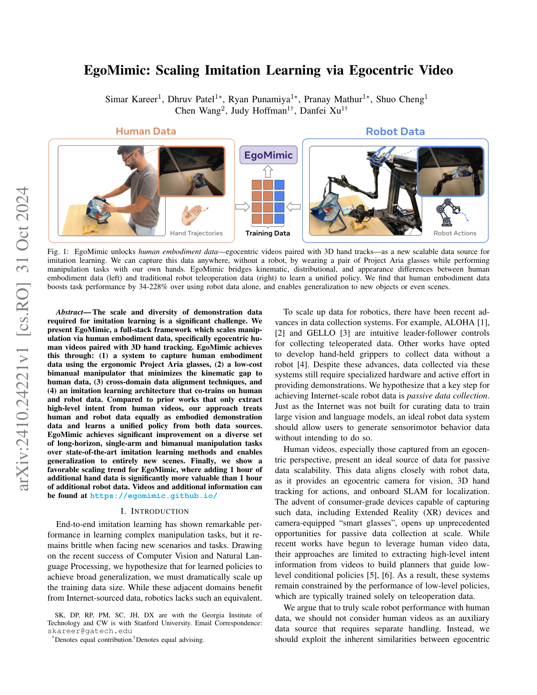
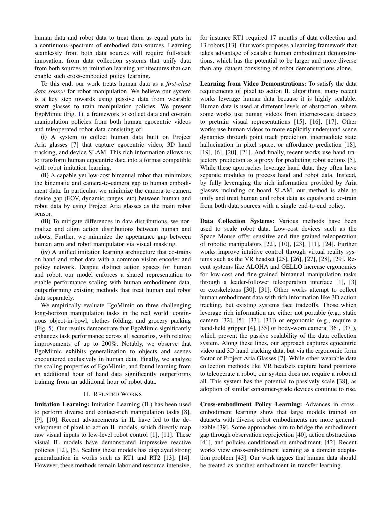

# Chapter 10: 사람에서 로봇으로 — Embodiment Retargeting

## 개요

인간의 시연 데이터(Chapter 6)를 로봇 정책으로 변환하려면, 인간과 로봇 사이의 **교차 체현 격차(cross-embodiment gap)**를 극복해야 합니다. 인간 손의 27 DoF와 로봇 핸드의 7-22 DoF는 근본적으로 다른 운동학적 구조이며, 시각적 외형과 촉각 특성도 상이합니다. 이 챕터에서는 운동학적, 시각적, 촉각적 세 차원의 격차와 각각의 해결 접근을 다루며, 나아가 인간-로봇 공동 학습(co-training)과 텔레옵 없이 인간 데이터만으로 로봇 정책을 학습하는 최신 패러다임까지 살펴봅니다.

> **이 챕터를 읽고 나면...**
> - 교차 체현 격차의 세 차원(운동학적, 시각적, 촉각적)을 구분할 수 있습니다.
> - AnyTeleop, ImMimic, DexH2R, ManipTrans의 운동학적 리타게팅을 비교할 수 있습니다.
> - Mirage, H2R 등 시각적 격차 해소의 최신 접근을 이해합니다.
> - UniTacHand [#16](https://terry.artlab.ai/ko/posts/2512-unitachand)와 OSMO [#18](https://terry.artlab.ai/ko/posts/2512-osmo-tactile-glove)의 촉각 격차 해소 접근을 이해합니다.
> - EgoMimic, EgoScale 등 인간-로봇 공동 학습의 스케일링 법칙을 설명할 수 있습니다.
> - X-Sim, EgoZero 등 텔레옵 없는(teleop-free) 접근의 가능성과 한계를 파악합니다.
> - 촉각 도메인 갭에 일반적 해법이 부재하다는 미해결 과제를 설명할 수 있습니다.

---

## 10.1 교차 체현 격차: 운동학적, 시각적, 촉각적 차이

| 격차 차원 | 인간 | 로봇 | 핵심 문제 |
|----------|------|------|----------|
| **운동학적** | 27 DoF | 7-22 DoF | 관절 구조, 범위, 커플링 차이 |
| **시각적** | 피부, 손톱, 유연 | 금속, 플라스틱, 강성 | 카메라 정책의 외형 의존 |
| **촉각적** | ~17,000 수용기 | 0-17 센서 | 밀도, 유형, 분포 완전 상이 |

세미나 1의 핵심 관찰: **촉각 도메인에서 domain gap을 해결한 논문은 UniTacHand 1편뿐**이며, 일반론적 방법론이 부재합니다.

---

## 10.2 운동학적 리타게팅: AnyTeleop, ImMimic, DexH2R

### AnyTeleop (2023)

Qin et al. [2023, RSS]의 Dex-Retarget:
- 인간 키포인트 → 로봇 관절 위치 매핑
- 범용 비전 기반 원격 조작
- **한계**: naive 매핑은 물리적 타당성(physical feasibility) 상실 — 세미나 1에서 강조

### ImMimic (2025)

Liu et al. [2025]:
- 대규모 인간 궤적 + 소수 원격 조작 궤적을 **보간(interpolation)**
- 인간 데이터의 다양성 + 원격 조작의 물리적 타당성을 결합
- 데이터 증강(augmentation)의 새로운 패러다임
- 세미나 1: "비싼 teleop data 대신 human data를 시너지적으로 활용"

> **핵심 논문**: Liu, Y., et al. (2025). "ImMimic: Large-scale Human Trajectory + Few-shot Teleoperation Interpolation." *Various*.
> 대규모 인간 궤적과 소수 원격 조작 궤적의 보간으로 데이터 증강. 교차 체현 격차를 데이터 측면에서 완화합니다.

### DexH2R (2024)

태스크 지향(task-oriented) 인간-로봇 다지 전이:
- 인간 시연의 **의도(intent)**를 추출
- 로봇의 운동학에 맞게 의도를 재현
- 단순 관절 매핑이 아닌 태스크 수준 전이

### ManipTrans (CVPR 2025)

Lv et al. [2025, CVPR]의 양손 조작 리타게팅:
- 인간 양손 궤적을 로봇 양손으로 리타게팅하는 최초의 대규모 프레임워크
- **DexManipNet**: 3,300개 이상의 양손 조작 에피소드 데이터셋 구축
- 물리적 타당성과 접촉 일관성을 동시에 보장하는 최적화 기반 리타게팅
- 기존 단일 손 리타게팅의 한계를 넘어 양손 협응(bimanual coordination) 영역으로 확장

### Park et al. (CMU/SNU, 2025)

Park et al. [arXiv, Jan 2025]:
- 인간 손과 로봇 핸드의 **관절 운동 매니폴드(joint motion manifold)**를 정렬
- 잠재 공간에서의 매핑으로 물리적 타당성을 자연스럽게 보존
- 리타게팅 정확도 **0.59 vs 0.39** (기존 베이스라인 대비)
- 매니폴드 기반 접근은 새로운 로봇 핸드에 대한 빠른 적응 가능

### Human2Sim2Robot

인간 비디오 → 시뮬레이션 재현 → 로봇 정책의 파이프라인. 인터넷 비디오 활용의 연장선입니다 (→ Chapter 6.5 참조).

---

## 10.3 시각적 격차 해소: DexUMI [#8](https://terry.artlab.ai/ko/posts/2505-dexumi), RoboPaint [#15](https://terry.artlab.ai/ko/posts/2602-robopaint), Mirage, H2R

### DexUMI (2025)

Xu et al. [2025]의 DexUMI (→ Chapter 6.4에서 소개):
- **SAM2 인페인팅**: 카메라 이미지에서 인간 손을 지우고 로봇 손으로 대체
- 시각 정책이 인간 손 외형에 의존하지 않게 함
- 운동학적 격차는 외골격으로 별도 해결

### RoboPaint (2025)

3D Gaussian Splatting(3DGS)으로:
- 실제 장면의 시각적 충실도를 시뮬레이션에 재현
- 시각적 sim-to-real 격차 감소
- Real-Sim-Real 루프의 시각적 구성 요소 (→ Chapter 9.4 참조)

### Mirage (RSS 2024)

Chen et al. [2024, RSS]의 Cross-Painting:
- **교차 페인팅(cross-painting)** 기법으로 인간 손을 로봇 핸드로 시각적 변환
- 추가 학습 없이 **제로샷(zero-shot)** 시각적 전이 달성
- 인간 시연 비디오를 로봇 관점 이미지로 직접 변환하여 정책 학습에 활용
- DexUMI의 인페인팅 방식과 상호 보완적 — Mirage는 스타일 전환, DexUMI는 완전 교체

### H2R (2025)

인간-로봇 비디오 증강(Human-to-Robot Video Augmentation):
- 인간 시연 비디오를 로봇 시각 데이터로 변환하여 사전 학습(pretraining)에 활용
- 대규모 인간 비디오 → 합성 로봇 비디오 자동 생성
- 시각적 표현 학습의 데이터 효율성을 극대화
- 사전 학습 단계에서의 시각적 격차 해소라는 새로운 접근

### Masquerade (2025)

인간 비디오를 로봇 시각(visual)으로 변환하는 프레임워크:
- 인간 시연의 시각적 요소를 로봇 환경에 맞게 자동 변환
- 마스킹과 재생성을 결합한 스타일 전이 파이프라인
- 기존 인간 비디오 데이터셋을 로봇 학습에 즉시 활용 가능하게 변환

---

## 10.4 촉각 격차 해소: UniTacHand, OSMO

촉각 격차는 세 차원 중 가장 해결이 어렵습니다.

### UniTacHand (2025)

Zhang et al. [2025]:
- **MANO [#17](https://terry.artlab.ai/ko/posts/2201-mano-hand-model) UV 맵**: 인간 손 표면을 2D UV 공간으로 전개
- 인간 글로브의 촉각 → MANO UV 맵으로 투영
- 로봇 핸드의 촉각 → 같은 MANO UV 맵으로 투영
- **공유 표현 공간(shared representation space)**에서 촉각 정책 학습
- 촉각 도메인 갭을 해결한 **유일한 논문**

> **핵심 논문**: Zhang, Y., et al. (2025). "UniTacHand: Cross-Embodiment Tactile Transfer via MANO UV Map." *Various*.
> MANO UV 맵을 이용한 인간-로봇 촉각 공유 표현. 촉각 교차 체현 전이를 최초로 체계적으로 다룬 연구입니다.

### OSMO (2025)

OSMO 글로브 [arXiv:2512.08920] (→ Chapter 6.3에서 소개):
- **Embodiment Bridge**: 인간/로봇에 동일 촉각 글로브 사용
- 촉각 도메인 갭을 **물리적으로 제거** — 같은 센서이므로 표현 차이가 없음
- 12개 3축 자기 센서
- 오픈소스

두 접근의 근본적 차이:
- **UniTacHand**: 소프트웨어적 해법 (표현 정렬)
- **OSMO**: 하드웨어적 해법 (물리적 공유)

---

## 10.5 기계적 결합: DEXOP [#10](https://terry.artlab.ai/ko/posts/2509-dexop)의 4절 링크 방식

DEXOP [2025]은 인간과 로봇 손가락을 **4절 링크(4-bar linkage)**로 직접 기계적으로 연결합니다:

- 세 가지 격차를 동시에 해소:
  - **운동학적**: 기계적 1:1 매핑
  - **시각적**: 로봇이 직접 동작하므로 카메라에 로봇만 보임
  - **촉각적**: 인간의 직접 접촉 피드백
- 원격 조작 대비 **8배 빠른** 데이터 수집
- **51.3% vs 42.5%** 성공률 (원격 조작 대비)

---

## 10.6 인간-로봇 공동 학습 (Human + Robot Co-training)

최근 가장 주목받는 패러다임은 인간 시연 데이터와 로봇 데이터를 **함께** 학습에 활용하는 공동 학습(co-training)입니다. 운동학적 리타게팅이 필요 없이, 인간 데이터가 로봇 정책을 직접 개선하는 접근입니다.

### EgoMimic (Georgia Tech, 2024)

Kareer et al. [arXiv, 2024]:
- 인간 에고센트릭 비디오와 로봇 데이터를 공동 학습
- **1시간의 인간 시연이 2시간의 로봇 데이터보다 효과적** — 반직관적이지만 재현 가능한 결과
- 기존 로봇 전용 학습 대비 **+34-228%** 성능 향상
- 인간 데이터의 풍부한 다양성이 로봇 데이터의 양을 보상

> **핵심 논문**: Kareer, S., et al. (2024). "EgoMimic: Scaling Imitation Learning via Egocentric Video." *arXiv preprint*.
> 1시간의 인간 에고센트릭 데이터가 2시간의 로봇 데이터보다 우수하다는 반직관적 결과를 제시. 인간-로봇 공동 학습 패러다임의 기초를 놓은 연구입니다.

### EgoScale (NVIDIA, 2026)

EgoScale [arXiv, Feb 2026]:
- **20,854시간**의 대규모 인간 에고센트릭 데이터 활용
- 인간 데이터 규모와 로봇 성능 간 **로그-선형 스케일링 법칙** 발견: R² = 0.998
- 로봇 전용 학습 대비 **+54%** 성능 향상
- 데이터 규모에 따른 예측 가능한 성능 개선 — 투자 대비 효과를 사전에 추정 가능

> **핵심 논문**: NVIDIA. (2026). "EgoScale: Scaling Robot Policy Learning with Human Egocentric Data." *arXiv preprint*.
> 20,854시간 인간 데이터에서 R² = 0.998의 로그-선형 스케일링 법칙을 발견. 인간 데이터의 스케일링이 로봇 학습에 예측 가능한 이득을 제공함을 실증합니다.

### AoE (2026)

AoE (Augmentation of Experience) [arXiv, Feb 2026]:
- **50개 텔레옵 + 200개 인간 에고 시연**의 소규모 혼합 데이터
- Close Laptop 태스크에서 성공률 **45% → 95%**로 개선
- 소량의 인간 데이터가 로봇 데이터의 부족을 효과적으로 보완
- 리소스 제약 환경에서의 실용적 공동 학습 접근

### pi0 [#2](https://terry.artlab.ai/ko/posts/2410-pi0-vla-flow-model) Human-to-Robot Transfer (Physical Intelligence, 2025)

Physical Intelligence [Dec 2025]:
- 대규모 사전 학습된 pi0 모델에 인간 데이터로 **공동 미세조정(co-finetuning)**
- 4개 일반화 시나리오(새 물체, 새 환경, 새 태스크, 새 로봇)에서 **2배 성능 개선**
- **창발적 정렬(emergent alignment)**: 명시적 리타게팅 없이 모델이 인간-로봇 대응을 자동 학습
- Foundation Model 시대의 교차 체현 전이 — 충분한 규모에서는 명시적 매핑이 불필요

---

## 10.7 텔레옵 없는 접근 (Teleop-Free Approaches)

더 급진적인 방향은 **로봇 데이터 자체를 완전히 배제**하고, 인간 데이터만으로 로봇 정책을 학습하는 것입니다. 이 접근이 성공한다면, 원격 조작(teleop)의 비용과 병목을 근본적으로 제거할 수 있습니다.

### X-Sim (Cornell, CoRL 2025 Oral)

Dan et al. [2025, CoRL Oral]:
- 인간 RGBD 비디오 **1개** → 시뮬레이션에서 RL 학습 → 실제 로봇 배치
- **제로 로봇 데이터(zero robot data)**로 실제 로봇 제어 달성
- Real-to-Sim-to-Real 파이프라인의 완전한 구현
- CoRL 2025 Oral 수상 — 인간 시연만으로 로봇 정책 생성의 실현 가능성을 입증

### EgoZero (2025)

EgoZero [2025]:
- **스마트글래스(smart glasses)**의 에고센트릭 비디오만으로 로봇 정책 학습
- 7개 조작 태스크에서 **70% 성공률** 달성
- 제로 로봇 데이터 — 웨어러블 장치의 일상 데이터만 활용
- 특별한 장비(글로브, 외골격) 없이 가장 자연스러운 인간 시연 수집

### VidBot (TU Munich, CVPR 2025)

VidBot [2025, CVPR]:
- **인터넷 비디오** → 3D 어포던스(affordance) 추출 → 제로샷 로봇 제어
- 기존 로봇 데이터 대비 **+20%** 성능 향상
- 인터넷의 무한한 비디오 데이터를 로봇 학습 자원으로 변환
- 어포던스 기반 표현이 체현 격차를 자연스럽게 추상화

### Human2Bot (Autonomous Robots, 2025)

Human2Bot [Autonomous Robots, 2025]:
- 인간 비디오 → **태스크 유사도 보상(task similarity reward)** 설계 → 제로샷 로봇 제어
- 로봇 데이터 완전 불필요 — 인간 비디오가 보상 함수의 역할
- 보상 설계를 통한 간접적 지식 전이
- 태스크 수준의 추상화로 체현 격차를 우회

---

## 10.8 미해결 과제: 촉각 도메인 갭과 새로운 패러다임의 한계

세미나 1의 가장 중요한 인사이트 중 하나: **촉각 도메인에서 cross-embodiment gap을 해결한 일반론적 방법론이 부재**합니다.

- UniTacHand: MANO UV 맵 기반이므로 MANO 호환 핸드에 한정
- OSMO: 동일 글로브 필수이므로 기존 센서와의 호환 불가
- DEXOP: 기계적 결합이므로 핸드 형태에 강하게 의존

향후 필요한 연구 방향:
1. **센서 무관 촉각 전이**: AnyTouch/Sensor-Invariant 방향의 교차 체현 확장 (→ Chapter 3.3 참조)
2. **범용 촉각 UV 맵**: MANO 외의 다양한 핸드 모델에 적용 가능한 공유 표현
3. **시뮬레이션 기반 촉각 전이**: DiffTactile로 시뮬레이션에서 촉각 갭을 극복

### 공동 학습과 텔레옵-프리 접근의 열린 문제

§10.6과 §10.7에서 다룬 새로운 패러다임은 강력하지만, 여전히 해결해야 할 과제가 있습니다:

1. **반직관적 스케일링**: EgoMimic의 결과(1시간 인간 > 2시간 로봇)는 인간 데이터의 **다양성**이 핵심이지만, 어떤 종류의 다양성이 중요한지는 아직 불명확합니다.
2. **인간 전용 로봇 제어의 실현**: X-Sim, EgoZero, VidBot은 인간 데이터만으로 로봇 제어가 가능함을 보였지만, 성공 태스크의 범위가 아직 제한적입니다.
3. **스케일링 법칙의 보편성**: EgoScale의 로그-선형 법칙(R² = 0.998)이 다양한 태스크와 로봇 플랫폼에 일반화되는지 검증이 필요합니다.
4. **창발적 정렬의 조건**: pi0의 결과는 Foundation Model 규모에서만 나타나는 현상일 수 있으며, 필요 조건의 이해가 부족합니다.
5. **촉각 데이터의 부재**: 공동 학습과 텔레옵-프리 접근 모두 시각 데이터에 의존하며, 촉각 정보의 전이는 여전히 미해결입니다.

---

## 요약 및 전망

Embodiment Retargeting은 운동학적(AnyTeleop, ImMimic, ManipTrans), 시각적(DexUMI, RoboPaint, Mirage), 촉각적(UniTacHand, OSMO), 기계적(DEXOP) 네 차원에서 진행되고 있습니다. 최근에는 인간-로봇 공동 학습(EgoMimic, EgoScale, pi0)과 텔레옵 없는 접근(X-Sim, EgoZero, VidBot)이 패러다임의 근본적 변화를 이끌고 있습니다.

특히 세 가지 반직관적 발견이 이 분야의 방향을 재정의하고 있습니다:
1. **1시간 인간 > 2시간 로봇** (EgoMimic): 인간 데이터의 다양성이 양을 압도
2. **인간 전용 로봇 제어 가능** (X-Sim, EgoZero, VidBot): 로봇 데이터 자체가 불필요할 수 있음
3. **로그-선형 스케일링** (EgoScale, R² = 0.998): 인간 데이터 투자의 수확이 예측 가능

그러나 촉각 도메인의 교차 체현 전이는 여전히 1편의 논문(UniTacHand)만이 체계적으로 다루고 있으며, 공동 학습과 텔레옵-프리 접근 역시 촉각 정보를 다루지 못하고 있습니다. 이는 이 분야의 가장 큰 열린 문제입니다.

Chapter 13에서 제안하는 **"Shared Sensing Platform"** 방향 — OSMO/UniTacHand 방식의 교차 체현 촉각 전이 일반화 — 이 이 격차를 메울 핵심 연구 방향입니다.

다음 파트에서는 지금까지의 모든 기술을 통합하는 **시스템 통합과 전망**을 다룹니다 (→ Chapter 11: 시스템 통합 참조).

---

## 참고문헌

1. Qin, Y., et al. (2023). AnyTeleop: A general vision-based dexterous robot teleoperation system. *RSS 2023*.

2. Liu, Y., et al. (2025). ImMimic: Cross-domain imitation from human videos via mapping and interpolation. *arXiv preprint*.

3. Li, Y., et al. (2024). DexH2R: Task-oriented dexterous manipulation from human to robots. *arXiv preprint*. arXiv:2411.04428.

4. Xu, M., Zhang, H., Hou, Y., Xu, Z., Fan, L., Veloso, M., & Song, S. (2025). DexUMI: Using human hand as the universal manipulation interface for dexterous manipulation. *arXiv preprint*. arXiv:2505.21864. [#8](https://terry.artlab.ai/ko/posts/2505-dexumi)

5. Various. (2026). RoboPaint: From human demonstration to any robot and any view. *arXiv preprint*. [#15](https://terry.artlab.ai/ko/posts/2602-robopaint)

6. Zhang, C., Xue, Z., Yin, S., Zhao, B., et al. (2025). UniTacHand: Unified spatio-tactile representation for human to robotic hand skill transfer. *arXiv preprint*. arXiv:2512.21233. [#16](https://terry.artlab.ai/ko/posts/2512-unitachand)

7. Yin, J., Qi, H., Wi, Y., Kundu, S., Lambeta, M., Yang, W., Wang, C., Wu, T., Malik, J., & Hellebrekers, T. (2025). OSMO: Open-source tactile glove for human-to-robot skill transfer. *arXiv preprint*. arXiv:2512.08920. [#18](https://terry.artlab.ai/ko/posts/2512-osmo-tactile-glove)

8. Fang, H.-S., Romero, B., Xie, Y., Hu, A., Huang, B.-R., Alvarez, J., Kim, M., Margolis, G., Anbarasu, K., Tomizuka, M., Adelson, E., & Agrawal, P. (2025). DEXOP: A device for robotic transfer of dexterous human manipulation. *arXiv preprint*. arXiv:2509.04441. [#10](https://terry.artlab.ai/ko/posts/2509-dexop)

9. Dan, P., et al. (2025). X-Sim: Cross-embodiment learning via real-to-sim-to-real. *CoRL 2025 (Oral)*.

10. Si, Z., Qian, K., Sontakke, N., et al. (2025). ExoStart: Efficient learning for dexterous manipulation with sensorized exoskeleton demonstrations. *arXiv preprint*. arXiv:2506.11775. [#9](https://terry.artlab.ai/ko/posts/2506-exostart)

11. Shaw, K., Bahl, S., & Pathak, D. (2024). Learning dexterity from human hand motion in internet videos. *arXiv preprint*. arXiv:2404.xxxxx.

12. Romero, J., Tzionas, D., & Black, M. J. (2017). Embodied hands (MANO). *SIGGRAPH Asia 2017*. [#17](https://terry.artlab.ai/ko/posts/2201-mano-hand-model)

13. Various. (2025). Human2Sim2Robot: Learning from human video via sim-to-real transfer. *arXiv preprint*.

14. Various. (2025). AnyTouch: Unified static-dynamic tactile representation. *arXiv:2502.12191*.

15. Various. (2025). Sensor-invariant tactile representation. *OpenReview*.

16. Lv, Y., et al. (2025). ManipTrans: Efficient bimanual dexterous manipulation retargeting. *CVPR 2025*.

17. Park, J., et al. (2025). Joint motion manifold for human-to-robot hand retargeting. *arXiv preprint, Jan 2025*.

18. Chen, B., et al. (2024). Mirage: Cross-embodiment zero-shot transfer via cross-painting. *RSS 2024*.

19. Various. (2025). H2R: Human-to-robot video augmentation for policy pretraining. *arXiv preprint*.

20. Various. (2025). Masquerade: Human video to robot visual transformation. *arXiv preprint*.

21. Kareer, S., et al. (2024). EgoMimic: Scaling imitation learning via egocentric video. *arXiv preprint*.

22. NVIDIA. (2026). EgoScale: Scaling robot policy learning with 20K hours of human egocentric data. *arXiv preprint, Feb 2026*.

23. Various. (2026). AoE: Augmentation of experience via human ego demonstrations. *arXiv preprint, Feb 2026*.

24. Physical Intelligence. (2025). pi0 human-to-robot transfer: Co-finetuning for cross-embodiment generalization. *Technical Report, Dec 2025*. [#2](https://terry.artlab.ai/ko/posts/2410-pi0-vla-flow-model)

25. Various. (2025). EgoZero: Zero robot data policy learning from smart glasses. *arXiv preprint*.

26. Various. (2025). VidBot: Internet video to 3D affordance for zero-shot robot control. *CVPR 2025*.

27. Various. (2025). Human2Bot: Task similarity reward from human video for zero-shot robot control. *Autonomous Robots, 2025*.
